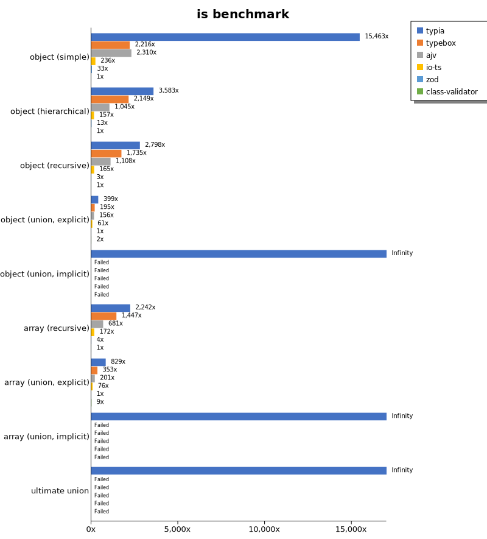
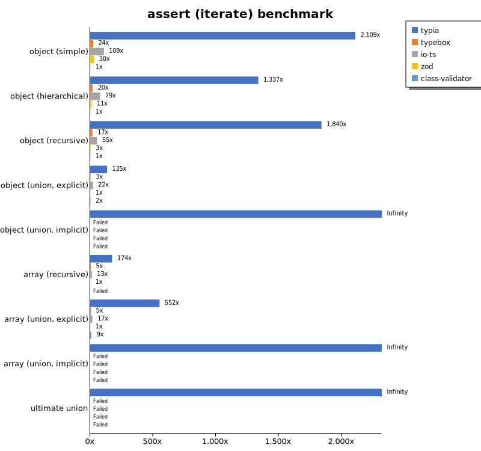
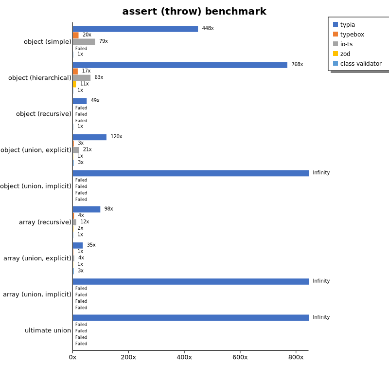
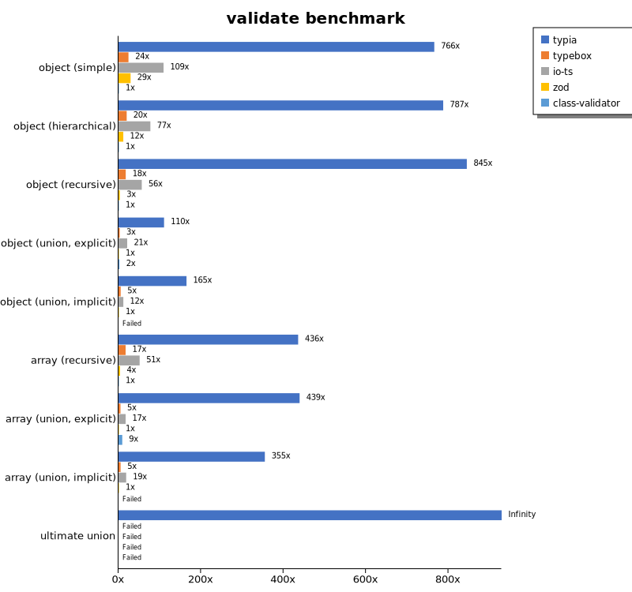
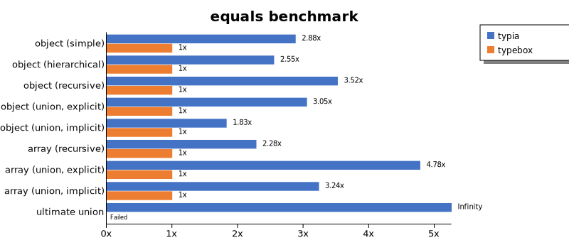
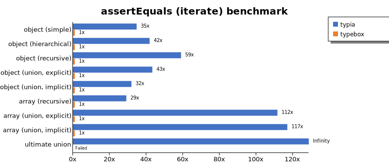
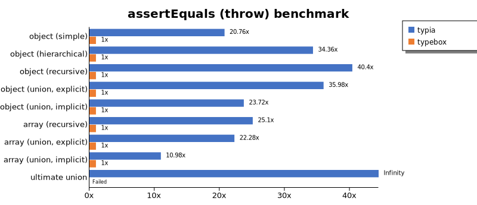
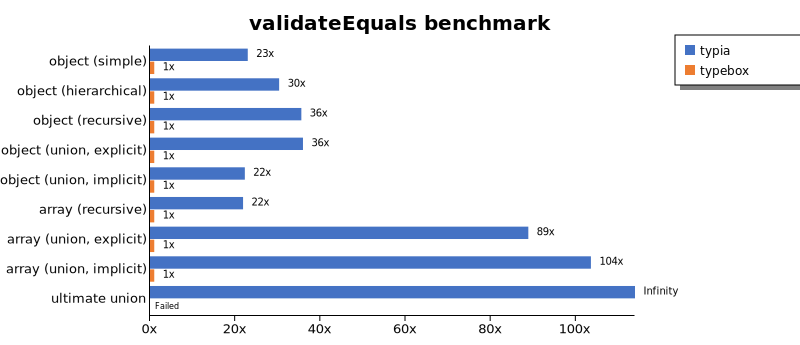
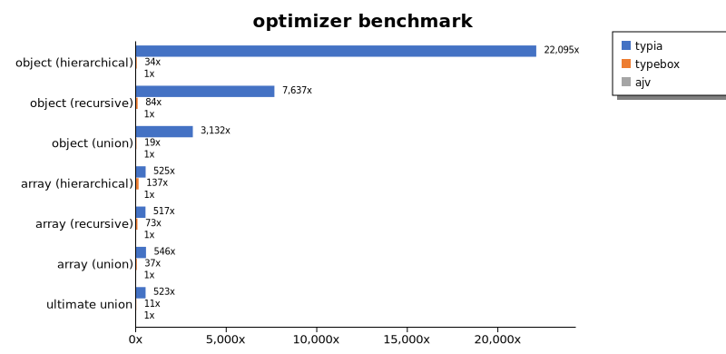
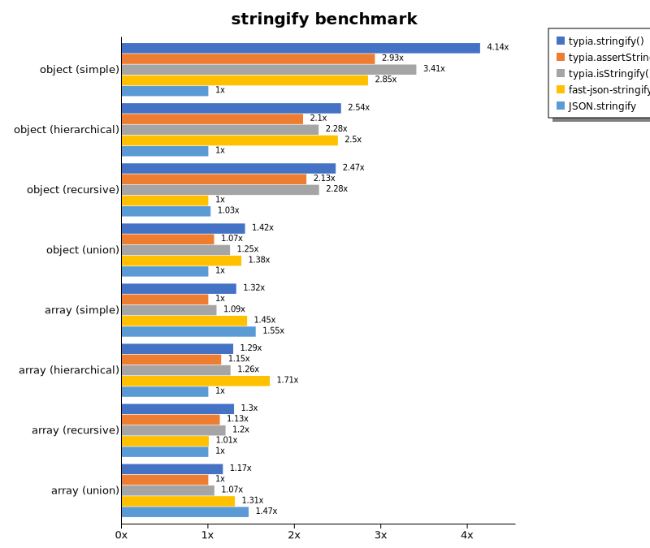

# Benchmark of `typia`
> - CPU: Intel(R) Xeon(R) W-3235 CPU @ 3.30GHz
> - Memory: 32,768 MB
> - OS: darwin
> - Typia version: 3.4.28

## is

 Components | typia | typebox | ajv | io-ts | zod | class-validator 
------------|-------|---------|-----|-------|-----|-----------------
object (simple) | 185826.45519322305 | 26634.504304108796 | 27760.7513986499 | 2839.2581762104282 | 396.59913852278964 | 12.017221491619116
object (hierarchical) | 98767.82490974729 | 59239.174127535174 | 28798.808339363244 | 4316.511942526591 | 362.97150330396477 | 27.566126670327655
object (recursive) | 64289.58940287209 | 39853.26360887097 | 25450.521198062557 | 3798.1298207803998 | 73.68749420974615 | 22.973125695474778
object (union, explicit) | 16073.32732280458 | 7838.125464597658 | 6303.41743510929 | 2453.8989584300703 | 40.2947469520675 | 92.37351705174322
object (union, implicit) | 18546.615268391695 | Failed | Failed | Failed | Failed | Failed
array (recursive) | 54150.260487011525 | 34943.29256425451 | 16449.118884332576 | 4150.414270581114 | 97.25647704222754 | 24.15377701960066
array (union, explicit) | 18962.25572336351 | 8068.319828552607 | 4601.768895348837 | 1744.1459037162163 | 22.86923224590469 | 210.5753976369671
array (union, implicit) | 10529.43997027635 | Failed | Failed | Failed | Failed | Failed
ultimate union | 5718.428140818335 | Failed | Failed | Failed | Failed | Failed

 Unit: kilobytes/sec 

## assert (iterate)

 Components | typia | typebox | io-ts | zod | class-validator 
------------|-------|---------|-------|-----|-----------------
object (simple) | 25399.91226449945 | 292.04211107024645 | 1316.5299773755655 | 357.24811199115857 | 12.042881009838503
object (hierarchical) | 35976.20156934432 | 531.027487582027 | 2122.4415268809657 | 306.6050944479467 | 26.90778780325308
object (recursive) | 41715.64164049699 | 393.00986080229757 | 1251.1678629785247 | 73.00277099380048 | 22.666743520620507
object (union, explicit) | 5277.8090481289455 | 116.97186449187372 | 869.2236056354361 | 39.23589300670017 | 91.70188358548359
object (union, implicit) | 6145.568836471504 | Failed | Failed | Failed | Failed
array (recursive) | 16179.846998501589 | 431.7760890420694 | 1234.3360154690617 | 92.94844541658847 | Failed
array (union, explicit) | 12435.34972773531 | 106.04126134889752 | 392.39398700342133 | 22.526950541880968 | 207.33491735060863
array (union, implicit) | 7581.673763032436 | Failed | Failed | Failed | Failed
ultimate union | 3009.280200239945 | Failed | Failed | Failed | Failed

 Unit: kilobytes/sec 

## assert (throw)

 Components | typia | typebox | io-ts | zod | class-validator 
------------|-------|---------|-------|-----|-----------------
object (simple) | 6209.238673035847 | 277.97986790091693 | 1096.0261119093952 | Failed | 13.862741185452528
object (hierarchical) | 23007.614661907326 | 515.450356632559 | 1883.0049599373422 | 328.04318691821805 | 29.956099157559198
object (recursive) | 5129.9120498175025 | Failed | Failed | Failed | 104.06449062961595
object (union, explicit) | 4633.112328023171 | 117.9208825182687 | 828.1852506426736 | 38.59110559234732 | 98.2121956928839
object (union, implicit) | 5103.118800747371 | Failed | Failed | Failed | Failed
array (recursive) | 10375.014999016932 | 403.57735923733475 | 1225.3517294027492 | 180.36828983798196 | 105.80796213306063
array (union, explicit) | 3048.4139578683034 | 121.30835433691598 | 376.2229898415978 | 86.74348660600864 | 244.8788691276672
array (union, implicit) | 1423.3052720118612 | Failed | Failed | Failed | Failed
ultimate union | 3162.8764698480963 | Failed | Failed | Failed | Failed

 Unit: kilobytes/sec 

## validate

 Components | typia | typebox | io-ts | zod | class-validator 
------------|-------|---------|-------|-----|-----------------
object (simple) | 9036.662584067719 | 285.5240722020822 | 1289.4340559204397 | 345.9113082913216 | 11.7997011906926
object (hierarchical) | 21244.777810984648 | 535.211423022599 | 2084.92114425125 | 313.5465121362619 | 26.978125288603625
object (recursive) | 18887.36007992996 | 392.19205055011093 | 1261.748282037521 | 71.45823222869292 | 22.358648255813954
object (union, explicit) | 4382.923006234878 | 116.5931179254036 | 838.0230610108384 | 39.67715451225259 | 89.48143942851927
object (union, implicit) | 4675.792928406415 | 149.0468532179368 | 332.08190639269407 | 28.349642578862866 | Failed
array (recursive) | 10735.450706811089 | 424.7586598523566 | 1262.3955431754875 | 93.91007398975526 | 24.64065708418891
array (union, explicit) | 10034.288824383164 | 109.18774966711052 | 394.67723669309174 | 22.845468053491828 | 209.2224902579328
array (union, implicit) | 6806.7744884706535 | 96.89010503811117 | 356.4245345744681 | 19.178357865685374 | Failed
ultimate union | 2296.668060486073 | Failed | Failed | Failed | Failed

 Unit: kilobytes/sec 

## equals

 Components | typia | typebox 
------------|-------|---------
object (simple) | 13390.137251614222 | 4646.518289459038
object (hierarchical) | 23489.439973839853 | 9199.396874412374
object (recursive) | 25353.648800771916 | 7194.836669877087
object (union, explicit) | 7399.536266417366 | 2422.7524780050276
object (union, implicit) | 4211.135189090154 | 2302.2202799236784
array (recursive) | 15670.551172642436 | 6865.099695835699
array (union, explicit) | 13975.982610428051 | 2922.832041995232
array (union, implicit) | 8299.157511876485 | 2563.3268386452332
ultimate union | 3957.6876863845387 | Failed

 Unit: kilobytes/sec 

## assertEquals (iterate)

 Components | typia | typebox 
------------|-------|---------
object (simple) | 8506.290904660229 | 244.77844008653122
object (hierarchical) | 18610.75785121123 | 444.82475948228125
object (recursive) | 20131.851179478057 | 341.2481433078482
object (union, explicit) | 3961.788054435484 | 91.43384810705574
object (union, implicit) | 2748.938260649087 | 86.11114300146951
array (recursive) | 10614.16479823758 | 364.47713944137803
array (union, explicit) | 10274.325788698663 | 92.08027533657443
array (union, implicit) | 6293.642117210546 | 53.79612856401057
ultimate union | 2554.3230158460283 | Failed

 Unit: kilobytes/sec 

## assertEquals (throw)

 Components | typia | typebox 
------------|-------|---------
object (simple) | 4491.184682958674 | 216.30227554902496
object (hierarchical) | 14767.127622656106 | 429.8361984512036
object (recursive) | 13233.449005602728 | 327.5649641577061
object (union, explicit) | 3499.153045794931 | 97.25327307817136
object (union, implicit) | 2430.1405556326304 | 102.43779459753445
array (recursive) | 10004.538559263041 | 398.6541206052918
array (union, explicit) | 2672.906372366213 | 119.96649824253075
array (union, implicit) | 1432.4203331535707 | 130.50317886308898
ultimate union | 2664.50154660037 | Failed

 Unit: kilobytes/sec 

## validateEquals

 Components | typia | typebox 
------------|-------|---------
object (simple) | 5573.4296158256875 | 242.77598409155328
object (hierarchical) | 13484.160802412722 | 444.6524110617009
object (recursive) | 12110.814635770716 | 340.7655417484577
object (union, explicit) | 3214.9143229651704 | 89.5011720904578
object (union, implicit) | 1923.9940004485645 | 86.39450666419843
array (recursive) | 7576.291012014787 | 346.67409477184555
array (union, explicit) | 8143.630571939133 | 91.66695537694014
array (union, implicit) | 5557.195685891544 | 53.672823295985054
ultimate union | 1711.904874649448 | Failed

 Unit: kilobytes/sec 

## optimizer

 Components | typia | typebox | ajv 
------------|-------|---------|-----
object (hierarchical) | 77363.15538756241 | 117.37450132978725 | 3.501333841463415
object (recursive) | 62657.98731008288 | 693.0267906399412 | 8.20484644693353
object (union) | 17745.051066080727 | 109.32110821759258 | 5.6665819545709475
array (hierarchical) | 100013.76951336752 | 26100.81457208046 | 190.34739290730337
array (recursive) | 45677.93813799401 | 6460.861120810056 | 88.28482701831433
array (union) | 19676.1474833234 | 1336.5347515549572 | 36.06150964272611
ultimate union | 5562.896677850027 | 118.57413103480538 | 10.642059624976907

 Unit: kilobytes/sec 

## stringify

 Components | typia.stringify() | typia.assertStringify() | typia.isStringify() | fast-json-stringify | JSON.stringify 
------------|-------------------|-------------------------|---------------------|---------------------|----------------
object (simple) | 4639.743734196479 | 3277.059778546066 | 3813.6842078769328 | 3187.571192960836 | 1119.640775155455
object (hierarchical) | 4381.864834129756 | 3622.8286935186034 | 3934.3429257454127 | 4318.181229270315 | 1728.332726118842
object (recursive) | 4700.468055941144 | 4056.737843493183 | 4334.431950866035 | 1900.2945873618787 | 1951.3215912573073
object (union) | 1633.4620835666294 | 1222.9008766968325 | 1434.1111060988812 | 1584.9146055535123 | 1146.5092873086735
array (simple) | 1434.3912397921306 | 1084.3224981738495 | 1187.06912191582 | 1570.653186731271 | 1678.6641929499074
array (hierarchical) | 2634.2554909743612 | 2348.896593538116 | 2570.5403944202567 | 3499.104344833646 | 2045.1551444575473
array (recursive) | 2302.709215126978 | 2010.4486731843576 | 2127.5271147213653 | 1783.6170664903666 | 1774.505416589176
array (union) | 1810.3180268975684 | 1549.0274777150246 | 1657.123851356002 | 2024.5875032132174 | 2271.2773999032433

 Unit: kilobytes/sec 

## stringify (server)

 Components | express (pure) | express (typia.stringify) | express (typia.isStringify) | express (typia.assertStringify) | fastify 
------------|----------------|---------------------------|-----------------------------|---------------------------------|---------
object (simple) | 57208.73179587567 | 63869.75161892125 | 63107.98355569038 | 58817.01364206076 | 93269.7367908354
object (hierarchical) | 107239.22035118347 | 107210.04253180849 | 106763.97518794883 | 102960.57072428105 | 134150.25684931508
object (recursive) | 56225.7904805708 | 57571.41843949522 | 56345.70536593959 | 53681.05236635898 | 81215.46969254581
object (union) | 81383.39613878915 | 95175.86520301437 | 89687.77272840614 | 79963.86981738106 | 53905.271489828476
array (simple) | 104629.74909151542 | 80067.66565537763 | 72969.87414276808 | 68530.50214356575 | 61088.26114602035
array (hierarchical) | 97058.20791388418 | 98234.53798464869 | 88525.1062120004 | 55753.336137681785 | 54085.24987456995
array (recursive) | 47492.73655065086 | 51076.3604848364 | 50656.647580961944 | 48137.32850350435 | 60005.102456269946
array (union) | 129342.02952066135 | 90811.30102040817 | 85255.96669170073 | 82566.83584008728 | 86061.41101200868

 Unit: megabytes/sec 

