# Benchmark of `typescript-json`
> CPU: AMD Ryzen 5 5600X 6-Core Processor             
> Memory: 16,310 MB

## assert
 Components | typescript-json | typescript-is 
------------|-----------------|---------------
object (hierarchical) | 40250.27746947836 | 27249.907578558224
object (recursive) | 39937.242244934554 | 22028.24753763241
object (union) | 6075.9470393527035 | 2610.8956602031394
array (recursive) | 1887.1179448715543 | 1790.3518317011244
array (union) | 3988.4594248030776 | 256.99558173784976
ultimate union | 5296.715531638522 | 38.568001476287144

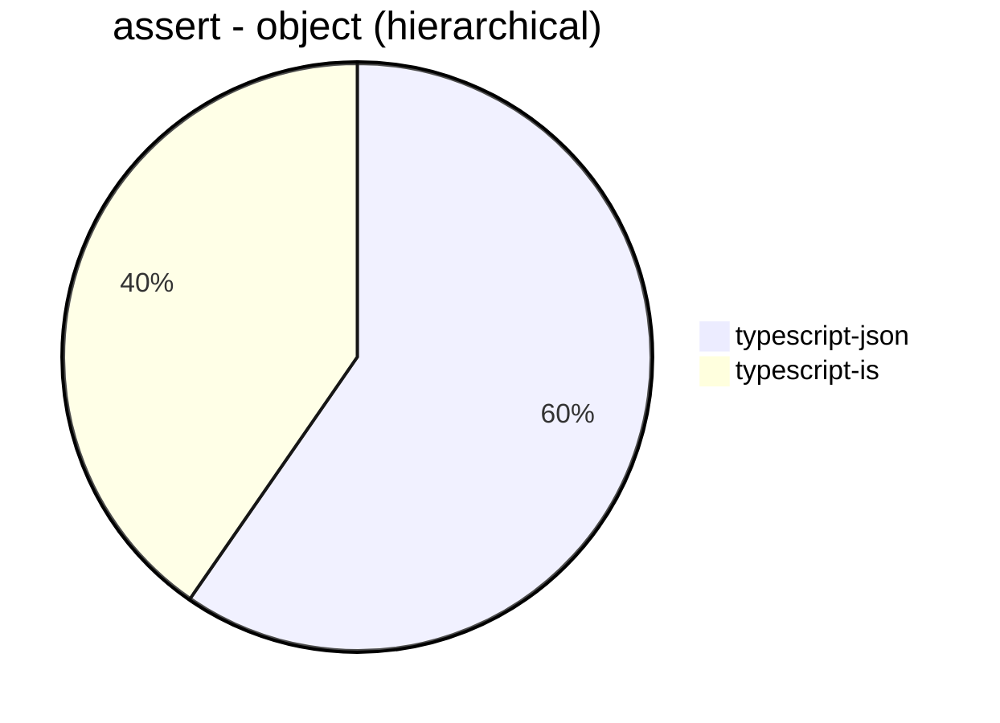
```mermaid
pie title assert - object (hierarchical)
  "typescript-json": 40250.27746947836
  "typescript-is": 27249.907578558224
```

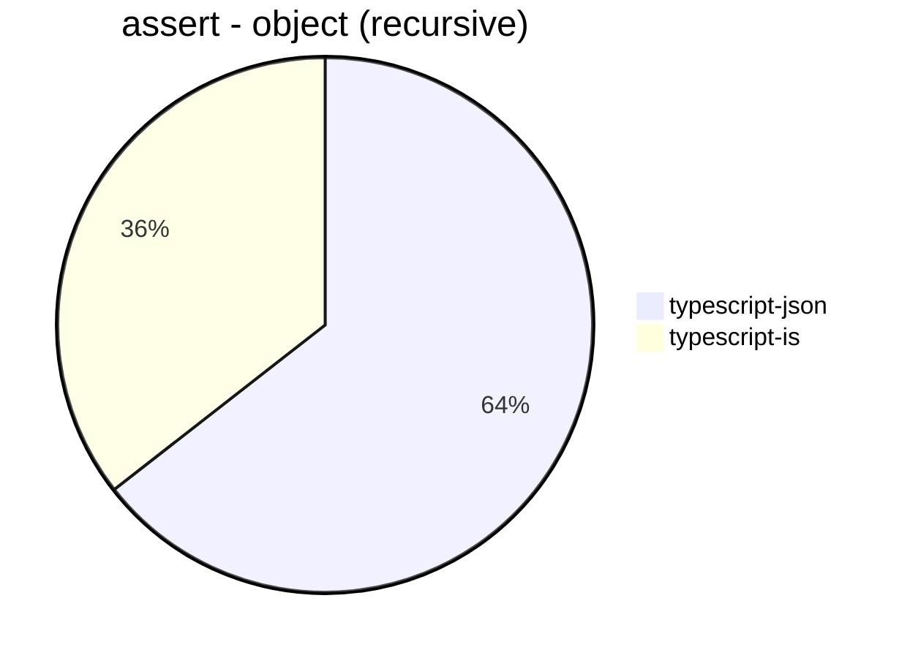
```mermaid
pie title assert - object (recursive)
  "typescript-json": 39937.242244934554
  "typescript-is": 22028.24753763241
```

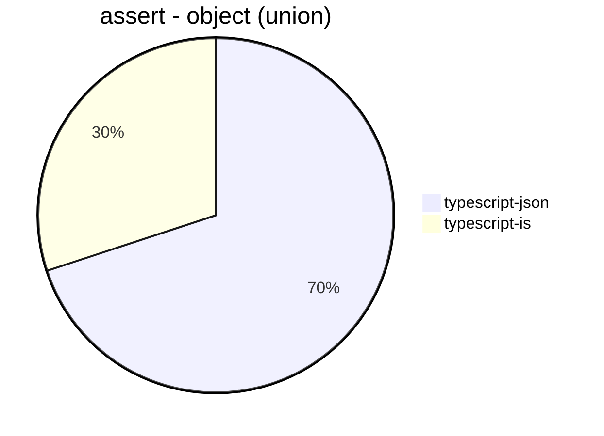
```mermaid
pie title assert - object (union)
  "typescript-json": 6075.9470393527035
  "typescript-is": 2610.8956602031394
```

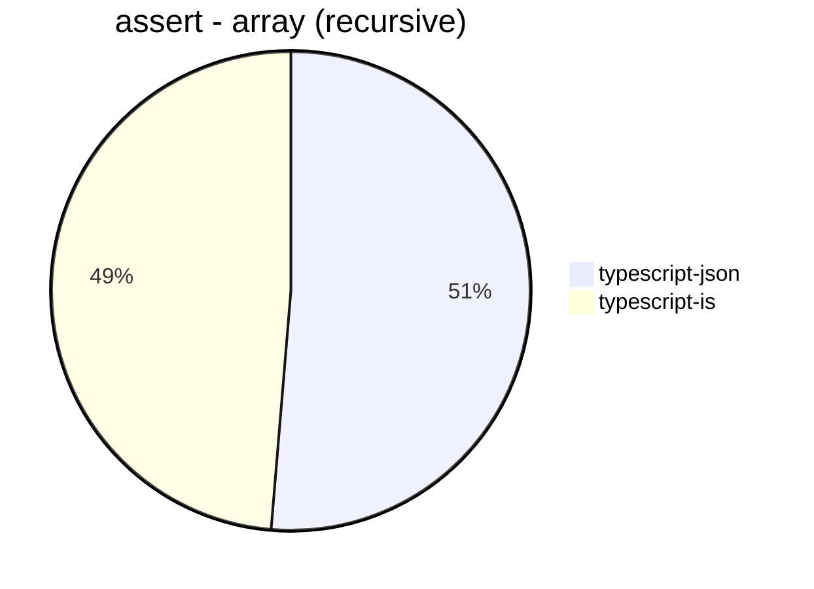
```mermaid
pie title assert - array (recursive)
  "typescript-json": 1887.1179448715543
  "typescript-is": 1790.3518317011244
```

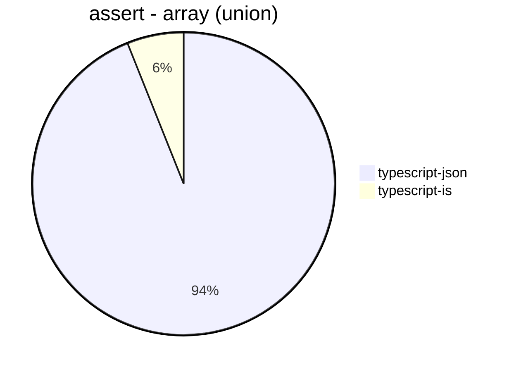
```mermaid
pie title assert - array (union)
  "typescript-json": 3988.4594248030776
  "typescript-is": 256.99558173784976
```

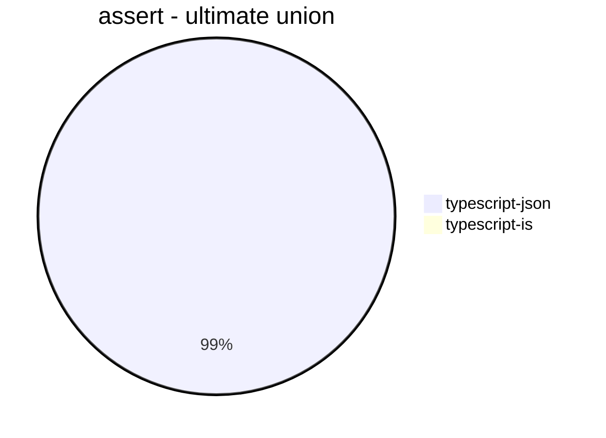
```mermaid
pie title assert - ultimate union
  "typescript-json": 5296.715531638522
  "typescript-is": 38.568001476287144
```

## is
 Components | typescript-json | typescript-is | ajv 
------------|-----------------|---------------|-----
object (hierarchical) | 125272.91242362525 | 56963.61957525392 | 92808.35555555555
object (recursive) | 86355.8699246739 | 49597.871188886886 | Failed
object (union, explicit) | 17375.70364990013 | Failed | 1525.47065337763
object (union, implicit) | 19701.373825018076 | Failed | Failed
array (recursive) | 6403.373670700404 | 5005.852231163131 | Failed
array (union, explicit) | 7484.662576687117 | 1220.8578038796938 | Failed
array (union, implicit) | 7142.937853107345 | 1378.057685286601 | Failed
ultimate union | 11405.535946498236 | 345.575959933222 | Failed

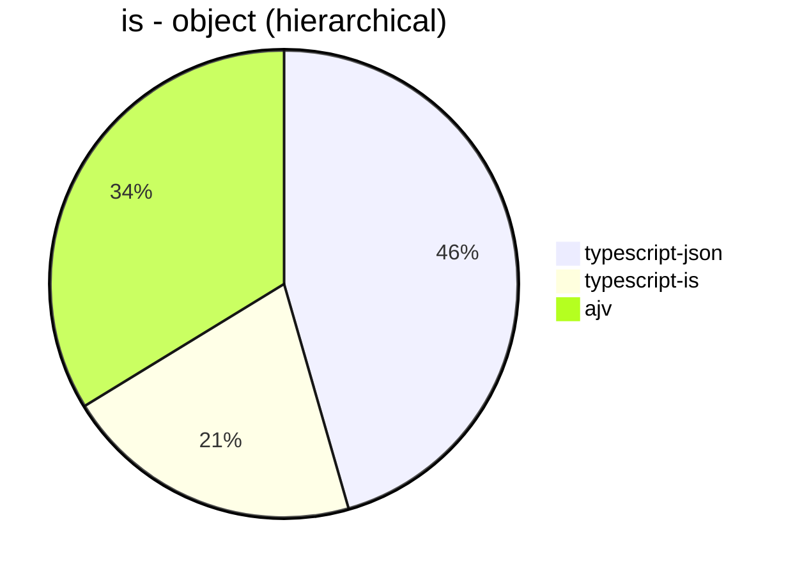
```mermaid
pie title is - object (hierarchical)
  "typescript-json": 125272.91242362525
  "typescript-is": 56963.61957525392
  "ajv": 92808.35555555555
```

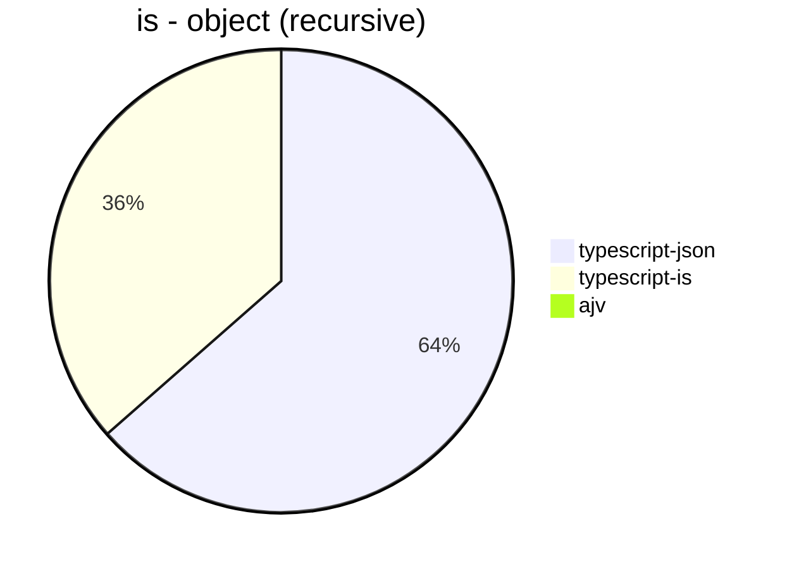
```mermaid
pie title is - object (recursive)
  "typescript-json": 86355.8699246739
  "typescript-is": 49597.871188886886
  "ajv": 0
```

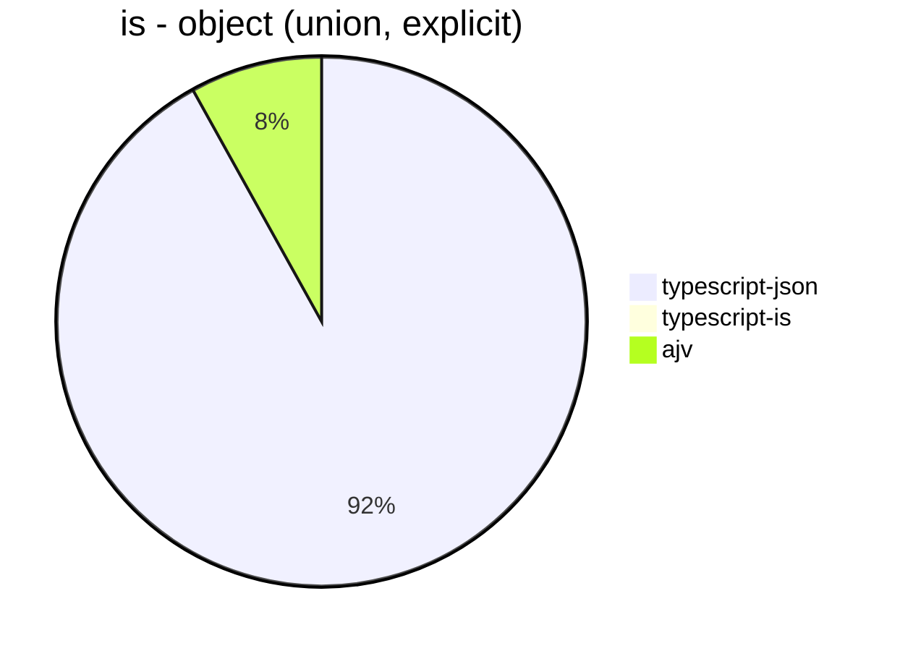
```mermaid
pie title is - object (union, explicit)
  "typescript-json": 17375.70364990013
  "typescript-is": 0
  "ajv": 1525.47065337763
```

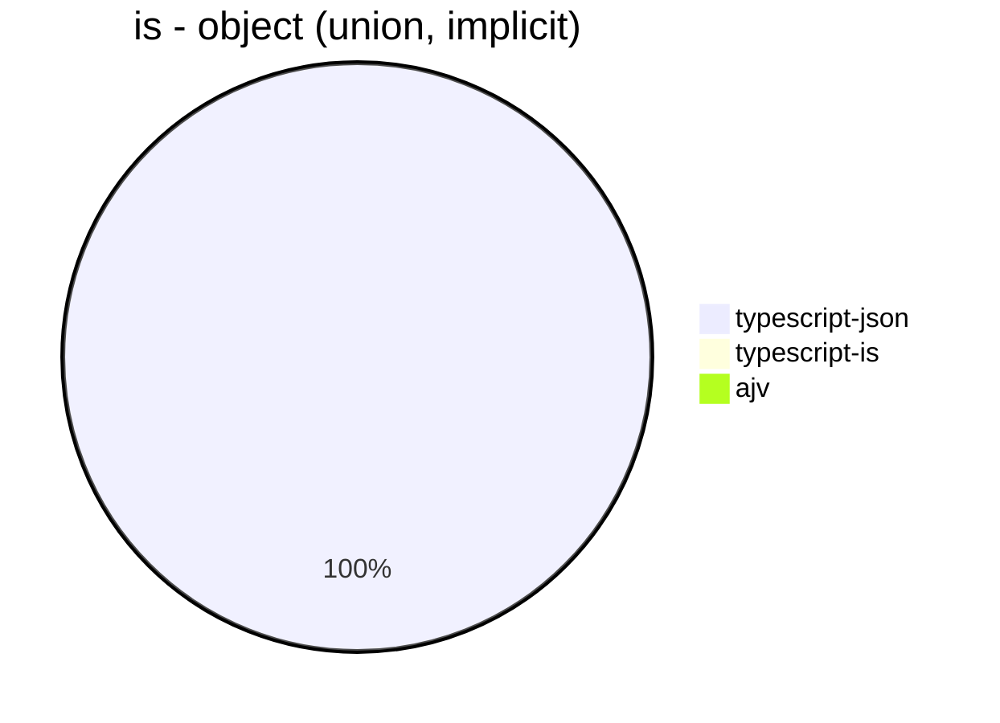
```mermaid
pie title is - object (union, implicit)
  "typescript-json": 19701.373825018076
  "typescript-is": 0
  "ajv": 0
```

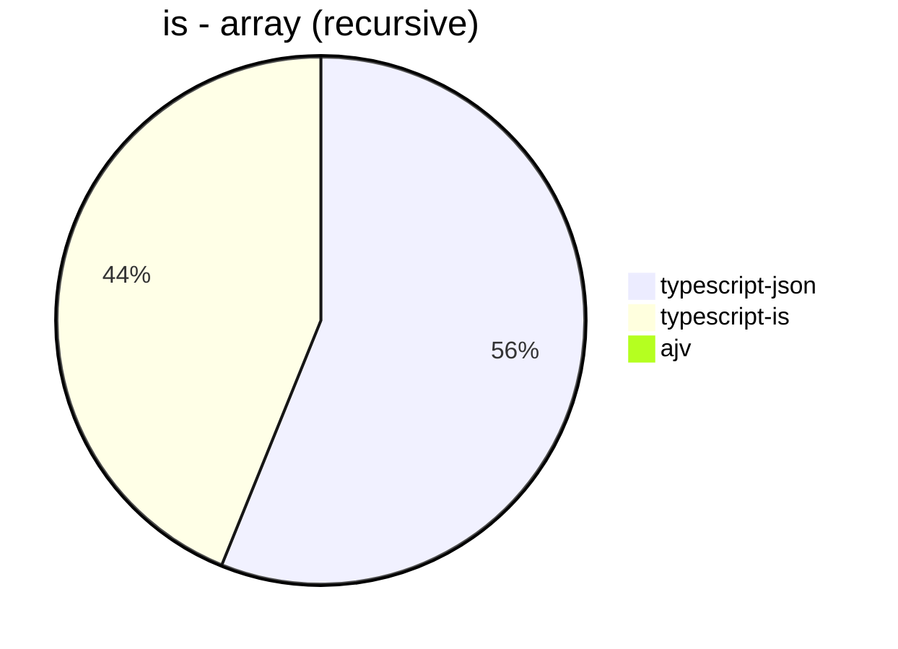
```mermaid
pie title is - array (recursive)
  "typescript-json": 6403.373670700404
  "typescript-is": 5005.852231163131
  "ajv": 0
```

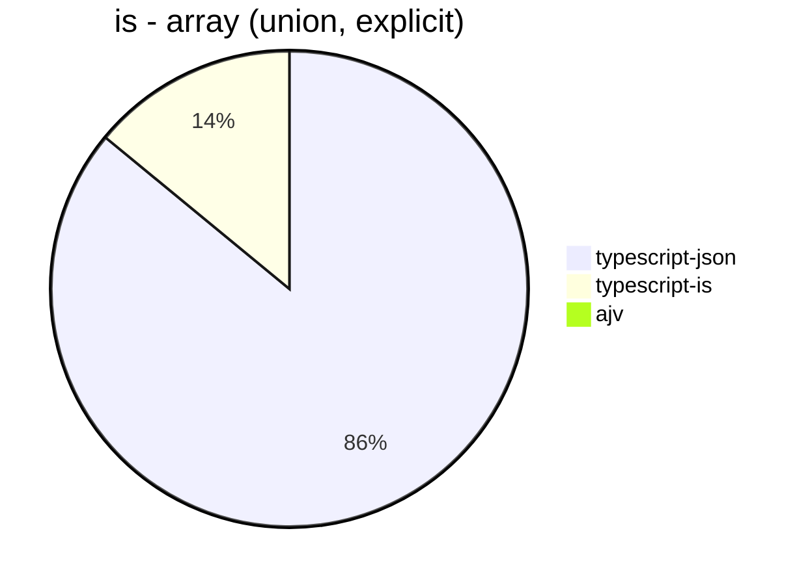
```mermaid
pie title is - array (union, explicit)
  "typescript-json": 7484.662576687117
  "typescript-is": 1220.8578038796938
  "ajv": 0
```

```mermaid
pie title is - array (union, implicit)
  "typescript-json": 7142.937853107345
  "typescript-is": 1378.057685286601
  "ajv": 0
```

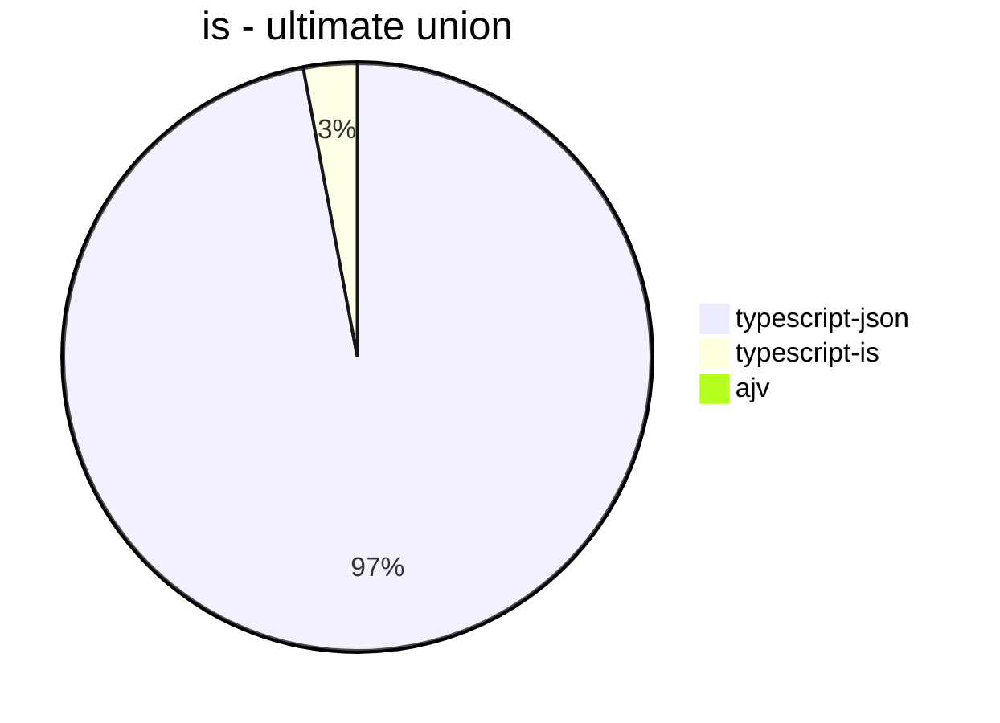
```mermaid
pie title is - ultimate union
  "typescript-json": 11405.535946498236
  "typescript-is": 345.575959933222
  "ajv": 0
```

## optimizer
 Components | typescript-json | fast-json-stringify | JSON.stringify() 
------------|-----------------|---------------------|------------------
object (simple) | 57382.73886527445 | 5.72655690765927 | 7466.750539180445
object (hierarchical) | 5668.063399526325 | 1.2970168612191957 | 1902.3150762281198
object (recursive) | 6628.56626941134 | 45.094239915448306 | 1433.4451901565997
object (union) | 2458.69365225391 | 1.095290251916758 | 1060.4510138336175
array (hierarchical) | 192.96974089508967 | 2.7958993476234855 | 90.08676389145283
array (recursive) | 292.9182596031312 | 38.65546218487395 | 147.08586137157565
array (union) | 441.52787834902244 | 2.2091310751104563 | 287.704309063893
ultimate union | 1332.162661737523 | Failed | 223.69389256806477

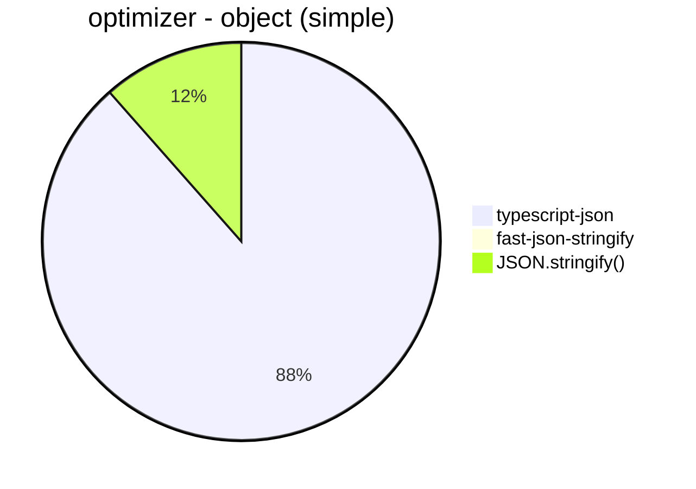
```mermaid
pie title optimizer - object (simple)
  "typescript-json": 57382.73886527445
  "fast-json-stringify": 5.72655690765927
  "JSON.stringify()": 7466.750539180445
```

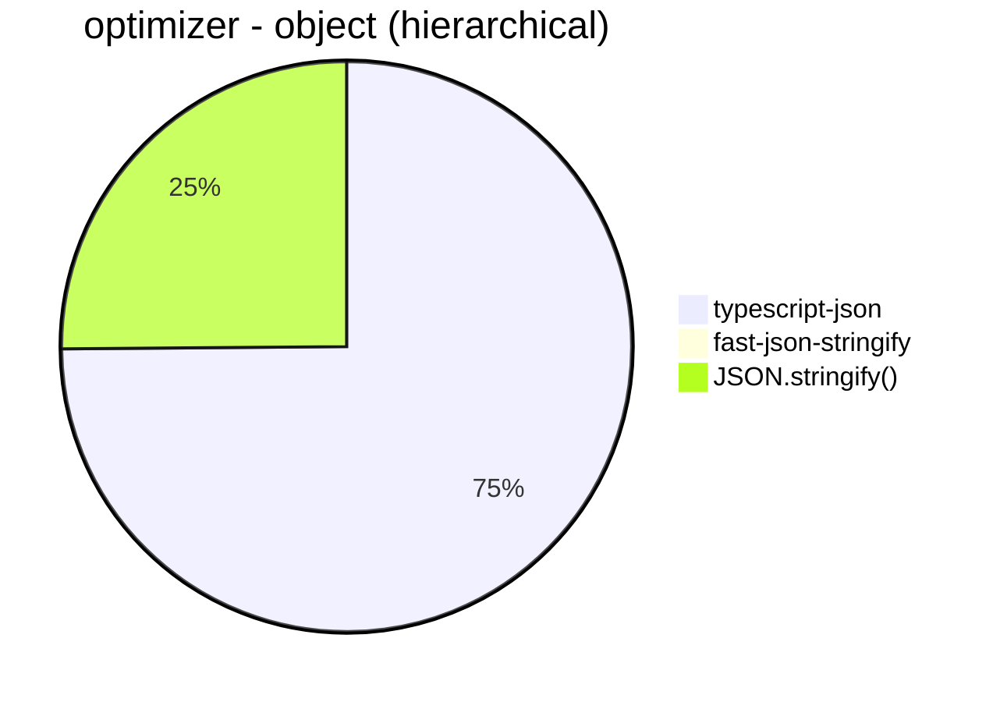
```mermaid
pie title optimizer - object (hierarchical)
  "typescript-json": 5668.063399526325
  "fast-json-stringify": 1.2970168612191957
  "JSON.stringify()": 1902.3150762281198
```

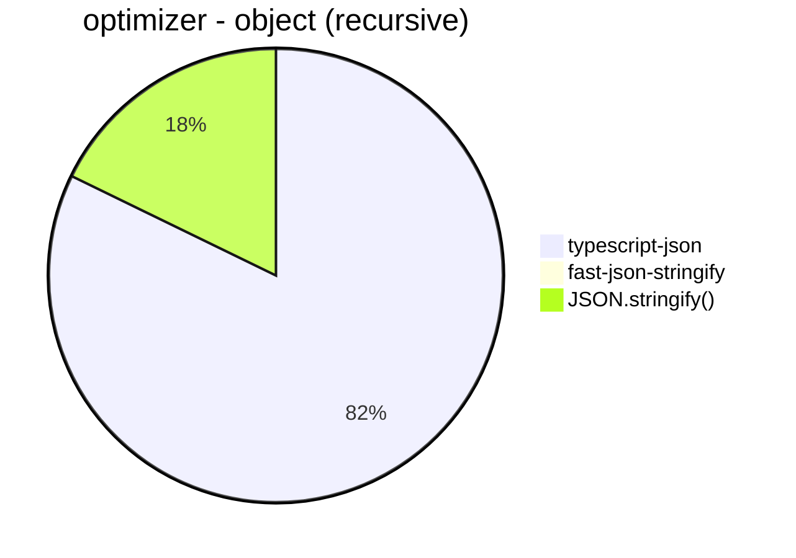
```mermaid
pie title optimizer - object (recursive)
  "typescript-json": 6628.56626941134
  "fast-json-stringify": 45.094239915448306
  "JSON.stringify()": 1433.4451901565997
```

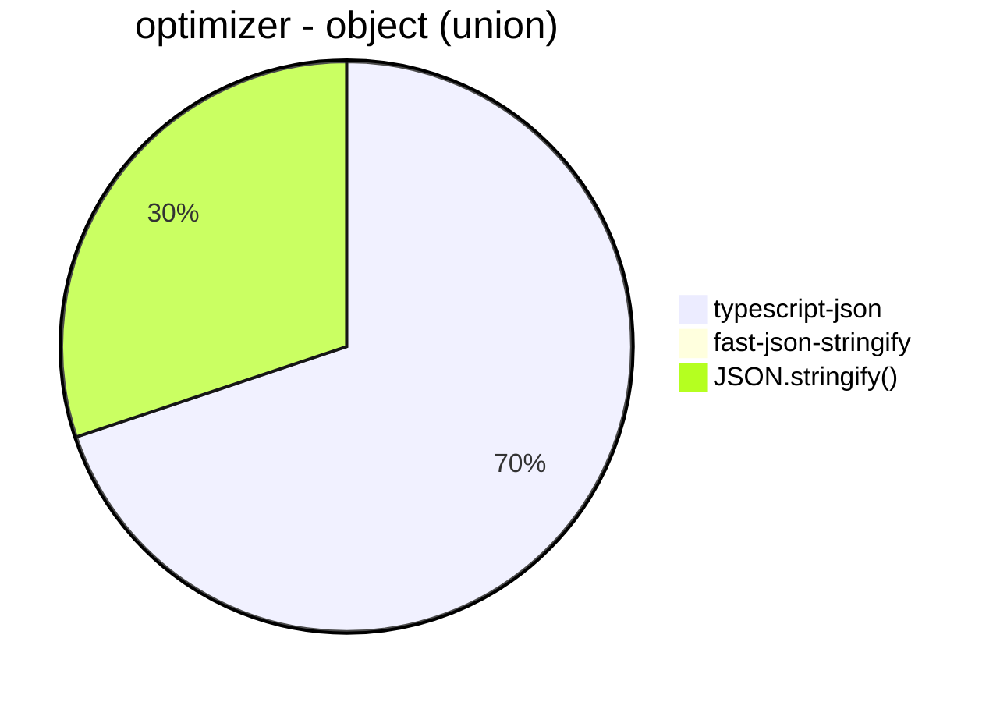
```mermaid
pie title optimizer - object (union)
  "typescript-json": 2458.69365225391
  "fast-json-stringify": 1.095290251916758
  "JSON.stringify()": 1060.4510138336175
```

```mermaid
pie title optimizer - array (hierarchical)
  "typescript-json": 192.96974089508967
  "fast-json-stringify": 2.7958993476234855
  "JSON.stringify()": 90.08676389145283
```

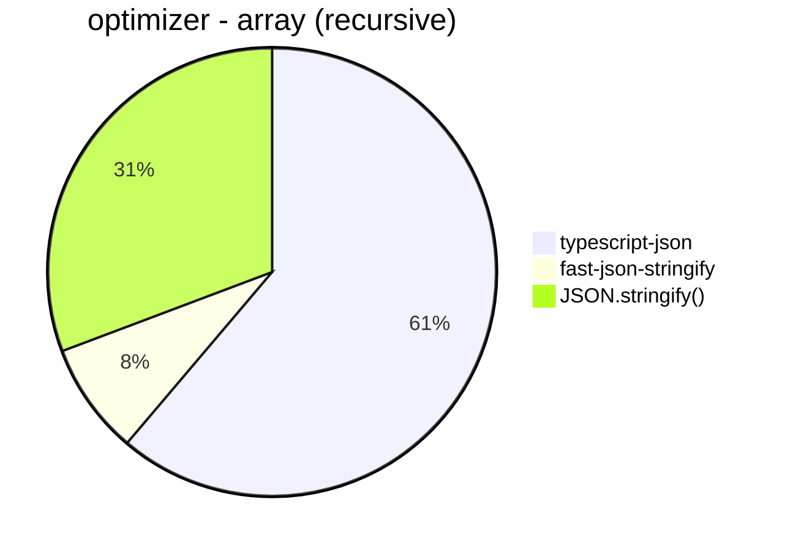
```mermaid
pie title optimizer - array (recursive)
  "typescript-json": 292.9182596031312
  "fast-json-stringify": 38.65546218487395
  "JSON.stringify()": 147.08586137157565
```

```mermaid
pie title optimizer - array (union)
  "typescript-json": 441.52787834902244
  "fast-json-stringify": 2.2091310751104563
  "JSON.stringify()": 287.704309063893
```

```mermaid
pie title optimizer - ultimate union
  "typescript-json": 1332.162661737523
  "fast-json-stringify": 0
  "JSON.stringify()": 223.69389256806477
```

## stringify
 Components | typescript-json | fast-json-stringify | JSON.stringify() 
------------|-----------------|---------------------|------------------
object (simple) | 57853.86297376093 | 47019.38490214352 | 7667.4132138857785
object (hierarchical) | 6037.28386167147 | 5669.482188762395 | 1922.709923664122
object (recursive) | 7377.659574468085 | 1434.8314606741574 | 1445.1116532182398
object (union) | 2437.3294524285975 | 2044.5848040126323 | 1012.7674878618953
array (hierarchical) | 112.11673439231622 | 181.15671641791045 | 51.26781417730891
array (recursive) | 303.01914580265094 | 150.15914622729827 | 149.79454613373179
array (union) | 456.9247546346783 | 260.43191800878475 | 290.6890130353817
ultimate union | 1311.3794365166484 | Failed | 224.9583410479541

```mermaid
pie title stringify - object (simple)
  "typescript-json": 57853.86297376093
  "fast-json-stringify": 47019.38490214352
  "JSON.stringify()": 7667.4132138857785
```

```mermaid
pie title stringify - object (hierarchical)
  "typescript-json": 6037.28386167147
  "fast-json-stringify": 5669.482188762395
  "JSON.stringify()": 1922.709923664122
```

```mermaid
pie title stringify - object (recursive)
  "typescript-json": 7377.659574468085
  "fast-json-stringify": 1434.8314606741574
  "JSON.stringify()": 1445.1116532182398
```

```mermaid
pie title stringify - object (union)
  "typescript-json": 2437.3294524285975
  "fast-json-stringify": 2044.5848040126323
  "JSON.stringify()": 1012.7674878618953
```

```mermaid
pie title stringify - array (hierarchical)
  "typescript-json": 112.11673439231622
  "fast-json-stringify": 181.15671641791045
  "JSON.stringify()": 51.26781417730891
```

```mermaid
pie title stringify - array (recursive)
  "typescript-json": 303.01914580265094
  "fast-json-stringify": 150.15914622729827
  "JSON.stringify()": 149.79454613373179
```

```mermaid
pie title stringify - array (union)
  "typescript-json": 456.9247546346783
  "fast-json-stringify": 260.43191800878475
  "JSON.stringify()": 290.6890130353817
```

```mermaid
pie title stringify - ultimate union
  "typescript-json": 1311.3794365166484
  "fast-json-stringify": 0
  "JSON.stringify()": 224.9583410479541
```

