# Benchmark of `typescript-json`
> CPU: Intel(R) Core(TM) i7-8750H CPU @ 2.20GHz
> Memory: 16,384 MB
> NodeJS version: v16.13.2

## assert
 Components | typescript-json | typescript-is 
------------|-----------------|---------------
object (hierarchical) | 12665.930018416208 | 13361.615083600143
object (recursive) | 15816.113048265737 | 11957.419590643274
object (union) | 2458.44600685055 | 950.9267431597528
array (recursive) | 698.6711585251732 | 751.5257192676547
array (union) | 1627.0543615676359 | 114.94863620262133
ultimate union | 2735.1302785265048 | 16.101108033240997

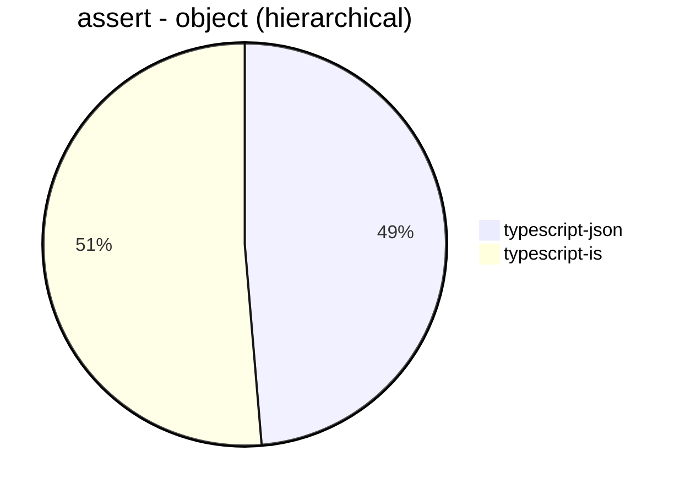
```mermaid
pie title assert - object (hierarchical)
  "typescript-json": 12665.930018416208
  "typescript-is": 13361.615083600143
```

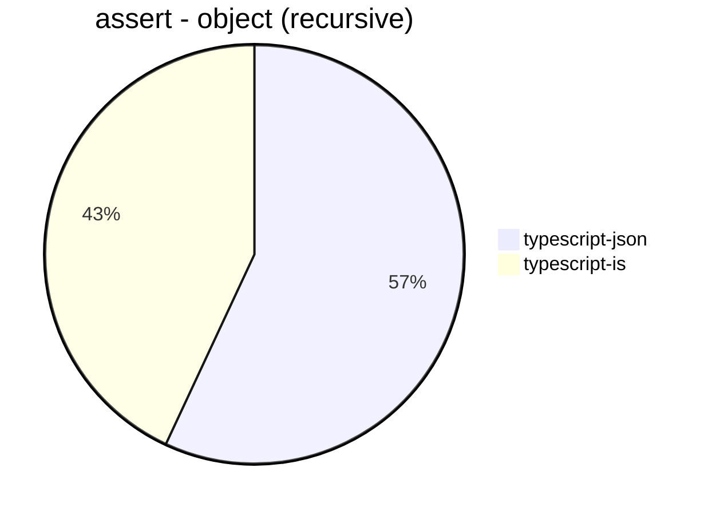
```mermaid
pie title assert - object (recursive)
  "typescript-json": 15816.113048265737
  "typescript-is": 11957.419590643274
```

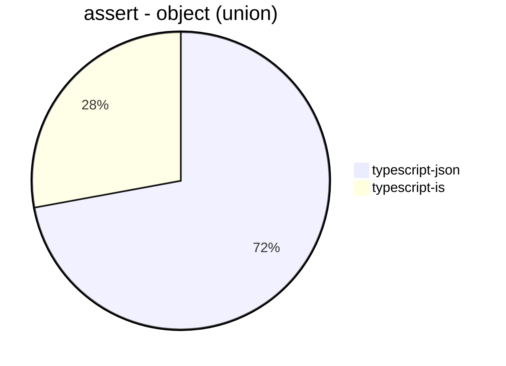
```mermaid
pie title assert - object (union)
  "typescript-json": 2458.44600685055
  "typescript-is": 950.9267431597528
```

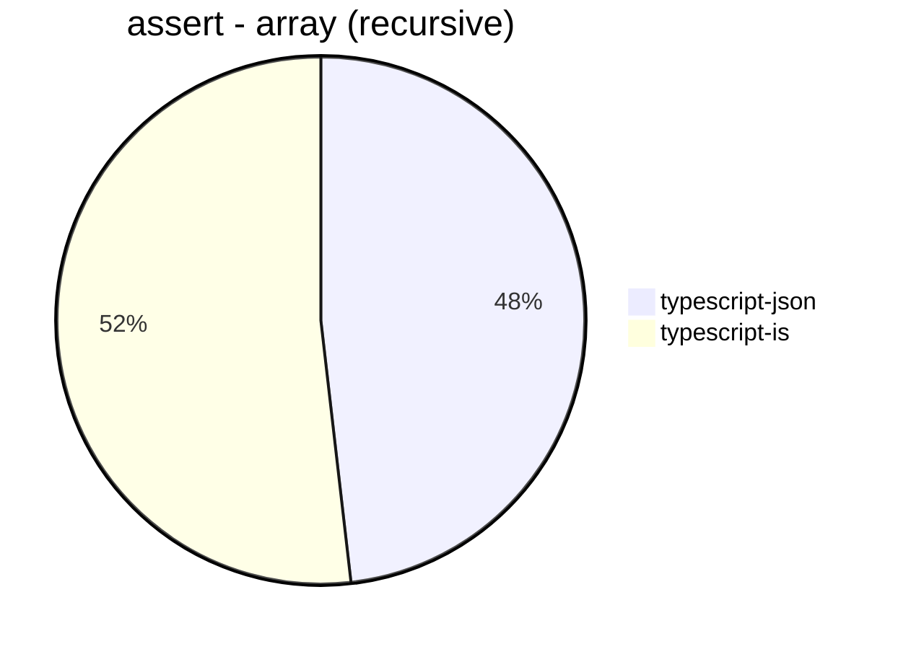
```mermaid
pie title assert - array (recursive)
  "typescript-json": 698.6711585251732
  "typescript-is": 751.5257192676547
```

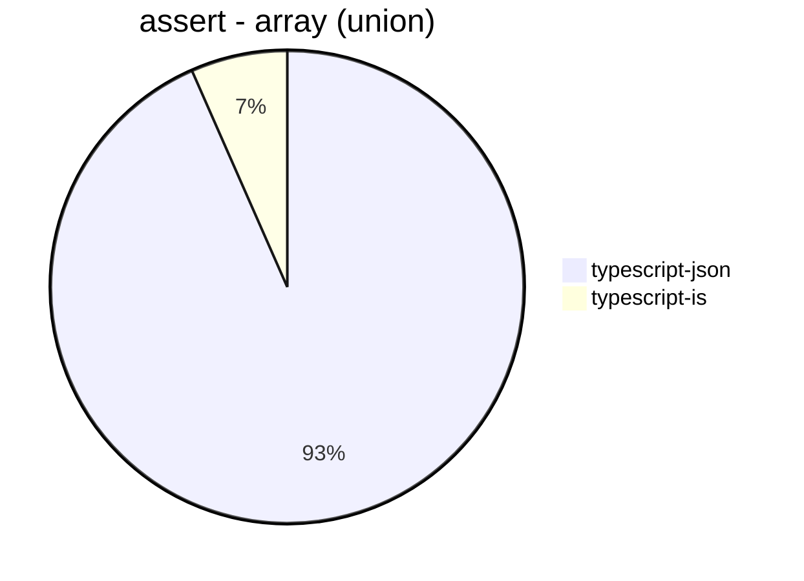
```mermaid
pie title assert - array (union)
  "typescript-json": 1627.0543615676359
  "typescript-is": 114.94863620262133
```

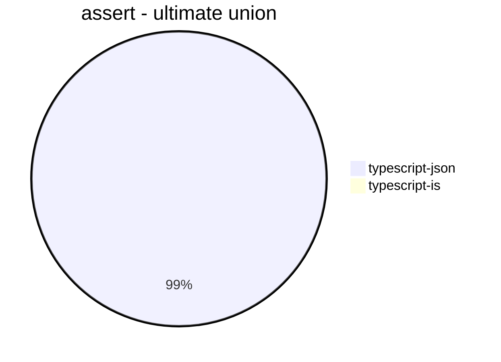
```mermaid
pie title assert - ultimate union
  "typescript-json": 2735.1302785265048
  "typescript-is": 16.101108033240997
```

## is
 Components | typescript-json | typescript-is | ajv 
------------|-----------------|---------------|-----
object (hierarchical) | 49439.47557471265 | 23531.312397894355 | 33871.06214494749
object (recursive) | 42808.171491388784 | 18704.319537321524 | Failed
object (union, explicit) | 6374.2429640185255 | Failed | 719.6500182282173
object (union, implicit) | 6448.852517345667 | Failed | Failed
array (recursive) | 3830.3229337712096 | 2315.8953722334004 | Failed
array (union, explicit) | 3440.0579500181093 | 517.6156583629893 | Failed
array (union, implicit) | 3885.5337078651687 | 563.5242290748898 | Failed
ultimate union | 6364.747269024255 | 151.54200638071606 | Failed

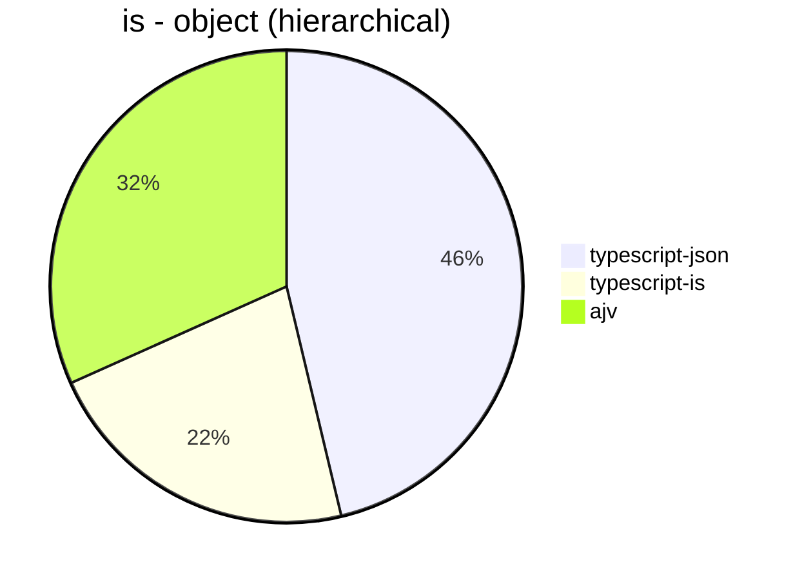
```mermaid
pie title is - object (hierarchical)
  "typescript-json": 49439.47557471265
  "typescript-is": 23531.312397894355
  "ajv": 33871.06214494749
```

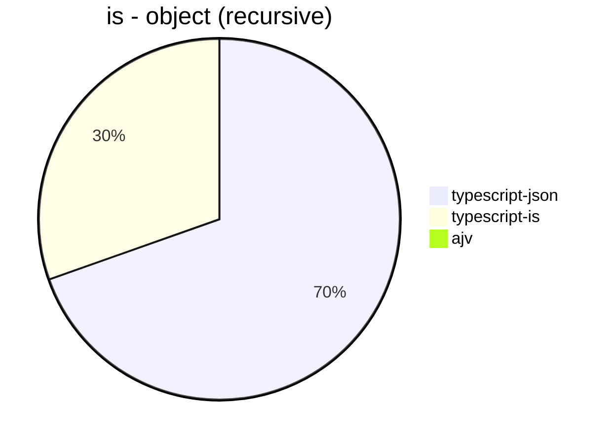
```mermaid
pie title is - object (recursive)
  "typescript-json": 42808.171491388784
  "typescript-is": 18704.319537321524
  "ajv": 0
```

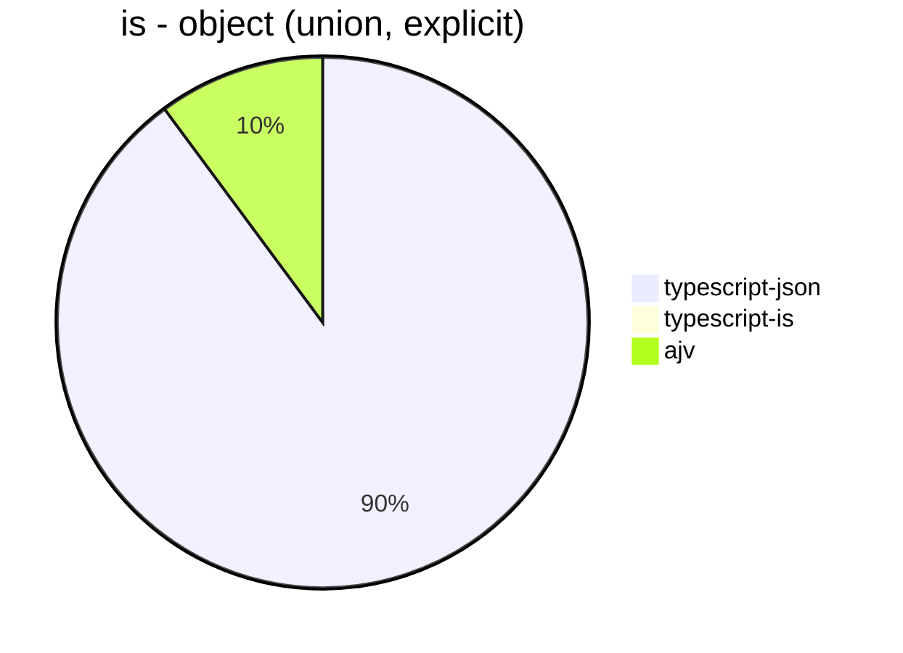
```mermaid
pie title is - object (union, explicit)
  "typescript-json": 6374.2429640185255
  "typescript-is": 0
  "ajv": 719.6500182282173
```

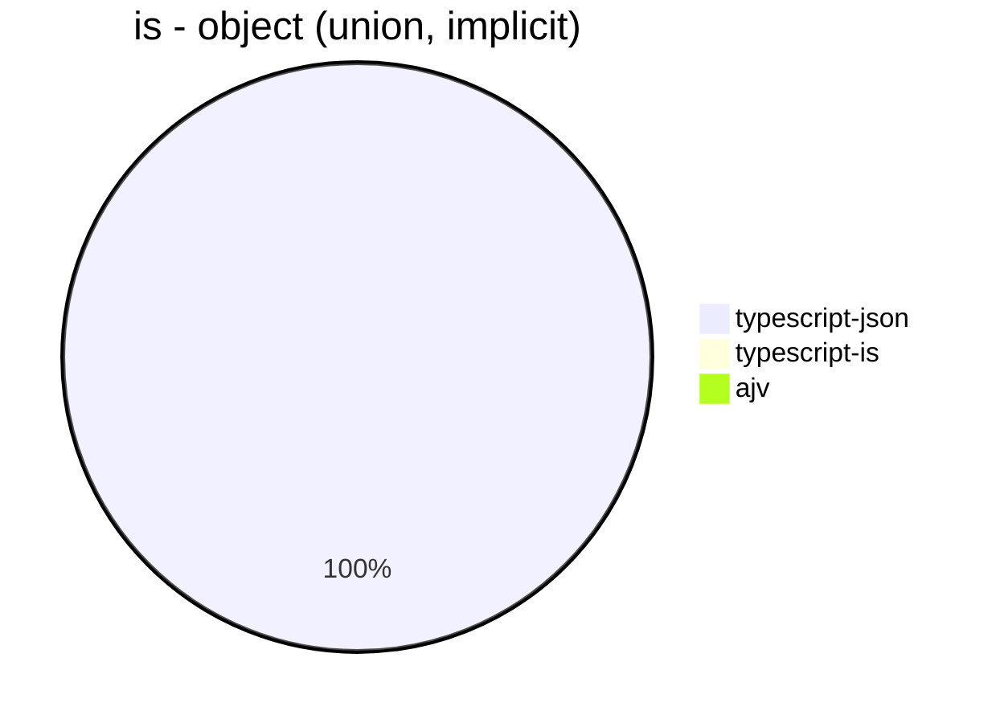
```mermaid
pie title is - object (union, implicit)
  "typescript-json": 6448.852517345667
  "typescript-is": 0
  "ajv": 0
```

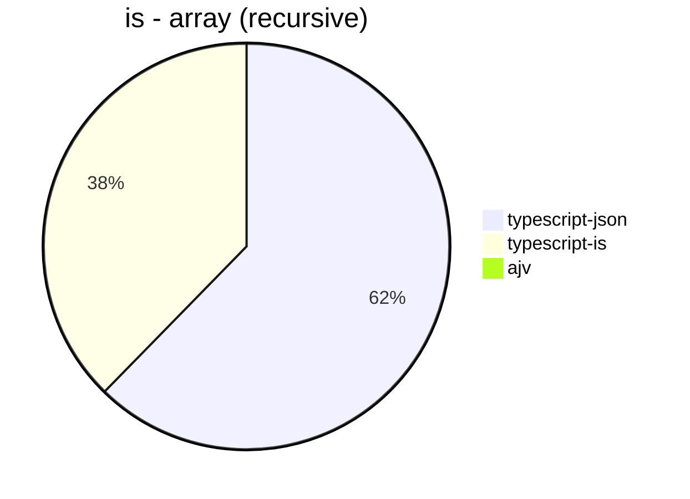
```mermaid
pie title is - array (recursive)
  "typescript-json": 3830.3229337712096
  "typescript-is": 2315.8953722334004
  "ajv": 0
```

```mermaid
pie title is - array (union, explicit)
  "typescript-json": 3440.0579500181093
  "typescript-is": 517.6156583629893
  "ajv": 0
```

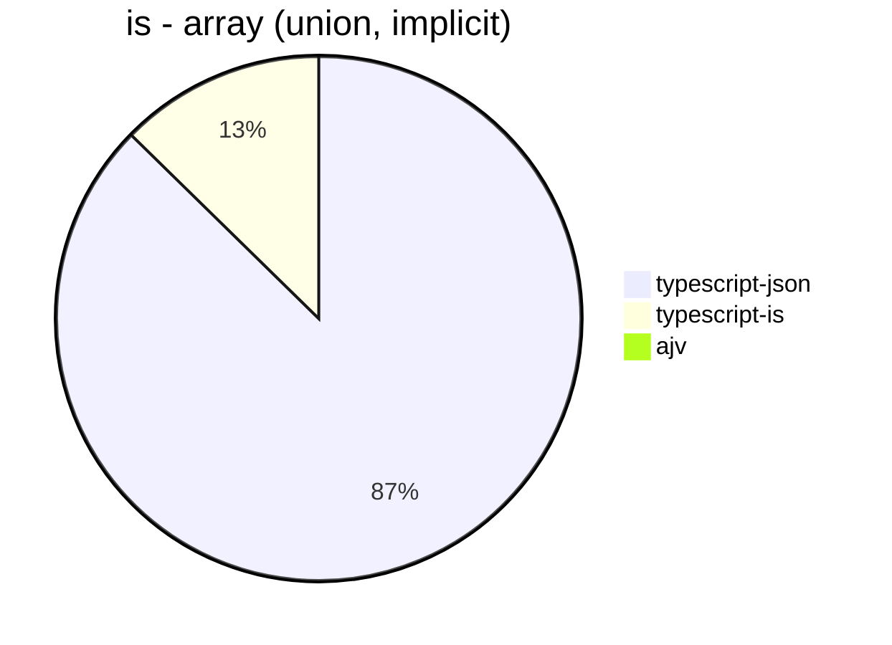
```mermaid
pie title is - array (union, implicit)
  "typescript-json": 3885.5337078651687
  "typescript-is": 563.5242290748898
  "ajv": 0
```

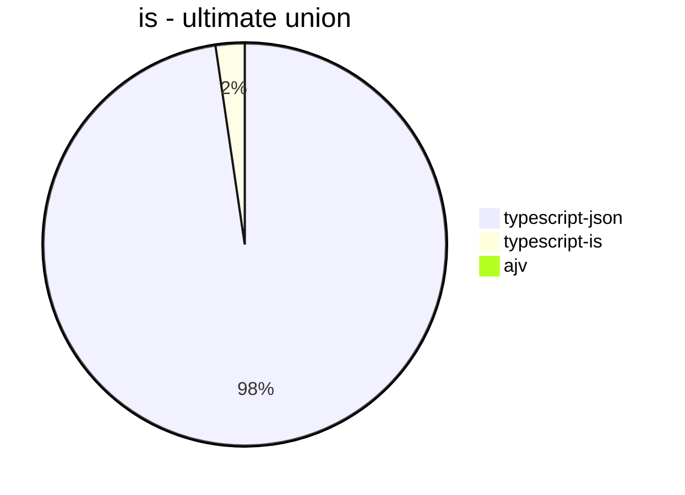
```mermaid
pie title is - ultimate union
  "typescript-json": 6364.747269024255
  "typescript-is": 151.54200638071606
  "ajv": 0
```

## optimizer
 Components | typescript-json | fast-json-stringify | JSON.stringify() 
------------|-----------------|---------------------|------------------
object (simple) | 20065.406976744187 | 3.1852769421341356 | 6269.909040282161
object (hierarchical) | 3014.3699336772293 | 0.7208506037123805 | 1359.6730245231608
object (recursive) | 2989.0889252591383 | 29.972247918593894 | 1153.3081285444234
object (union) | 1178.273967747652 | 0.5390835579514824 | 986.3820390136179
array (hierarchical) | 109.50110051357301 | 1.471129091577786 | 91.76688251618872
array (recursive) | 191.28195696155967 | 29.373729909477184 | 120.83256585006447
array (union) | 232.18852758494702 | 1.1102886750555145 | 280.13392857142856
ultimate union | 840.8304498269897 | Failed | 182.00109749405524

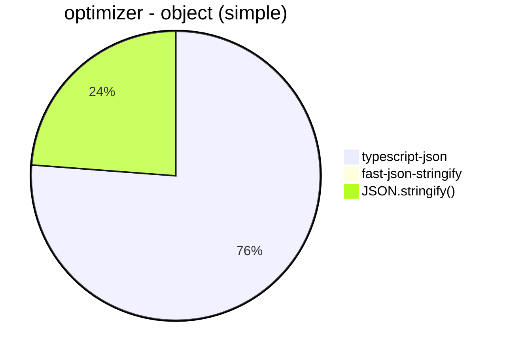
```mermaid
pie title optimizer - object (simple)
  "typescript-json": 20065.406976744187
  "fast-json-stringify": 3.1852769421341356
  "JSON.stringify()": 6269.909040282161
```

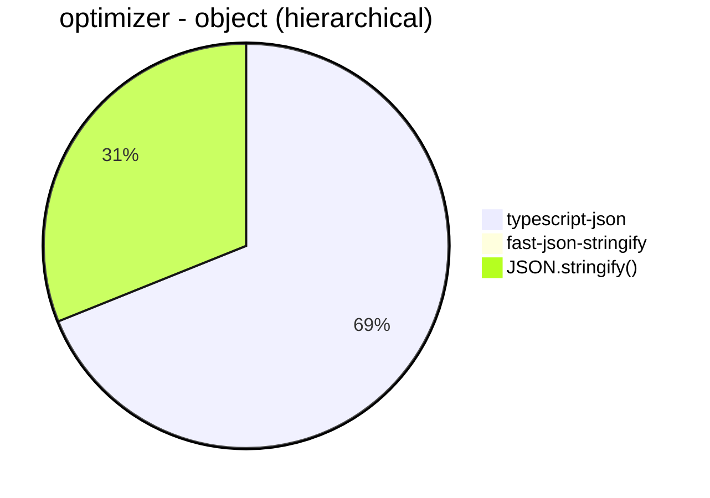
```mermaid
pie title optimizer - object (hierarchical)
  "typescript-json": 3014.3699336772293
  "fast-json-stringify": 0.7208506037123805
  "JSON.stringify()": 1359.6730245231608
```

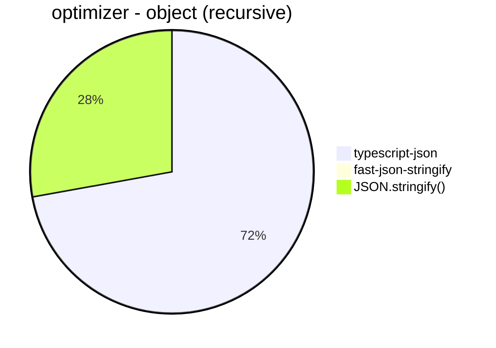
```mermaid
pie title optimizer - object (recursive)
  "typescript-json": 2989.0889252591383
  "fast-json-stringify": 29.972247918593894
  "JSON.stringify()": 1153.3081285444234
```

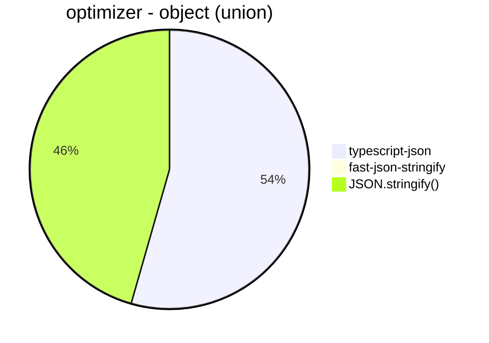
```mermaid
pie title optimizer - object (union)
  "typescript-json": 1178.273967747652
  "fast-json-stringify": 0.5390835579514824
  "JSON.stringify()": 986.3820390136179
```

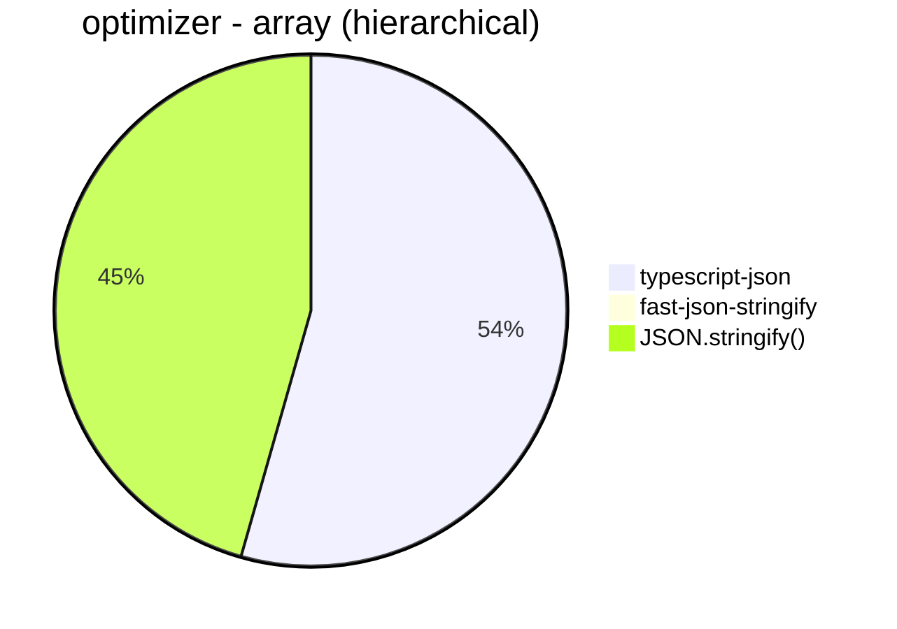
```mermaid
pie title optimizer - array (hierarchical)
  "typescript-json": 109.50110051357301
  "fast-json-stringify": 1.471129091577786
  "JSON.stringify()": 91.76688251618872
```

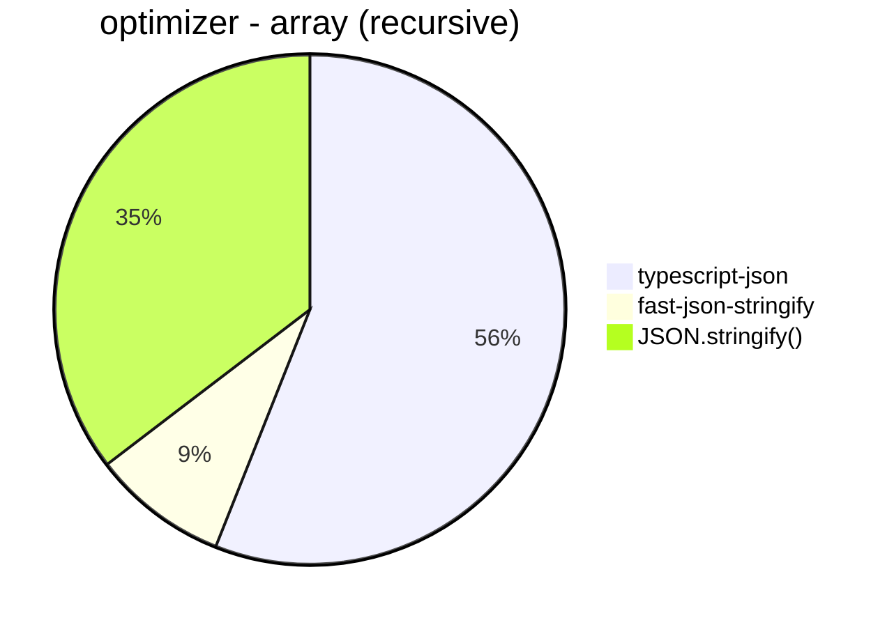
```mermaid
pie title optimizer - array (recursive)
  "typescript-json": 191.28195696155967
  "fast-json-stringify": 29.373729909477184
  "JSON.stringify()": 120.83256585006447
```

```mermaid
pie title optimizer - array (union)
  "typescript-json": 232.18852758494702
  "fast-json-stringify": 1.1102886750555145
  "JSON.stringify()": 280.13392857142856
```

```mermaid
pie title optimizer - ultimate union
  "typescript-json": 840.8304498269897
  "fast-json-stringify": 0
  "JSON.stringify()": 182.00109749405524
```

## stringify
 Components | typescript-json | fast-json-stringify | JSON.stringify() 
------------|-----------------|---------------------|------------------
object (simple) | 20256.38718963656 | 17378.29428989751 | 6902.641788287456
object (hierarchical) | 3727.7271915729334 | 3256.8824404761904 | 1786.3935625457207
object (recursive) | 2955.472769203477 | 1459.7980553477937 | 1107.700592353258
object (union) | 1238.6301866280123 | 876.8953068592058 | 1021.3824884792627
array (hierarchical) | 69.70755931579914 | 86.55101660138034 | 59.88805970149254
array (recursive) | 153.81876446501693 | 146.41860465116278 | 146.23338257016246
array (union) | 235.29411764705884 | 237.4191229331416 | 235.15263644773356
ultimate union | 833.9389534883721 | Failed | 211.5663524292966

```mermaid
pie title stringify - object (simple)
  "typescript-json": 20256.38718963656
  "fast-json-stringify": 17378.29428989751
  "JSON.stringify()": 6902.641788287456
```

```mermaid
pie title stringify - object (hierarchical)
  "typescript-json": 3727.7271915729334
  "fast-json-stringify": 3256.8824404761904
  "JSON.stringify()": 1786.3935625457207
```

```mermaid
pie title stringify - object (recursive)
  "typescript-json": 2955.472769203477
  "fast-json-stringify": 1459.7980553477937
  "JSON.stringify()": 1107.700592353258
```

```mermaid
pie title stringify - object (union)
  "typescript-json": 1238.6301866280123
  "fast-json-stringify": 876.8953068592058
  "JSON.stringify()": 1021.3824884792627
```

```mermaid
pie title stringify - array (hierarchical)
  "typescript-json": 69.70755931579914
  "fast-json-stringify": 86.55101660138034
  "JSON.stringify()": 59.88805970149254
```

```mermaid
pie title stringify - array (recursive)
  "typescript-json": 153.81876446501693
  "fast-json-stringify": 146.41860465116278
  "JSON.stringify()": 146.23338257016246
```

```mermaid
pie title stringify - array (union)
  "typescript-json": 235.29411764705884
  "fast-json-stringify": 237.4191229331416
  "JSON.stringify()": 235.15263644773356
```

```mermaid
pie title stringify - ultimate union
  "typescript-json": 833.9389534883721
  "fast-json-stringify": 0
  "JSON.stringify()": 211.5663524292966
```

