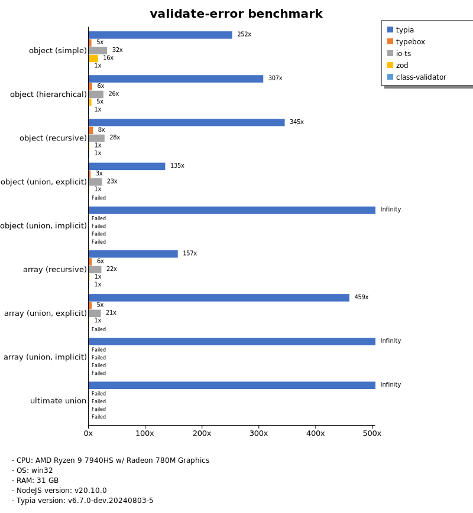

# Benchmark of `typia`
> - CPU: AMD Ryzen 9 7940HS w/ Radeon 780M Graphics
> - Memory: 31,954 MB
> - OS: win32
> - NodeJS version: v20.10.0
> - Typia version: v6.7.0-dev.20240803-5

## is

 Types | typia | typebox | ajv | io-ts | zod | class-validator 
-------|------|------|------|------|------|------
 object (simple) | 199,973 | 199,500 | 7,619 | 808 | 115 | 9.89 
 object (hierarchical) | 192,189 | 34,833 | 11,204 | 1,255 | 63 | 19 
 object (recursive) | 24,531 | 20,977 | 8,080 | 1,168 | 11 | 13 
 object (union, explicit) | 6,487 | 2,811 | 222 | 636 | 6.36 |  -  
 object (union, implicit) | 5,590 |  -  |  -  |  -  |  -  |  -  
 array (recursive) | 10,506 | 10,819 | 3,932 | 1,223 | 14 | 14 
 array (union, explicit) | 4,492 | 2,510 | 385 | 453 | 2.92 |  -  
 array (union, implicit) | 3,567 |  -  |  -  |  -  |  -  |  -  
 ultimate union | 1,524 |  -  |  -  |  -  |  -  |  -  

> Unit: Megabytes/sec

## assert

 Types | typia | typebox | ajv | io-ts | zod | class-validator 
-------|------|------|------|------|------|------
 object (simple) | 198,734 | 203,390 | 7,721 | 819 | 117 | 10 
 object (hierarchical) | 201,822 | 35,154 | 10,983 | 1,213 | 60 | 19 
 object (recursive) | 23,829 | 20,815 | 8,024 | 1,141 | 11 | 18 
 object (union, explicit) | 6,122 | 2,822 | 226 | 671 | 6.33 |  -  
 object (union, implicit) | 4,909 |  -  |  -  |  -  |  -  |  -  
 array (recursive) | 10,609 | 9,488 | 3,935 | 1,227 | 15 | 14 
 array (union, explicit) | 4,403 | 2,567 | 402 | 462 | 2.87 |  -  
 array (union, implicit) | 3,509 |  -  |  -  |  -  |  -  |  -  
 ultimate union | 1,540 |  -  |  -  |  -  |  -  |  -  

> Unit: Megabytes/sec

## validate

 Types | typia | typebox | ajv | io-ts | zod | class-validator 
-------|------|------|------|------|------|------
 object (simple) | 189,413 | 195,079 | 6,978 | 783 | 118 | 10 
 object (hierarchical) | 60,160 | 33,863 | 9,780 | 1,278 | 62 | 14 
 object (recursive) | 23,410 | 20,846 | 7,881 | 1,148 | 11 | 18 
 object (union, explicit) | 6,268 | 2,725 | 134 | 665 | 6.25 |  -  
 object (union, implicit) | 5,271 |  -  |  -  |  -  |  -  |  -  
 array (recursive) | 11,076 | 10,529 | 3,744 | 1,275 | 15 | 14 
 array (union, explicit) | 4,666 | 2,438 | 173 | 443 | 2.90 |  -  
 array (union, implicit) | 3,516 |  -  |  -  |  -  |  -  |  -  
 ultimate union | 1,541 |  -  |  -  |  -  |  -  |  -  

> Unit: Megabytes/sec

## assert-error

 Types | typia | typebox | io-ts | zod | class-validator 
-------|------|------|------|------|------
 object (simple) | 815 | 34 | 204 | 110 | 6.75 
 object (hierarchical) | 3,420 | 76 | 259 | 61 | 12 
 object (recursive) | 2,978 | 56 | 202 | 10 | 11 
 object (union, explicit) | 882 | 20 | 132 | 5.95 |  -  
 object (union, implicit) | 587 |  -  |  -  |  -  |  -  
 array (recursive) | 1,692 | 53 | 202 | 14 | 9.40 
 array (union, explicit) | 1,631 | 15 | 63 | 2.89 |  -  
 array (union, implicit) | 1,414 |  -  |  -  |  -  |  -  
 ultimate union | 385 |  -  |  -  |  -  |  -  

> Unit: Megabytes/sec

## validate-error

 Types | typia | typebox | io-ts | zod | class-validator 
-------|------|------|------|------|------
 object (simple) | 1,760 | 34 | 226 | 114 | 6.97 
 object (hierarchical) | 3,849 | 77 | 325 | 61 | 13 
 object (recursive) | 2,601 | 58 | 210 | 10 | 7.54 
 object (union, explicit) | 815 | 20 | 140 | 6.05 |  -  
 object (union, implicit) | 548 |  -  |  -  |  -  |  -  
 array (recursive) | 1,475 | 53 | 209 | 13 | 9.40 
 array (union, explicit) | 1,325 | 15 | 62 | 2.89 |  -  
 array (union, implicit) | 1,096 |  -  |  -  |  -  |  -  
 ultimate union | 342 |  -  |  -  |  -  |  -  

> Unit: Megabytes/sec

## optimizer

 Types | typia | typebox | ajv | class-validator 
-------|------|------|------|------
 object (simple) | 202,498 | 8.44 | 0.04 | 10 
 object (hierarchical) | 83,879 | 17 | 0.15 | 19 
 object (recursive) | 29,526 | 89 | 0.34 | 18 
 object (union, explicit) | 6,471 | 18 | 0.17 | 19 
 array (simple) | 23,776 | 129 | 0.36 | 42 
 array (hierarchical) | 40,544 | 950 | 8.16 | 35 
 array (recursive) | 11,863 | 940 | 3.31 | 14 
 array (union, explicit) | 8,193 | 194 | 1.08 | 51 

> Unit: Megabytes/sec

## stringify

 Types | typia.stringify | typia.isStringify | typia.assertStringify | fast-json-stringify | JSON.stringify | class-transformer 
-------|------|------|------|------|------|------
 object (simple) | 1,976 | 1,027 | 1,068 | 703 | 120 | 9.98 
 object (hierarchical) | 882 | 835 | 890 | 808 | 187 | 20 
 object (recursive) | 1,066 | 1,007 | 1,017 | 855 | 195 | 18 
 object (union, explicit) | 307 | 287 | 300 | 216 | 121 | 7.34 
 array (simple) | 391 | 385 | 397 | 602 | 240 | 19 
 array (hierarchical) | 494 | 472 | 472 | 811 | 199 | 14 
 array (recursive) | 413 | 398 | 401 | 807 | 196 | 16 
 array (union, explicit) | 368 | 340 | 339 | 80 | 247 | 16 

> Unit: Megabytes/sec

## server-assert

 Types | fastify-typia | fastify-pure | fastify-class-transformer | express-typia | express-class-transformer 
-------|------|------|------|------|------
 object (simple) | 88 | 87 | 7.64 | 56 | 6.86 
 object (hierarchical) | 173 | 166 | 13 | 133 | 13 
 object (recursive) | 159 | 158 | 11 | 135 | 11 
 object (union, explicit) | 105 | 68 | 4.44 | 81 | 4.18 
 array (simple) | 158 | 150 | 12 | 131 | 10 
 array (hierarchical) | 109 | 137 | 7.62 | 128 | 6.54 
 array (recursive) | 138 | 133 | 8.29 | 118 | 8.31 
 array (union, explicit) | 160 | 106 | 8.30 | 148 | 8.26 

> Unit: Megabytes/sec

## server-stringify

 Types | fastify-typia | fastify-pure | fastify-class-transformer | express-typia | express-pure | express-class-transformer 
-------|------|------|------|------|------|------
 object (simple) | 148 | 137 | 8.94 | 76 | 56 | 8.46 
 object (hierarchical) | 227 | 221 | 17 | 177 | 125 | 17 
 object (recursive) | 238 | 202 | 14 | 195 | 133 | 14 
 object (union, explicit) | 173 | 102 | 6.09 | 146 | 91 | 5.18 
 array (simple) | 162 | 157 | 14 | 164 | 142 | 15 
 array (hierarchical) | 184 | 138 | 12 | 178 | 130 | 12 
 array (recursive) | 150 | 97 | 12 | 154 | 132 | 12 
 array (union, explicit) | 161 | 39 | 13 | 150 | 166 | 13 

> Unit: Megabytes/sec

## server-performance

 Types | fastify-typia | fastify-pure | fastify-class-transformer | express-typia | express-class-transformer 
-------|------|------|------|------|------
 object (simple) | 127 | 123 | 10 | 80 | 14 
 object (hierarchical) | 202 | 192 | 18 | 162 | 26 
 object (recursive) | 195 | 188 | 15 | 169 | 21 
 object (union, explicit) | 130 | 81 | 4.41 | 107 | 4.18 
 array (simple) | 163 | 170 | 10 | 151 | 9.92 
 array (hierarchical) | 117 | 102 | 6.02 | 99 | 7.73 
 array (recursive) | 146 | 148 | 12 | 137 | 17 
 array (union, explicit) | 161 | 58 | 8.26 | 153 | 8.07 

> Unit: Megabytes/sec

Total elapsed time: 4,343,526 ms
