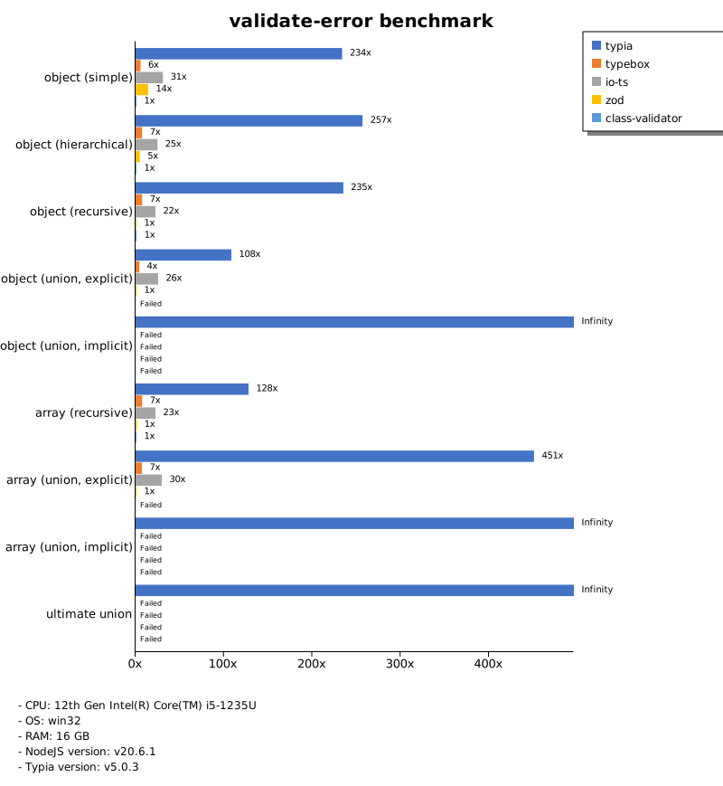

# Benchmark of `typia`
> - CPU: 12th Gen Intel(R) Core(TM) i5-1235U
> - Memory: 16,209 MB
> - OS: win32
> - NodeJS version: v20.6.1
> - Typia version: v5.0.3

## is

 Types | typia | typebox | ajv | io-ts | zod | class-validator 
-------|------|------|------|------|------|------
 object (simple) | 183,925 | 182,308 | 4,855 | 494 | 74 | 7.63 
 object (hierarchical) | 21,146 | 20,662 | 6,272 | 806 | 46 | 13 
 object (recursive) | 13,270 | 13,378 | 2,151 | 702 | 7.66 | 12 
 object (union, explicit) | 2,751 | 1,680 | 147 | 441 | 4.54 |  -  
 object (union, implicit) | 2,535 |  -  |  -  |  -  |  -  |  -  
 array (recursive) | 7,511 | 8,204 | 2,753 | 704 | 10 | 11 
 array (union, explicit) | 2,593 | 1,459 | 245 | 297 | 1.90 |  -  
 array (union, implicit) | 2,398 |  -  |  -  |  -  |  -  |  -  
 ultimate union | 753 |  -  |  -  |  -  |  -  |  -  

> Unit: Megabytes/sec

## assert

 Types | typia | typebox | ajv | io-ts | zod | class-validator 
-------|------|------|------|------|------|------
 object (simple) | 181,564 | 173,786 | 4,756 | 455 | 72 | 7.39 
 object (hierarchical) | 16,022 | 20,136 | 6,299 | 792 | 46 | 13 
 object (recursive) | 12,717 | 13,651 | 2,108 | 691 | 7.72 | 12 
 object (union, explicit) | 2,674 | 1,646 | 147 | 444 | 4.50 |  -  
 object (union, implicit) | 2,376 |  -  |  -  |  -  |  -  |  -  
 array (recursive) | 7,423 | 8,153 | 2,728 | 696 | 5.66 | 9.84 
 array (union, explicit) | 2,626 | 1,429 | 244 | 301 | 1.89 |  -  
 array (union, implicit) | 2,419 |  -  |  -  |  -  |  -  |  -  
 ultimate union | 735 |  -  |  -  |  -  |  -  |  -  

> Unit: Megabytes/sec

## validate

 Types | typia | typebox | ajv | io-ts | zod | class-validator 
-------|------|------|------|------|------|------
 object (simple) | 179,124 | 179,819 | 4,778 | 495 | 71 | 7.21 
 object (hierarchical) | 12,460 | 20,544 | 6,245 | 810 | 46 | 13 
 object (recursive) | 12,728 | 13,489 | 2,155 | 715 | 7.74 | 12 
 object (union, explicit) | 2,727 | 1,637 | 95 | 434 | 4.51 |  -  
 object (union, implicit) | 2,508 |  -  |  -  |  -  |  -  |  -  
 array (recursive) | 8,034 | 8,039 | 2,353 | 704 | 7.44 | 7.58 
 array (union, explicit) | 2,648 | 1,410 | 115 | 308 | 1.92 |  -  
 array (union, implicit) | 2,389 |  -  |  -  |  -  |  -  |  -  
 ultimate union | 738 |  -  |  -  |  -  |  -  |  -  

> Unit: Megabytes/sec

## assert-error

 Types | typia | typebox | io-ts | zod | class-validator 
-------|------|------|------|------|------
 object (simple) | 498 | 28 | 129 | 68 | 4.78 
 object (hierarchical) | 2,040 | 68 | 220 | 45 | 9.19 
 object (recursive) | 1,755 | 53 | 159 | 7.04 | 8.22 
 object (union, explicit) | 463 | 17 | 101 | 4.16 |  -  
 object (union, implicit) | 341 |  -  |  -  |  -  |  -  
 array (recursive) | 1,257 | 52 | 161 | 9.40 | 7.04 
 array (union, explicit) | 994 | 13 | 56 | 1.89 |  -  
 array (union, implicit) | 867 |  -  |  -  |  -  |  -  
 ultimate union | 244 |  -  |  -  |  -  |  -  

> Unit: Megabytes/sec

## validate-error

 Types | typia | typebox | io-ts | zod | class-validator 
-------|------|------|------|------|------
 object (simple) | 1,142 | 27 | 151 | 69 | 4.89 
 object (hierarchical) | 2,397 | 68 | 232 | 45 | 9.33 
 object (recursive) | 1,703 | 53 | 163 | 7.24 | 8.46 
 object (union, explicit) | 444 | 17 | 105 | 4.09 |  -  
 object (union, implicit) | 291 |  -  |  -  |  -  |  -  
 array (recursive) | 896 | 52 | 158 | 9.55 | 7.01 
 array (union, explicit) | 838 | 13 | 55 | 1.86 |  -  
 array (union, implicit) | 679 |  -  |  -  |  -  |  -  
 ultimate union | 208 |  -  |  -  |  -  |  -  

> Unit: Megabytes/sec

## optimizer

 Types | typia | typebox | ajv | class-validator 
-------|------|------|------|------
 object (simple) | 181,564 | 5.33 | 0.02 | 7.55 
 object (hierarchical) | 18,949 | 11 | 0.10 | 14 
 object (recursive) | 16,999 | 60 | 0.21 | 12 
 object (union, explicit) | 2,825 | 12 | 0.10 | 13 
 array (simple) | 12,404 | 156 | 0.22 | 30 
 array (hierarchical) | 25,155 | 739 | 8.42 | 24 
 array (recursive) | 8,341 | 621 | 2.13 | 10 
 array (union, explicit) | 5,005 | 123 | 0.69 | 32 

> Unit: Megabytes/sec

## stringify

 Types | typia.stringify | typia.isStringify | typia.assertStringify | fast-json-stringify | JSON.stringify | class-transformer 
-------|------|------|------|------|------|------
 object (simple) | 1,275 | 1,110 | 1,016 | 421 | 80 | 6.78 
 object (hierarchical) | 570 | 520 | 523 | 333 | 132 | 7.76 
 object (recursive) | 566 | 536 | 542 | 160 | 138 | 11 
 object (union, explicit) | 187 | 167 | 170 | 138 | 90 | 5.04 
 array (simple) | 224 | 219 | 222 | 352 | 154 | 13 
 array (hierarchical) | 295 | 292 | 289 | 428 | 146 | 10 
 array (recursive) | 270 | 256 | 260 | 468 | 139 | 11 
 array (union, explicit) | 220 | 209 | 212 | 54 | 178 | 10 

> Unit: Megabytes/sec

## server-assert

 Types | fastify-typia | fastify-pure | fastify-class-transformer | express-typia | express-class-transformer 
-------|------|------|------|------|------
 object (simple) | 69 | 66 | 5.80 | 49 | 5.34 
 object (hierarchical) | 119 | 114 | 10 | 112 | 9.97 
 object (recursive) | 110 | 104 | 8.16 | 108 | 7.77 
 object (union, explicit) | 73 | 47 | 2.97 | 72 | 2.96 
 array (simple) | 99 | 101 | 7.66 | 99 | 7.04 
 array (hierarchical) | 62 | 67 | 2.35 | 66 | 3.50 
 array (recursive) | 89 | 86 | 5.81 | 95 | 5.79 
 array (union, explicit) | 104 | 70 | 5.32 | 108 | 5.78 

> Unit: Megabytes/sec

## server-stringify

 Types | fastify-typia | fastify-pure | fastify-class-transformer | express-typia | express-pure | express-class-transformer 
-------|------|------|------|------|------|------
 object (simple) | 120 | 112 | 6.45 | 62 | 46 | 5.93 
 object (hierarchical) | 185 | 142 | 12 | 140 | 89 | 12 
 object (recursive) | 179 | 85 | 10 | 140 | 91 | 10 
 object (union, explicit) | 126 | 76 | 4.51 | 103 | 68 | 4.58 
 array (simple) | 121 | 105 | 11 | 108 | 100 | 11 
 array (hierarchical) | 136 | 60 | 8.67 | 130 | 101 | 8.95 
 array (recursive) | 128 | 90 | 8.79 | 129 | 91 | 9.12 
 array (union, explicit) | 130 | 32 | 8.55 | 115 | 111 | 8.71 

> Unit: Megabytes/sec

## server-performance

 Types | fastify-typia | fastify-pure | fastify-class-transformer | express-typia | express-class-transformer 
-------|------|------|------|------|------
 object (simple) | 95 | 91 | 7.51 | 63 | 11 
 object (hierarchical) | 147 | 128 | 14 | 118 | 21 
 object (recursive) | 138 | 88 | 12 | 114 | 15 
 object (union, explicit) | 91 | 57 | 3.02 | 75 | 3.03 
 array (simple) | 110 | 103 | 6.92 | 95 | 8.64 
 array (hierarchical) | 95 | 73 | 4.24 | 79 | 3.62 
 array (recursive) | 95 | 102 | 8.13 | 99 | 12 
 array (union, explicit) | 110 | 42 | 5.56 | 100 | 5.65 

> Unit: Megabytes/sec

Total elapsed time: 4,841,310 ms
