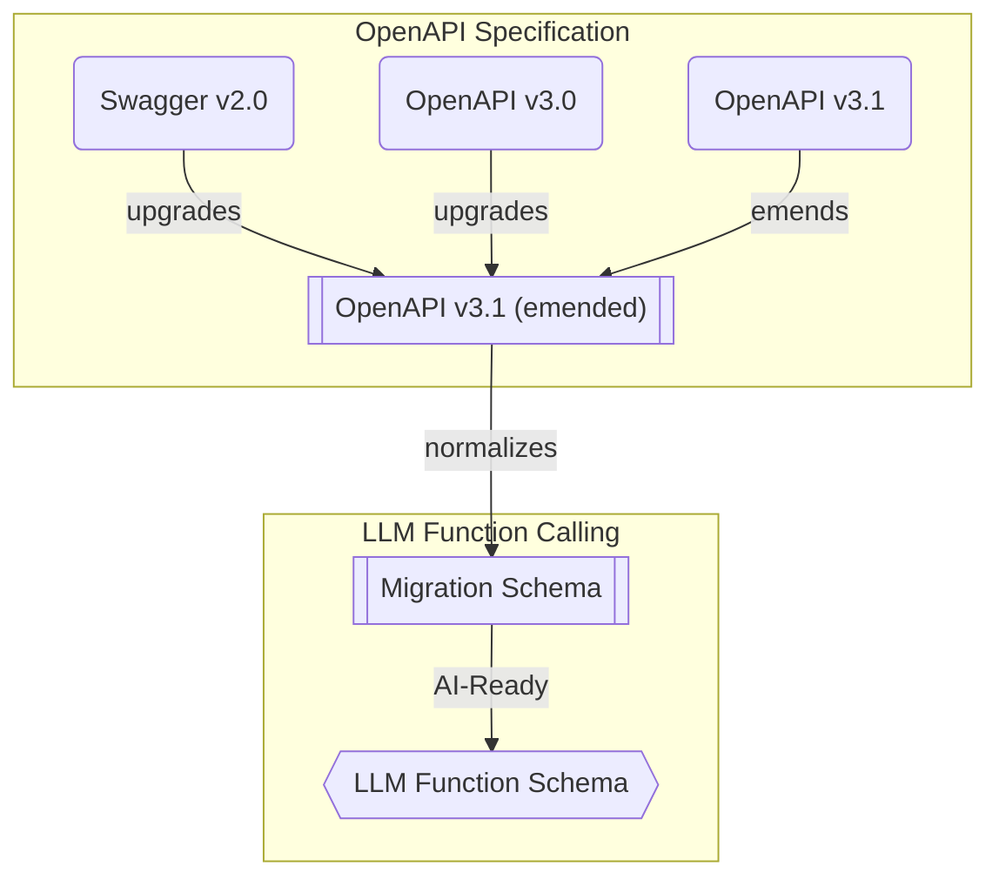
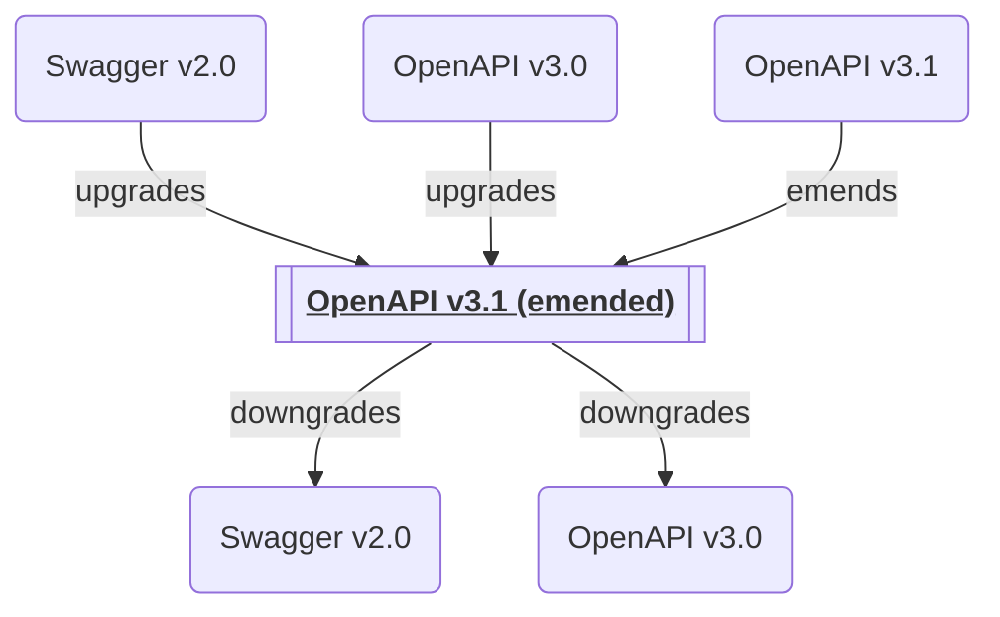
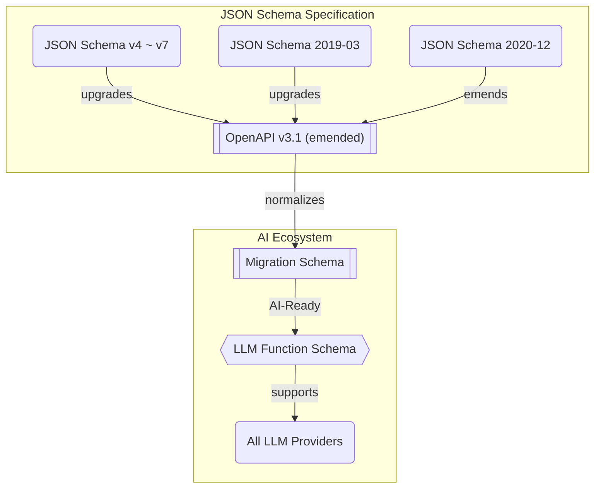

# `@samchon/openapi`


[](https://github.com/samchon/openapi/blob/master/LICENSE)
[](https://www.npmjs.com/package/@samchon/openapi)
[](https://www.npmjs.com/package/@samchon/openapi)
[](https://github.com/samchon/openapi/actions?query=workflow%3Abuild)
[](https://samchon.github.io/openapi/api/)
[](https://discord.gg/E94XhzrUCZ)

**Transform OpenAPI documents into LLM function calling applications.**

`@samchon/openapi` converts OpenAPI/Swagger documents into LLM function calling schemas. With full TypeScript type safety, automatic validation, and support for every OpenAPI version, it's the simplest way to make your HTTP backend AI-callable.

## Key Features

- **🌐 Multi-Provider Support**: Works with OpenAI, Claude, Qwen, Llama, and other LLM providers
- **📝 Complete OpenAPI Coverage**: Swagger 2.0, OpenAPI 3.0, and OpenAPI 3.1 fully supported
- **🔒 Type-Safe Validation**: Built-in validation with detailed error feedback for LLM responses
- **🔄 MCP Integration**: Compose function calling schemas from Model Context Protocol servers
- **📊 Emended Specification**: Standardized OpenAPI v3.1 format that removes ambiguities
- **✅ Production Ready**: Battle-tested with 98%+ success rates in real-world LLM applications

**Live Demo:**
> https://github.com/user-attachments/assets/e1faf30b-c703-4451-b68b-2e7a8170bce5
>
> Watch how `@samchon/openapi` powers an AI shopping chatbot with [`@agentica`](https://github.com/wrtnlabs/agentica)
>
> - [View Backend Repository](https://github.com/samchon/shopping-backend)
> - [Explore OpenAPI Document](https://nestia.io/editor/?simulate=true&e2e=true&url=https%3A%2F%2Fraw.githubusercontent.com%2Fsamchon%2Fshopping-backend%2Frefs%2Fheads%2Fmaster%2Fpackages%2Fapi%2Fswagger.json)


## Quick Start

```bash
npm install @samchon/openapi
```

Transform your OpenAPI document into an LLM function calling application:

```typescript
import { HttpLlm, OpenApi } from "@samchon/openapi";

// 1. Load and convert your OpenAPI document
const document: OpenApi.IDocument = OpenApi.convert(swagger);

// 2. Generate LLM function calling schemas
const application: IHttpLlmApplication = HttpLlm.application({
  document,
});

// 3. Find a function to call
const func: IHttpLlmFunction | undefined = application.functions.find(
  (f) => f.path === "/bbs/articles" && f.method === "post"
);

// 4. Use with any LLM provider (OpenAI, Claude, Qwen, etc.)
const completion = await llm.chat.completions.create({
  model: "gpt-4o", // or claude-3-5-sonnet, qwen-plus, etc.
  messages: [...],
  tools: [{
    type: "function",
    function: {
      name: func.name,
      description: func.description,
      parameters: func.parameters,
    }
  }],
});

// 5. Execute with validation
const result = await HttpLlm.execute({
  connection: { host: "http://localhost:3000" },
  application,
  function: func,
  input: llmGeneratedArgs,
});
```

**That's it!** Your HTTP backend is now AI-callable across all major LLM providers.


## OpenAPI Definitions

`@samchon/openapi` provides complete TypeScript definitions for all OpenAPI versions and introduces an "emended" OpenAPI v3.1 specification that serves as an intermediate format.



**Supported Specifications:**
- [Swagger v2.0](https://github.com/samchon/openapi/blob/master/src/SwaggerV2.ts)
- [OpenAPI v3.0](https://github.com/samchon/openapi/blob/master/src/OpenApiV3.ts)
- [OpenAPI v3.1](https://github.com/samchon/openapi/blob/master/src/OpenApiV3_1.ts)
- [**OpenAPI v3.1 (emended)**](https://github.com/samchon/openapi/blob/master/src/OpenApi.ts) - Standardized format

### What is "Emended" OpenAPI?

The emended specification removes ambiguities and duplications from OpenAPI v3.1, creating a cleaner, more consistent format. All conversions flow through this intermediate format.

**Key Improvements:**
- **Operations**: Merges parameters from path and operation levels, resolves all references
- **JSON Schema**: Eliminates mixed types, unifies nullable handling, standardizes array/tuple representations
- **Schema Composition**: Consolidates `anyOf`, `oneOf`, `allOf` patterns into simpler structures

### Converting Between Versions

```typescript
import { OpenApi } from "@samchon/openapi";

// Convert any version to emended format
const emended: OpenApi.IDocument = OpenApi.convert(swagger); // Swagger 2.0/3.0/3.1

// Downgrade to older versions if needed
const v30: OpenApiV3.IDocument = OpenApi.downgrade(emended, "3.0");
const v20: SwaggerV2.IDocument = OpenApi.downgrade(emended, "2.0");
```

### Validating OpenAPI Documents

Use `typia` for runtime validation with detailed type checking:

```typescript
import { OpenApi, OpenApiV3, OpenApiV3_1, SwaggerV2 } from "@samchon/openapi";
import typia from "typia";

const document: any = await fetch("swagger.json").then(r => r.json());

// Validate with detailed error messages
const result = typia.validate<
  SwaggerV2.IDocument | OpenApiV3.IDocument | OpenApiV3_1.IDocument
>(document);

if (result.success) {
  const emended: OpenApi.IDocument = OpenApi.convert(result.data);
} else {
  console.error(result.errors); // Detailed validation errors
}
```

Try it: [Type assertion](https://typia.io/playground/?script=JYWwDg9gTgLgBAbzgeTAUwHYEEzADQrra4BqAzAapjsOQPoCMBAygO4CGA5p2lCQExwAvnABmUCCDgAiAAIBndiADGACwgYA9BCLtc0gNwAoUJFhwYAT1zsxEqdKs3DRo8o3z4IdsAxwAvHDs8pYYynAAFACUAFxwAAr2wPJoADwAbhDAACYAfAH5CEZwcJqacADiAKIAKnAAmsgAqgBKKPFVAHJY8QCScAAiyADCTQCyXTXFcO4YnnBQaPKQc2hxLUsrKQFBHMDwomgwahHTJdKqMDBg8jFlUOysAHSc+6oArgBG7ylQszCYGBPdwgTSKFTqLQ6TB6YCabyeXiaNAADyUYAANktNOkyE8AAzaXTAJ4AK3kGmk0yixhKs3m2QgyneIEBcXYGEsO0ePngi2WHjQZIpGGixmmZTgNXqHTgWGYzCqLRqvWQnWmTmA7CewV+MAq73YUGyqTOcAAPoRqKQyIwnr0BkyWYCzZaqMRaHiHU7WRgYK64GwuDw+Px7Y7mb7-SVchFGZHATTXCVJcM1SQlXUasg4FUJp0BlUBtN6fA0L7smhsnF3TRwz7ATta7hgRp0rwYHGG36k3SPBAsU9fKIIBFy5hK9kk0JjN5fNFgexjqoIvSB0LeBIoDSgA) | [Detailed validation](https://typia.io/playground/?script=JYWwDg9gTgLgBAbzgeTAUwHYEEzADQrra4BqAzAapjsOQPoCMBAygO4CGA5p2lCQExwAvnABmUCCDgAiAAIBndiADGACwgYA9BCLtc0gNwAoUJFhwYAT1zsxEqdKs3DRo8o3z4IdsAxwAvHDs8pYYynAAFACUAFxwAAr2wPJoADwAbhDAACYAfAH5CEZwcJqacADiAKIAKnAAmsgAqgBKKPFVAHJY8QCScAAiyADCTQCyXTXFcO4YnnBQaPKQc2hxLUsrKQFBHMDwomgwahHTJdKqMDBg8jFlUOysAHSc+6oArgBG7ylQszCYGBPdwgTSKFTqLQ6TB6YCabyeXiaNAADyUYAANktNOkyE8AAzaXTAJ4AK3kGmk0yixhKs3m2QgyneIEBcXYGEsO0ePngi2WHjQZIpGGixmmZTgNXqHTgJCwABlegMsDVeshOtN6Xylu8MfBAk5gOwnul2BicuwAakznAAD6EaikMiMJ7KpkswG2h1UYi0PHu5msjAwb1wNhcHh8fhugYe4Ohkq5CKMoOAmnTYCiSL8vVA+TvZTKJbyAL+QKic0pKKIW30iBYp6+UQQCK5-VPXgSKDyDMlEqLGDvKAYWnCVwlSXDDUkKotOo1ZBwKoTToDKoDLUeeBoYPZNDZOK+mix+OAnbH3DAjTpXgwFNnkN9mYeBtC5ut3eYffZDNCYzeL40TAlaJz1o2XbQDSQA)


## LLM Function Calling

Turn your HTTP backend into an AI-callable service. `@samchon/openapi` converts your OpenAPI document into function calling schemas that work with OpenAI GPT, Claude, Qwen, Llama, and other LLM providers.

**Type Definitions:**

<table>
  <thead>
    <tr>
      <th>Category</th>
      <th>Base</th>
      <th>HTTP</th>
      <th>MCP</th>
    </tr>
  </thead>
  <tbody>
    <tr>
      <td>Application</td>
      <td><a href="https://samchon.github.io/openapi/api/interfaces/ILlmApplication-1.html"><code>ILlmApplication</code></a></td>
      <td><a href="https://samchon.github.io/openapi/api/interfaces/IHttpLlmApplication-1.html"><code>IHttpLlmApplication</code></a></td>
      <td><a href="https://samchon.github.io/openapi/api/interfaces/IMcpLlmApplication-1.html"><code>IMcpLlmApplication</code></a></td>
    </tr>
    <tr>
      <td>Function</td>
      <td><a href="https://samchon.github.io/openapi/api/interfaces/ILlmFunction-1.html"><code>ILlmFunction</code></a></td>
      <td><a href="https://samchon.github.io/openapi/api/interfaces/IHttpLlmFunction-1.html"><code>IHttpLlmFunction</code></a></td>
      <td><a href="https://samchon.github.io/openapi/api/interfaces/IMcpLlmFunction-1.html"><code>IMcpLlmFunction</code></a></td>
    </tr>
    <tr>
      <td>Parameters</td>
      <td colspan="3" align="center"><a href="https://samchon.github.io/openapi/api/interfaces/ILlmSchema.IParameters.html"><code>ILlmSchema.IParameters</code></a></td>
    </tr>
    <tr>
      <td>Schema</td>
      <td colspan="3" align="center"><a href="https://samchon.github.io/openapi/api/types/ILlmSchema.html"><code>ILlmSchema</code></a></td>
    </tr>
  </tbody>
</table>

### Complete Example

Here's a full example showing LLM function calling with OpenAI (works identically with Claude, Qwen, etc.):

```typescript
import { HttpLlm, OpenApi, IHttpLlmApplication, IHttpLlmFunction } from "@samchon/openapi";
import OpenAI from "openai";

// 1. Convert OpenAPI to LLM function calling application
const document: OpenApi.IDocument = OpenApi.convert(swagger);
const application: IHttpLlmApplication = HttpLlm.application({
  document,
});

// 2. Find the function by path and method
const func: IHttpLlmFunction | undefined = application.functions.find(
  (f) => f.path === "/shoppings/sellers/sale" && f.method === "post"
);
if (!func) throw new Error("Function not found");

// 3. Let OpenAI GPT call the function
const client: OpenAI = new OpenAI({ apiKey: process.env.OPENAI_API_KEY });
const completion: OpenAI.ChatCompletion = await client.chat.completions.create({
  model: "gpt-4o",
  messages: [
    { role: "system", content: "You are a helpful shopping assistant." },
    { role: "user", content: "I want to sell Microsoft Surface Pro 9..." }
  ],
  tools: [{
    type: "function",
    function: {
      name: func.name,
      description: func.description,
      parameters: func.parameters,
    }
  }],
});

// 4. Execute the function call on your actual server
const toolCall = completion.choices[0].message.tool_calls![0];
const result = await HttpLlm.execute({
  connection: { host: "http://localhost:37001" },
  application,
  function: func,
  input: JSON.parse(toolCall.function.arguments),
});
```

**Works with Any LLM Provider:**

```typescript
// OpenAI
const openai = new OpenAI({ apiKey: "..." });

// Anthropic Claude
const anthropic = new Anthropic({ apiKey: "..." });

// Alibaba Qwen via DashScope
const qwen = new OpenAI({
  apiKey: "...",
  baseURL: "https://dashscope.aliyuncs.com/compatible-mode/v1",
});

// All use the same func.parameters schema
```

### Validation Feedback - Fixing LLM Mistakes

**The Problem**: LLMs make type errors. A lot.

Even when your schema says `Array<string>`, GPT might return just `"string"`. In real-world testing with OpenAI GPT-4o-mini on a shopping service:
- **1st attempt**: 70% success rate ❌
- **2nd attempt** (with validation feedback): 98% success rate ✅
- **3rd attempt**: Never failed ✅

**The Solution**: Validate LLM output and send errors back for correction.

```typescript
import { HttpLlm, IHttpLlmFunction, IValidation } from "@samchon/openapi";

const func: IHttpLlmFunction = application.functions[0];

// Validate LLM-generated arguments
const result: IValidation<unknown> = func.validate(llmArguments);

if (result.success === false) {
  // Send detailed error feedback to LLM
  return await retryWithFeedback({
    message: "Type errors detected. Please correct the arguments.",
    errors: result.errors, // Detailed error information
  });
} else {
  // Execute the validated function
  const output = await HttpLlm.execute({
    connection: { host: "http://localhost:3000" },
    application,
    function: func,
    input: result.data,
  });
  return output;
}
```

The validation uses [`typia.validate<T>()`](https://typia.io/docs/validators/validate), which provides the most accurate validation and extremely detailed error messages compared to other validators:

Components               | `typia` | `TypeBox` | `ajv` | `io-ts` | `zod` | `C.V.`
-------------------------|--------|-----------|-------|---------|-------|------------------
**Easy to use**          | ✅ | ❌ | ❌ | ❌ | ❌ | ❌
[Object (simple)](https://github.com/samchon/typia/blob/master/test/src/structures/ObjectSimple.ts)          | ✔ | ✔ | ✔ | ✔ | ✔ | ✔
[Object (hierarchical)](https://github.com/samchon/typia/blob/master/test/src/structures/ObjectHierarchical.ts)    | ✔ | ✔ | ✔ | ✔ | ✔ | ✔
[Object (recursive)](https://github.com/samchon/typia/blob/master/test/src/structures/ObjectRecursive.ts)       | ✔ | ❌ | ✔ | ✔ | ✔ | ✔
[Object (union, implicit)](https://github.com/samchon/typia/blob/master/test/src/structures/ObjectUnionImplicit.ts) | ✅ | ❌ | ❌ | ❌ | ❌ | ❌
[Object (union, explicit)](https://github.com/samchon/typia/blob/master/test/src/structures/ObjectUnionExplicit.ts) | ✔ | ✔ | ✔ | ✔ | ✔ | ❌
[Object (additional tags)](https://github.com/samchon/#comment-tags)        | ✔ | ✔ | ✔ | ✔ | ✔ | ✔
[Object (template literal)](https://github.com/samchon/typia/blob/master/test/src/structures/TemplateUnion.ts) | ✔ | ✔ | ✔ | ❌ | ❌ | ❌
[Object (dynamic properties)](https://github.com/samchon/typia/blob/master/test/src/structures/DynamicTemplate.ts) | ✔ | ✔ | ✔ | ❌ | ❌ | ❌
[Array (rest tuple)](https://github.com/samchon/typia/blob/master/test/src/structures/TupleRestAtomic.ts) | ✅ | ❌ | ❌ | ❌ | ❌ | ❌
[Array (hierarchical)](https://github.com/samchon/typia/blob/master/test/src/structures/ArrayHierarchical.ts)     | ✔ | ✔ | ✔ | ✔ | ✔ | ✔
[Array (recursive)](https://github.com/samchon/typia/blob/master/test/src/structures/ArrayRecursive.ts)        | ✔ | ✔ | ✔ | ✔ | ✔ | ❌
[Array (R+U, explicit)](https://github.com/samchon/typia/blob/master/test/src/structures/ArrayRecursiveUnionExplicit.ts) | ✔ | ✔ | ❌ | ✔ | ✔ | ❌
[Array (R+U, implicit)](https://github.com/samchon/typia/blob/master/test/src/structures/ArrayRecursiveUnionImplicit.ts)    | ✅ | ❌ | ❌ | ❌ | ❌ | ❌
[Array (repeated)](https://github.com/samchon/typia/blob/master/test/src/structures/ArrayRepeatedNullable.ts)    | ✅ | ❌ | ❌ | ❌ | ❌ | ❌
[Array (repeated, union)](https://github.com/samchon/typia/blob/master/test/src/structures/ArrayRepeatedUnionWithTuple.ts)    | ✅ | ❌ | ❌ | ❌ | ❌ | ❌
[**Ultimate Union Type**](https://github.com/samchon/typia/blob/master/test/src/structures/UltimateUnion.ts)  | ✅ | ❌ | ❌ | ❌ | ❌ | ❌

> `C.V.` means `class-validator`

### Human-AI Collaboration (Separating Parameters)

Sometimes you need both human input and AI-generated parameters. Use the `separate` option to split parameters between LLM and human:

```typescript
import { HttpLlm, LlmTypeChecker } from "@samchon/openapi";

const application = HttpLlm.application({
  document,
  options: {
    separate: (schema) =>
      LlmTypeChecker.isString(schema) &&
      !!schema.contentMediaType?.startsWith("image"),
  },
});

const func = application.functions.find(
  (f) => f.path === "/shoppings/sellers/sale" && f.method === "post"
)!;

// func.separated.llm - for AI to fill (text, numbers, etc.)
// func.separated.human - for human to provide (file uploads, images)

const result = await HttpLlm.execute({
  connection: { host: "http://localhost:37001" },
  application,
  function: func,
  input: HttpLlm.mergeParameters({
    function: func,
    llm: llmGeneratedArgs,
    human: {
      content: {
        files: [...], // Human provides files
        thumbnails: [...], // Human provides images
      },
    },
  }),
});
```


## Model Context Protocol



`@samchon/openapi` provides better MCP function calling than using the [`mcp_servers`](https://openai.github.io/openai-agents-python/mcp/#using-mcp-servers) property directly.

While MCP can execute server functions directly through the `mcp_servers` property, `@samchon/openapi` offers significant advantages through [validation feedback](#validation-feedback---fixing-llm-mistakes) and [selector agent filtering](https://wrtnlabs.io/agentica/docs/concepts/function-calling/#orchestration-strategy) for context optimization.

For example, the GitHub MCP server has 30 functions. Loading all of them via `mcp_servers` creates huge context that often causes AI agents to crash with hallucinations. Function calling with proper filtering avoids this problem.

> https://github.com/user-attachments/assets/72390cb4-d9b1-4d31-a6dd-d866da5a433b
>
> GitHub MCP server via [`mcp_servers`](https://openai.github.io/openai-agents-python/mcp/#using-mcp-servers) often crashes.
>
> However, function calling to GitHub MCP with [`@agentica`](https://github.com/wrtnlabs/agentica) works properly.
>
> - Function calling demo: https://www.youtube.com/watch?v=rLlHkc24cJs

**Creating MCP applications:**

Use [`McpLlm.application()`](https://samchon.github.io/openapi/api/functions/McpLlm.application.html) to create function calling schemas from MCP tools. The returned [`IMcpLlmApplication`](https://samchon.github.io/openapi/api/interfaces/IMcpLlmApplication-1.html) works across all LLM providers and includes validation feedback.

MCP supports all JSON schema specifications:
- JSON Schema v4, v5, v6, v7
- JSON Schema 2019-03
- JSON Schema 2020-12

```typescript
import { IMcpLlmApplication, IMcpLlmFunction, IValidation, McpLlm } from "@samchon/openapi";

const application: IMcpLlmApplication = McpLlm.application({
  tools: [...], // MCP tools
});

const func: IMcpLlmFunction = application.functions.find(
  (f) => f.name === "create",
)!;

// Validate with detailed feedback
const result: IValidation<unknown> = func.validate({
  title: "Hello World",
  body: "Nice to meet you AI developers",
  thumbnail: "https://wrtnlabs.io/agentica/thumbnail.jpg",
});

if (result.success) {
  // Execute validated function
  console.log("Valid arguments:", result.data);
} else {
  // Send errors back to LLM for correction
  console.error("Validation errors:", result.errors);
}
```

> [!NOTE]
>
> You can also compose [`ILlmApplication`](https://samchon.github.io/openapi/api/interfaces/ILlmApplication-1.html) from a TypeScript class using `typia`.
>
> https://typia.io/docs/llm/application
>
> ```typescript
> import { ILlmApplication } from "@samchon/openapi";
> import typia from "typia";
>
> const app: ILlmApplication = typia.llm.application<YourClassType>();
> ```


## Utilization Cases

### Agentica
[](https://github.com/wrtnlabs/agentica)

https://github.com/wrtnlabs/agentica

Agentic AI framework that converts OpenAPI documents into LLM function calling schemas. Uses `@samchon/openapi` to transform backend REST APIs into callable functions with automatic parameter validation and type-safe remote execution.

```typescript
import { Agentica, assertHttpController } from "@agentica/core";
import OpenAI from "openai";
import typia from "typia";

import { MobileFileSystem } from "./services/MobileFileSystem";

const agent = new Agentica({
  vendor: {
    api: new OpenAI({ apiKey: "********" }),
    model: "gpt-4o-mini",
  },
  controllers: [
    // Functions from TypeScript class
    typia.llm.controller(
      "filesystem",
      MobileFileSystem(),
    ),
    // Functions from Swagger/OpenAPI
    // Uses @samchon/openapi under the hood
    assertHttpController({
      name: "shopping",
      document: await fetch(
        "https://shopping-be.wrtn.ai/editor/swagger.json",
      ).then(r => r.json()),
      connection: {
        host: "https://shopping-be.wrtn.ai",
        headers: { Authorization: "Bearer ********" },
      },
    }),
  ],
});
await agent.conversate("I wanna buy MacBook Pro");
```

### AutoBE
[](https://autobe.dev)

https://autobe.dev

AI backend code generator achieving 100% compilation success by using function calling to construct compiler AST instead of generating code text. For API specification design, uses `@samchon/openapi` types - AI calls compiler functions to build OpenAPI document structures that define REST endpoints and request/response schemas.

```typescript
import { MicroAgentica } from "@agentica/core";
import { OpenApi } from "@samchon/openapi";

const agent = new MicroAgentica({
  vendor: {
    api: new OpenAI({ apiKey: "********" }),
    model: "gpt-4o-mini",
  },
  controllers: [
    // Compiler functions that receive/produce OpenApi.IDocument
    typia.llm.controller(
      "api",
      new OpenApiWriteApplication(),
    ),
  ],
});
await agent.conversate("Design API specification and generate backend app.");

class OpenApiWriteApplication {
  // LLM calls this function with OpenApi.IDocument structure
  public async write(document: OpenApi.IDocument): Promise<void> {
    // Compiler validates schema structure before code generation
    ...
  }
}
```


## License

MIT License

Copyright (c) 2024 Jeongho Nam

For detailed API documentation, visit: https://samchon.github.io/openapi/api/
