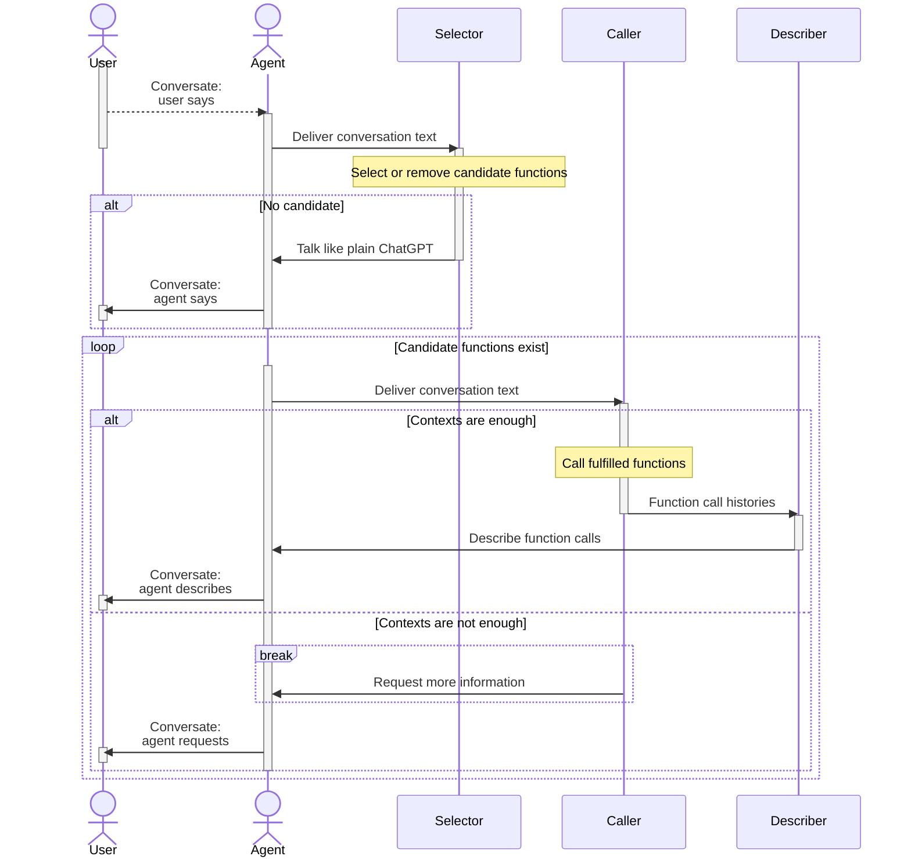
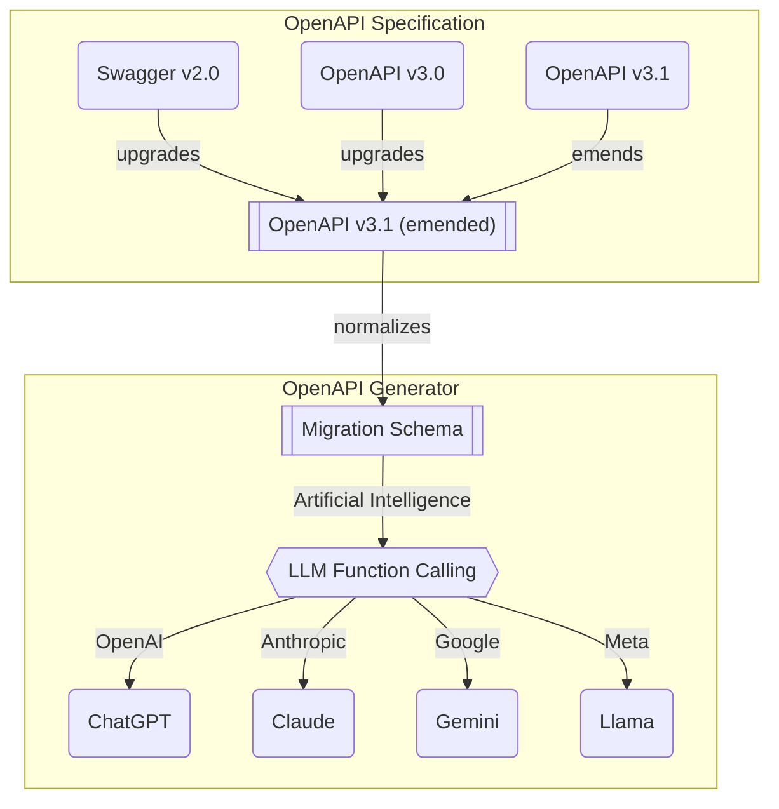

import { Callout, Tabs } from "nextra/components";

import BbsArticleServiceSnippet from "../../../src/snippets/BbsArticleServiceSnippet.mdx";
import IBbsArticleSnippet from "../../../src/snippets/IBbsArticleSnippet.mdx";
import ValidatorSupportMatrixSnippet from "../../../src/snippets/ValidatorSupportMatrixSnippet.mdx";

## Agentica


https://github.com/wrtnlabs/agentica

The simplest **Agentic AI** framework, specialized in **LLM Function Calling**.

With `@agentica`, you can build Agentic AI chatbot only with TypeScript class types. Complex agent workflows and graphs required in conventional AI agent develoopment are not necessary in `@agentica`. Only with TypeScript class types, `@agentica` will do everything with the function calling.

Look at below demonstration, and and feel how `@agentica` is powerful. Now, you can let users to read and write articles only with conversation texts. The TypeScript class functions would be adequately called in the AI chatbot with LLM function calling.

<Callout type="info">
`@nestia/agent` had been migrated to `@agentica/*` for enhancements and separation to multiple packages extending the functionalities.
</Callout>

<Tabs 
  items={[
    "Pseudo Code",
    "Real Code",
    <code>BbsArticleService.ts</code>, 
    <code>IBbsArticle.ts</code>, 
  ]}>
  <Tabs.Tab>
```typescript showLineNumbers
import { Agentica } from "@agentica/core";
import typia from "typia";

import { BbsArticleService } from "./BbsArticleService";

const agent = new Agentica({
  controllers: [
    typia.llm.application<BbsArticleService>(),
  ]
});
await agent.conversate("Hello, I want to create an article.");
```
  </Tabs.Tab>
  <Tabs.Tab>
```typescript filename="src/index.tsx" showLineNumbers {23-26, 37}
import { Agentica } from "@agentica/core";
import typia from "typia";

import { BbsArticleService } from "./BbsArticleService";

const agent = new Agentica({
  model: "chatgpt",
  service: {
    api: new OpenAI({ apiKey: "*****" }),
    model: "gpt-4o-mini",
  },
  controllers: [
    {
      protocol: "class",
      name: "bbs",
      application: typia.llm.application<BbsArticleService>(),
      execute: new BbsArticleService(),
    },
  ],
});
await agent.conversate("Hello, I want to create an article.");
```
  </Tabs.Tab>
  <Tabs.Tab>
    <BbsArticleServiceSnippet />
  </Tabs.Tab>
  <Tabs.Tab>
    <IBbsArticleSnippet />
  </Tabs.Tab>
</Tabs>

<br/>
<iframe 
  src="https://www.youtube.com/embed/pdsplQyok8k?si=geL7DH5CWcC8qlz_" 
  title="Shopping A.I. Chatbot built with Typia" 
  width="100%" 
  height="600" 
  allow="accelerometer; autoplay; clipboard-write; encrypted-media; gyroscope; picture-in-picture; web-share" referrerPolicy="strict-origin-when-cross-origin" 
  allowFullScreen 
/>

  - BBS A.I. Chatbot Application: https://nestia.io/chat/bbs


## Swagger Chatbot
You also can make the super A.I. chatbot by Swagger document too.

With `@agentica`, you can build Agentic AI chatbot only with Swagger document built by [`@nestia/sdk`](/docs/swagger). Complex agent workflows and graphs required in conventional AI agent development are not necessary in `@agentica`. Only with the Swagger document, `@agentica` will do everything with the function calling.

Look at below demonstration, and feel how `@agentica` is powerful. Now, you can let users to search and purchase products only with conversation texts. The backend API functions would be adequately called in the AI chatbot with LLM function calling.

<Tabs items={["Pseudo Code", "Real Code"]}>
  <Tabs.Tab>
```typescript showLineNumbers {6-8}
import { Agentica } from "@agentica/core";
import typia from "typia";

const agent = new Agentica({
  controllers: [
    await fetch(
      "https://shopping-be.wrtn.ai/editor/swagger.json",
    ).then(r => r.json()),
    typia.llm.application<ShoppingCounselor>(),
    typia.llm.application<ShoppingPolicy>(),
    typia.llm.application<ShoppingSearchRag>(),
  ],
});
await agent.conversate("I wanna buy MacBook Pro");
```
  </Tabs.Tab>
  <Tabs.Tab>
```typescript showLineNumbers {16-23}
import { Agentica } from "@agentica/core";
import { OpenApi, HttpLlm } from "@samchon/openapi";
import typia from "typia";

const main = async (): Promise<void> => {
  const agent = new Agentica({
    model: "chatgpt",
    vendor: {
      api: new OpenAI({ apiKey: "*****" }),
      model: "gpt-4o-mini",
    },
    controllers: [
      {
        protocol: "http",
        name: "shopping",
        application: HttpLlm.application({
          model: "chatgpt",
          document: OpenApi.convert(
            await fetch(
              "https://shopping-be.wrtn.ai/editor/swagger.json",
            ).then(r => r.json()),
          ),
        }),
        connection: {
          host: "https://shopping-be.wrtn.ai",
          headers: {
            Authorization: "Bearer *****",
          },
        },
      },
      {
        protocol: "class",
        name: "counselor",
        application: 
          typia.llm.application<ShoppingCounselor, "chatgpt">(),
        execute: new ShoppingCounselor(),
      },
      {
        protocol: "class",
        name: "policy",
        application: 
          typia.llm.application<ShoppingPolicy, "chatgpt">(),
        execute: new ShoppingPolicy(),
      },
      {
        protocol: "class",
        name: "rag",
        application: 
          typia.llm.application<ShoppingSearchRag, "chatgpt">(),
        execute: new ShoppingSearchRag(),
      },
    ],
  });
  await agent.conversate("I wanna buy MacBook Pro");
};
main().catch(console.error);
```
  </Tabs.Tab>
</Tabs>

<br/>
<iframe src="https://www.youtube.com/embed/m47p4iJ90Ms?si=cvgfckN25GJhjLTB" 
        title="Shopping A.I. Chatbot built with Nestia" 
        width="100%" 
        height="600" 
        allow="accelerometer; autoplay; clipboard-write; encrypted-media; gyroscope; picture-in-picture; web-share" referrerPolicy="strict-origin-when-cross-origin" 
        allowFullScreen></iframe>

- Shopping A.I. Chatbot Application: [https://nestia.io/chat/shopping](/chat/shopping)
- Shopping Backend Repository: https://github.com/samchon/shopping-backend
- Shopping Swagger Document (`@nestia/editor`): [https://nestia.io/editor/?url=...](https://nestia.io/editor/?simulate=true&e2e=true&url=https%3A%2F%2Fraw.githubusercontent.com%2Fsamchon%2Fshopping-backend%2Frefs%2Fheads%2Fmaster%2Fpackages%2Fapi%2Fswagger.json)


## Principles
### Agent Strategy


When user says, `@agentica/core` delivers the conversation text to the `selector` agent, and let the `selector` agent to find (or cancel) candidate functions from the context. If the `selector` agent could not find any candidate function to call and there is not any candidate function previously selected either, the `selector` agent will work just like a plain ChatGPT.

And `@agentica/core` enters to a loop statement until the candidate functions to be empty. In the loop statement, `caller` agent tries to LLM function calling by analyzing the user's conversation text. If context is enough to compose arguments of candidate functions, the `caller` agent actually calls the target functions, and let `decriber` agent to explain the function calling results. Otherwise the context is not enough to compose arguments, `caller` agent requests more information to user.

Such LLM (Large Language Model) function calling strategy separating `selector`, `caller`, and `describer` is the key logic of `@agentica/core`.

### Validation Feedback
```typescript
import { FunctionCall } from "pseudo";
import { ILlmFunction, IValidation } from "typia";

export const correctFunctionCall = (p: {
  call: FunctionCall;
  functions: Array<ILlmFunction<"chatgpt">>;
  retry: (reason: string, errors?: IValidation.IError[]) => Promise<unknown>;
}): Promise<unknown> => {
  // FIND FUNCTION
  const func: ILlmFunction<"chatgpt"> | undefined =
    p.functions.find((f) => f.name === p.call.name);
  if (func === undefined) {
    // never happened in my experience
    return p.retry(
      "Unable to find the matched function name. Try it again.",
    );
  }

  // VALIDATE
  const result: IValidation<unknown> = func.validate(p.call.arguments);
  if (result.success === false) {
    // 1st trial: 50% (gpt-4o-mini in shopping mall chatbot)
    // 2nd trial with validation feedback: 99%
    // 3nd trial with validation feedback again: never have failed
    return p.retry(
      "Type errors are detected. Correct it through validation errors",
      {
        errors: result.errors,
      },
    );
  }
  return result.data;
}
```

Is LLM function calling perfect? 

The answer is not, and LLM (Large Language Model) vendors like OpenAI take a lot of type level mistakes when composing the arguments of the target function to call. Even though an LLM function calling schema has defined an `Array<string>` type, LLM often fills it just by a `string` typed value.

Therefore, when developing an LLM function calling agent, the validation feedback process is essentially required. If LLM takes a type level mistake on arguments composition, the agent must feedback the most detailed validation errors, and let the LLM to retry the function calling referencing the validation errors.

About the validation feedback, `@agentica/core` is utilizing [`typia.validate<T>()`](https://typia.io/docs/validators/validate) and [`typia.llm.application<Class, Model>()`](https://typia.io/docs/llm/application/#application) functions. They construct validation logic by analyzing TypeScript source codes and types in the compilation level, so that detailed and accurate than any other validators like below.

Such validation feedback strategy and combination with `typia` runtime validator, `@agentica/core` has achieved the most ideal LLM function calling. In my experience, when using OpenAI's `gpt-4o-mini` model, it tends to construct invalid function calling arguments at the first trial about 50% of the time. By the way, if correct it through validation feedback with `typia`, success rate soars to 99%. And I've never had a failure when trying validation feedback twice.

For reference, the embedded [`typia.validate<T>()`](/docs/validators/validate) function creates validation logic by analyzing TypeScript source codes and types in the compilation level. Therefore, it is accurate and detailed than any other validator libraries. This is exactly what is needed for function calling, and I can confidentelly say that `typia` is the best library for LLM function calling.

<ValidatorSupportMatrixSnippet />

Additionally, this validation feedback strategy is useful for some LLM providers do not supporting restriction properties of JSON schema like OpenAI ([`IChatGptSchema`](https://github.com/samchon/openapi/blob/master/src/structures/IChatGptSchema.ts)) and Gemini ([`IGeminiSchema`](https://github.com/samchon/openapi/blob/master/src/structures/IGeminiSchema.ts)). For example, OpenAI and Gemini do not support `format` property of JSON schema, so that cannot understand the `UUID` like type. Even though `typia.llm.application<App, Model>()` function is writing the restriction information to the `description` property of JSON schema, but LLM provider does not reflect it perfectly.

Also, some LLM providers which have not specified the JSON schema version like Claude ([`IClaudeSchema`](https://github.com/samchon/openapi/blob/master/src/structures/IClaudeSchema.ts)) and Llama ([`ILlamaSchema`](https://github.com/samchon/openapi/blob/master/src/structures/ILlamaSchema.ts)), they tend to fail a lot of function calling about the restriction properties. In fact, Llama does not support function calling formally, so you have to detour it by prompt template, and its success rate is lower than others.

In that case, if you give validation feedback from `ILlmFunction.validate()` function to the LLM agent, the LLM agent will be able to understand the restriction information exactly and fill the arguments properly.

  - Restriction properties of JSON schema
    - `string`: `minLength`, `maxLength`, `pattern`, `format`, `contentMediaType`
    - `number`: `minimum`, `maximum`, `exclusiveMinimum`, `exclusiveMaximum`, `multipleOf`
    - `array`: `minItems`, `maxItems`, `uniqueItems`, `items`

### OpenAPI Specification


`@agentica/core` obtains LLM function calling schemas from both Swagger/OpenAPI documents and TypeScript class types. The TypeScript class type can be converted to LLM function calling schema by [`typia.llm.application<Class, Model>()`](https://typia.io/docs/llm/application#application) function. Then how about OpenAPI document? How Swagger document can be LLM function calling schema.

The secret is in the above diagram. 

In the OpenAPI specification, there are three versions with different definitions. And even in the same version, there are too much ambiguous and duplicated expressions. To resolve these problems, [`@samchon/openapi`](https://github.com/samchon/openapi) is transforming every OpenAPI documents to v3.1 emended specification. The `@samchon/openapi`'s emended v3.1 specification has removed every ambiguous and duplicated expressions for clarity.

With the v3.1 emended OpenAPI document, `@samchon/openapi` converts it to a migration schema that is near to the function structure. And as the last step, the migration schema will be transformed to a specific LLM vendor's function calling schema. LLM function calling schemas are composed like this way.

> **Why do not directly convert, but intermediate?**
>
> If directly convert from each version of OpenAPI specification to specific LLM's function calling schema, I have to make much more converters increased by cartesian product. In current models, number of converters would be 12 = 3 x 4.
>
> However, if define intermediate schema, number of converters are shrunk to plus operation. In current models, I just need to develop only (7 = 3 + 4) converters, and this is the reason why I've defined intermediate specification. This way is economic.
