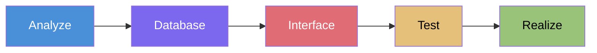
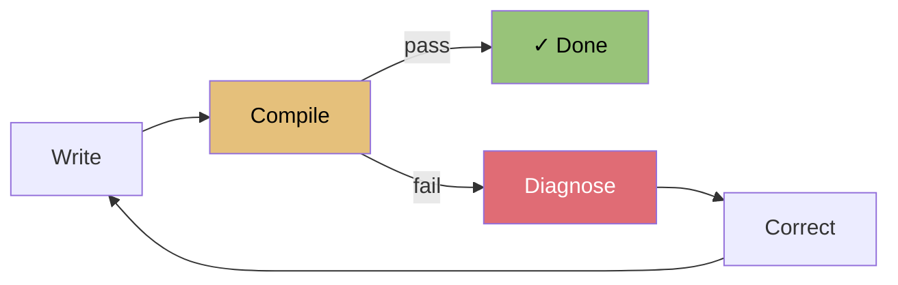
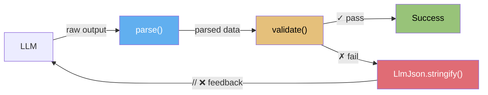

import { Tabs } from "nextra/components";

# Function Calling Harness: From 6.75% to 100%

<PptxBanner
  title="Qwen Meetup Korea"
  href="/seminars/20260326-qwen-meetup-korea.pptx"
/>

> [📥 Download Slides (PPTX)](https://autobe.dev/seminars/20260326-qwen-meetup-korea.pptx)
>
> **TL;DR**
>
> 1. [AutoBe](https://github.com/wrtnlabs/autobe) — AI backend auto-generation agent
>    - Production-grade backend from natural language conversation
>    - 4 AST types + 4-tier compiler validation + self-healing loops
>    - Schema specs are the new prompts
> 2. [Typia](https://github.com/samchon/typia) — The infrastructure that turns 0% into 100%
>    - A single type automates schema, parser, validator, and feedback generator
>    - Lenient JSON parsing + schema-based type coercion + precise validation feedback
>    - Combined with AutoBe to complete harness engineering
> 3. In Praise of Function Calling
>    - Types eliminate ambiguity; schemas constrain through absence
>    - Model-neutral, mechanically verifiable, deterministically convergent
>    - Applicable to all engineering domains with validators — semiconductors, chemical processes, control systems, etc.
> 4. Qwen — Why small models are the best QA engineers
>    - Smaller models are better at exposing system vulnerabilities
>    - R&D cost reduction, vendor independence, open ecosystem virtuous cycle
> 5. 6.75% is not failure — it's the first input to the loop
>    - `qwen3-coder-next` scores 6.75% on first-try tool calling
>    - AutoBe's self-healing harness turns that into 100% compilation success
>    - If you can verify, you converge

{
// function calling success rate 6.75% comes from
// https://github.com/wrtnlabs/autobe-examples/tree/58b9fe0847dfa84ca428482651391387594540b2/qwen/qwen3-coder-next/shopping#function-calling
//
// in actually, the 1st attempt was not 6.75%, but 4.60% estimated
// and after openrouter announced exacto mode,
// success rate became higher
}

## 1. Preface

6.75%.

That's the first-try function calling success rate when `qwen3-coder-next` is asked to generate API data types for a shopping mall backend. 93 out of 100 attempts produce invalid structured output.

This isn't surprising. [NESTFUL (EMNLP 2025)](https://arxiv.org/abs/2409.03797) measured GPT-4o at 28% accuracy on nested tool call sequences. [JSONSchemaBench (ICLR 2025)](https://arxiv.org/abs/2501.10868) tested constrained decoding frameworks on 10,000 real-world schemas and found 3–41% coverage on the hardest ones. BoundaryML went further, [arguing](https://boundaryml.com/blog/structured-outputs-create-false-confidence) that structured outputs actively degrade model reasoning — that forcing JSON format makes the model *dumber*. The consensus is clear: function calling works for flat, simple schemas. For anything with recursive nesting or deep structural complexity, don't bother.

But if you want to make AI output deterministic — parse it, validate it, and correct it in a loop until it converges — there is no alternative to structured output. Free-form text can't be mechanically verified. Natural language can't be compiled. Without structure, there's no feedback loop, and without a feedback loop, there's no guarantee. So we didn't have the luxury of giving up on function calling. We had to make it work on the exact kind of complex, recursive schemas the industry had written off.

[AutoBe](https://github.com/wrtnlabs/autobe) is the result. It's an open-source AI agent that takes a single natural language conversation and generates a complete backend — requirements analysis, database schema, API specification, E2E tests, and implementation code. Hook up that 6.75% model and what happens? Final compilation success rate: **99.8%+**. All five Qwen models.

The answer wasn't a better model or a smarter prompt. It was a **harness** — type schemas that constrain outputs, compilers that verify results, and structured feedback that pinpoints exactly where and why something went wrong so the LLM can correct itself. A deterministic loop wrapping a probabilistic model. The engineering outside the model, not inside, that made the difference.

This talk dissects that engineering.

**Chapter 2** examines AutoBe's architecture: a 5-phase pipeline running through 4 AST types and 4-tier compilers, with self-healing loops that systematically correct LLM mistakes.

**Chapter 3** delves into Typia, the heart of that structure. The TypeScript compiler analyzes a single type from source code and generates schema, parser, validator, and feedback generator — all automatically. The concrete mechanism that flipped Qwen 3.5's 0% to 100% lives here.

**Chapter 4** steps back to ask a bigger question. Does this pattern work beyond backends? Semiconductors, chemical processes, architecture, control systems — anywhere deterministic validators exist in engineering.

And **Chapter 5** answers why this story belongs at Qwen Meetup. Small models aren't a weakness. They're the harness system's best QA engineers.

---

## 2. AutoBe — AI Backend Auto-Generation Agent

### 2.1. What AutoBe Does

[AutoBe](https://github.com/wrtnlabs/autobe) is an open-source AI agent that generates production-grade backends from natural language. Developed by [Wrtn Technologies](https://wrtn.io).

"Build me a shopping mall backend with products, carts, orders, and payments." From this single sentence, AutoBe generates:

- Requirements analysis (SRS)
- Database schema (ERD)
- API specification (OpenAPI v3.2)
- E2E test code
- Complete implementation code
- Type-safe SDK




### 2.2. LLMs Don't Write Code

Most AI coding agents tell the LLM "write this code" and save the returned text directly as source files. AutoBe is different.

AutoBe uses **function calling**. Instead of generating free-form text, the LLM fills in predefined structures — JSON Schema. It's filling out a form, not writing on a blank page. Once the LLM fills the form, compilers validate and transform it into actual code. **The LLM fills structures; compilers write code.**

This approach applies across the entire 5-phase waterfall pipeline.

| Phase | Structure the LLM Fills | Compiler Validation |
|-------|------------------------|---------------------|
| Requirements | [`AutoBeAnalyze`](https://github.com/wrtnlabs/autobe/blob/main/packages/interface/src/analyze/AutoBeAnalyze.ts) — Structured SRS | Structure check |
| Database | [`AutoBeDatabase`](https://github.com/wrtnlabs/autobe/blob/main/packages/interface/src/database/AutoBeDatabase.ts) — DB schema AST | AutoBeDatabase compiler |
| API Design | [`AutoBeOpenApi`](https://github.com/wrtnlabs/autobe/blob/main/packages/interface/src/openapi/AutoBeOpenApi.ts) — OpenAPI v3.2 spec | AutoBeOpenApi compiler |
| Testing | [`AutoBeTest`](https://github.com/wrtnlabs/autobe/blob/main/packages/interface/src/test/AutoBeTest.ts) — 30+ expression types | AutoBeTest compiler |
| Implementation | Modularized code (Collector/Transformer/Operation) | TypeScript compiler |

Each AST strictly limits what the LLM can generate — `AutoBeDatabase`'s field types allow only 7 options (`"boolean" | "int" | "double" | "string" | "uri" | "uuid" | "datetime"`), making `"varchar"` physically impossible. **Schema specs are the new prompts** — unambiguous, model-independent, mechanically verifiable.

But the structures the LLM fills are far from simple. The `IJsonSchema` that defines DTO types is a recursive union of 10 variants:

```typescript
export type IJsonSchema =
  | IJsonSchema.IConstant
  | IJsonSchema.IBoolean
  | IJsonSchema.IInteger
  | IJsonSchema.INumber
  | IJsonSchema.IString
  | IJsonSchema.IArray      // items: IJsonSchema ← recursive
  | IJsonSchema.IObject     // properties: Record<string, IJsonSchema> ← recursive
  | IJsonSchema.IReference
  | IJsonSchema.IOneOf      // oneOf: IJsonSchema[] ← recursive
  | IJsonSchema.INull;
```

10 variants, infinitely recursive nesting. First-try success rate: **6.75%**.

The testing phase raises complexity further — `IExpression` captures E2E test logic with 30+ recursive variants:

```typescript
export type IExpression =
  | IBooleanLiteral   | INumericLiteral    | IStringLiteral     // literals
  | IArrayLiteralExpression  | IObjectLiteralExpression          // compound literals
  | INullLiteral      | IUndefinedKeyword                       // null/undefined
  | IIdentifier       | IPropertyAccessExpression               // accessors
  | IElementAccessExpression | ITypeOfExpression                 // access/operations
  | IPrefixUnaryExpression   | IPostfixUnaryExpression           // unary operations
  | IBinaryExpression                                            // binary operations
  | IArrowFunction    | ICallExpression    | INewExpression      // functions
  | IArrayFilterExpression   | IArrayForEachExpression           // array operations
  | IArrayMapExpression      | IArrayRepeatExpression            // array operations
  | IPickRandom       | ISampleRandom      | IBooleanRandom     // random generation
  | IIntegerRandom    | INumberRandom      | IStringRandom      // random generation
  | IPatternRandom    | IFormatRandom      | IKeywordRandom     // random generation
  | IEqualPredicate   | INotEqualPredicate                      // assertions
  | IConditionalPredicate    | IErrorPredicate;                  // assertions
```

Programming-language complexity in a single function call.

### 2.3. Self-Healing Loops

When compilation fails, AutoBe doesn't stop. It runs a **self-healing loop**:



Four compilers — Database, OpenAPI, Test, TypeScript — each validate at a different level and return structured diagnostics: exact location, target, and cause of every error. The Correct agent receives the original output + diagnostics and makes targeted fixes. Successful parts are preserved; only failures are corrected.

On top of this, Typia's validation feedback (Chapter 3) adds precise correction at the function calling level. The combination of compiler-level and function calling-level validation is the driving force behind the 99.8%+ compilation rate.

### 2.4. Five Qwen Models, All 99.8%+

AutoBe currently tests against five Qwen models. All achieve successful compilation.

| Model | Parameters | Compilation |
|-------|-----------|-------------|
| `qwen/qwen3.5-397b-a17b` | 17B / 397B (Largest MoE) | 100% |
| `qwen/qwen3.5-122b-a10b` | 10B / 122B (Medium MoE) | 100% |
| `qwen/qwen3.5-27b` | 27B (Medium Dense) | 100% |
| `qwen/qwen3.5-35b-a3b` | 3B / 35B (Small MoE) | 99.8% |
| `qwen/qwen3-coder-next` | 3B / 80B (Coding-specialized) | 99.8% |

From 397B to 35B. Same schema, same pipeline, same result.

---

## 3. Typia — The Infrastructure That Turns 0% into 100%

Chapter 2 described what AutoBe builds — but not how it survives 6.75%. Schema generation, broken JSON recovery, type coercion, precise error feedback — every piece of infrastructure that makes function calling work on complex types despite the industry consensus that it can't. Who handles all of it?

[Typia](https://github.com/samchon/typia). Making function calling reliable on recursive union types required going deeper than runtime libraries can reach. Runtime reflection can't see TypeScript types — they're erased at compilation. Zod-style schema builders choke on recursive unions. The only path was to operate at the **compiler level** itself — analyze types directly from source code and generate every piece of infrastructure from that single source of truth.

That's what Typia is. A **compiler library** that directly leverages the TypeScript compiler's type analyzer to automatically generate JSON Schema, validators, parsers, and feedback generators at compile time. Define one type, and the compiler handles the rest. It's the result of choosing to solve the problem at the deepest layer available, because every shallower approach hit a wall.

Let's examine in detail how it turns `qwen3-coder-next`'s 6.75% success rate and `qwen3.5`'s 0% success rate into 100%.

### 3.1. From TypeScript Types to Function Calling Schemas

Function calling requires JSON Schema to tell the LLM "give me data in this structure." Normally, developers define types, separately write schemas, and keep the two synchronized forever.

Typia automates this process. Define a TypeScript type, and Typia **automatically generates** validation code and JSON Schema **at compile time** — not through runtime reflection, but by directly leveraging the TypeScript compiler's type analyzer.

Let's see the principle first. When you call `typia.is<T>()`, type information is analyzed at compile time and transformed into optimized validation code:

<Tabs items={["Before Compilation: TypeScript", "After Compilation: JavaScript"]}>
  <Tabs.Tab>
```typescript
import typia, { tags } from "typia";

interface IMember {
  id: string & tags.Format<"uuid">;
  email: string & tags.Format<"email">;
  age: number &
    tags.Type<"uint32"> &
    tags.ExclusiveMinimum<19> &
    tags.Maximum<100>;
}

const check: boolean = typia.is<IMember>(input);
```
  </Tabs.Tab>
  <Tabs.Tab>
```javascript
((input) => {
  return (
    "object" === typeof input &&
    null !== input &&
    "string" === typeof input.id &&
    /^[0-9a-f]{8}-[0-9a-f]{4}-[1-5].*$/.test(input.id) &&
    "string" === typeof input.email &&
    /^[a-z0-9._%+-]+@[a-z0-9.-]+\.[a-z]{2,}$/.test(input.email) &&
    "number" === typeof input.age &&
    Number.isInteger(input.age) &&
    input.age >= 0 &&
    19 < input.age &&
    100 >= input.age
  );
})
```
  </Tabs.Tab>
</Tabs>

A single line — `typia.is<IMember>(input)` — transforms at compile time into optimized code containing UUID regex, email regex, integer checks, and range checks. It overcomes TypeScript's limitation of erasing type information at runtime through a compiler plugin.

This principle applies directly to function calling. `typia.llm.parameters<T>()` generates JSON Schema through the same type analysis:

<Tabs items={["Before Compilation: TypeScript", "After Compilation: JSON Schema"]}>
  <Tabs.Tab>
```typescript
import typia, { tags } from "typia";

interface IMember {
  /**
   * Member's age.
   *
   * Only adults aged 19 or older can register.
   * This is the platform's legal age restriction.
   */
  age: number & tags.Type<"uint32"> & tags.ExclusiveMinimum<18>;
  email: string & tags.Format<"email">;
  name: string & tags.MinLength<1> & tags.MaxLength<100>;
}

const schema = typia.llm.parameters<IMember>();
```
  </Tabs.Tab>
  <Tabs.Tab>
```json
{
  "type": "object",
  "properties": {
    "age": {
      "type": "integer",
      "description": "Member's age.\n\nOnly adults aged 19 or older can register.\nThis is the platform's legal age restriction.",
      "exclusiveMinimum": 18
    },
    "email": { "type": "string", "format": "email" },
    "name": { "type": "string", "minLength": 1, "maxLength": 100 }
  },
  "required": ["age", "email", "name"]
}
```
  </Tabs.Tab>
</Tabs>

**JSDoc comments become `description` fields.** The LLM reads these descriptions to decide what values to generate. **Type constraints become validation rules.** `ExclusiveMinimum<18>` becomes a "> 18" rule, and `Format<"email">` becomes an email format check. A single type definition simultaneously generates LLM guidance and validation rules.

At the class level, `typia.llm.application<T>()` can schematize an entire API:

```typescript
import { LlmJson } from "@typia/utils";
import typia from "typia";

class ShoppingOrderController {
  /** Creates an order */
  create(input: IShoppingOrderCreate): void;
}

const app = typia.llm.application<ShoppingOrderController>();
const func = app.functions[0];

// All public methods have built-in parse() and validate()
const data = func.parse(llmOutput);        // broken JSON recovery + type coercion
const result = func.validate(data);        // schema violation detection
if (result.success === false) {
  const feedback = LlmJson.stringify(result); // LLM-readable feedback generation
}
```

**The type is the schema.** The constraints the LLM sees and the constraints the validator applies are always identical — because they come from the same source.

This is the key point. The schema generated by the Typia compiler from source code types powers every runtime function that follows. The schema that `parse()` references when recovering broken JSON and coercing types, the schema that `validate()` uses as the comparison target when diagnosing errors — they're all the same schema, automatically generated from types at compile time. Because it's compiler output, not manually written, types and schemas can never diverge.

### 3.2. The Cause of 6.75%: Structural Complexity

The 10 variants of `IJsonSchema` and 30+ variants of `IExpression` from Chapter 2. Why is the first-try success rate so low?

Recursive union types cause **combinatorial explosion**. 10 variants nested 3 levels deep create 1,000 possible paths. With 30 variants, that's 27,000. The probability of the LLM choosing the correct path in one try is structurally low.

Moreover, subtle errors are frequent in union types:
- Chose the correct variant but got the type of a sub-field wrong
- Confused variants at recursive depth
- Missing required fields
- Serialized objects as strings (double-stringify)

These errors are "structurally correct but semantically wrong," making it difficult to provide accurate feedback with simple JSON Schema validation.

6.75% is the natural result of this structural complexity. The issue isn't the first try — it's **what happens after failure**.

### 3.3. Lenient JSON Parsing: Recovering Broken JSON

LLMs are language models, not JSON generators. They wrap output in Markdown code blocks, prepend chatter like "I'd be happy to help!", leave brackets unclosed, forget to quote keys, and write `tru` instead of `true`. The Qwen 3.5 series goes further: on every `anyOf` (union type) field, it **100% consistently** double-stringifies the value. Not occasionally — every union field, every attempt, without exception.

`JSON.parse()` rejects all of this. Here's a real example from production — all seven problems in a single response:

```typescript
import { dedent } from "@typia/utils";
import typia, { ILlmApplication, ILlmFunction, tags } from "typia";

const app: ILlmApplication = typia.llm.application<OrderService>();
const func: ILlmFunction = app.functions[0];

// LLM sometimes returns malformed JSON with wrong types
const llmOutput = dedent`
  > LLM sometimes returns some prefix text with markdown JSON code block.

  I'd be happy to help you with your order! 😊
  
  \`\`\`json
  {
    "order": {
      "payment": "{\\"type\\":\\"card\\",\\"cardNumber\\":\\"1234-5678", // unclosed string & bracket
      "product": {
        name: "Laptop", // unquoted key
        price: "1299.99", // wrong type (string instead of number)
        quantity: 2, // trailing comma
      },
      "customer": {
        // incomplete keyword + unclosed brackets
        "name": "John Doe",
        "email": "john@example.com",
        vip: tru
  \`\`\` `;

const result = func.parse(llmOutput);
if (result.success) console.log(result);

interface IOrder {
  payment: IPayment;
  product: {
    name: string;
    price: number & tags.Minimum<0>;
    quantity: number & tags.Type<"uint32">;
  };
  customer: {
    name: string;
    email: string & tags.Format<"email">;
    vip: boolean;
  };
}

type IPayment =
  | { type: "card"; cardNumber: string }
  | { type: "bank"; accountNumber: string };

declare class OrderService {
  /**
   * Create a new order.
   *
   * @param props Order properties
   */
  createOrder(props: { order: IOrder }): { id: string };
}
```

One call to `func.parse()` fixes all seven problems:

- **Markdown block & prefix chatter** → stripped
- **Unclosed string & bracket** (`"1234-5678`) → auto-closed
- **Unquoted key** (`name:`) → accepted
- **Trailing comma** (`quantity: 2,`) → ignored
- **Incomplete keyword** (`tru`) → completed to `true`
- **Wrong type** (`"1299.99"`) → coerced to `1299.99` (schema says `number`)
- **Double-stringify** (`"{\"type\":\"card\"...`) → recursively parsed to object (schema says `IPayment`)

The last one is the killer. The Qwen 3.5 series double-stringifies every `anyOf` field, 100% of the time — **0% success rate** on union types without this. It's not Qwen-only either; Claude does the same on `oneOf`. `parse()` eliminates all of them. Zero model changes, zero prompt tuning.

### 3.4. Validation Feedback: Precise Error Feedback

Even after parsing and coercion, values themselves can be wrong. Negative prices, strings that aren't emails, decimals where integers should be.

Typia's `ILlmFunction.validate()` detects schema violations and tells you exactly **where and why** something is wrong:

```typescript
import { LlmJson } from "@typia/utils";
import typia, { ILlmApplication, ILlmFunction, IValidation, tags } from "typia";

const app: ILlmApplication = typia.llm.application<OrderService>();
const func: ILlmFunction = app.functions[0];

// LLM generated invalid data
const input = {
  order: {
    payment: { type: "card", cardNumber: 12345678 }, // should be string
    product: {
      name: "Laptop",
      price: -100, // violates Minimum<0>
      quantity: 2.5, // should be uint32
    },
    customer: {
      name: "John Doe",
      email: "invalid-email", // violates Format<"email">
      vip: "yes", // should be boolean
    },
  },
};

// Validate and format errors for LLM feedback
const result: IValidation = func.validate(input);
if (result.success === false) {
  const feedback: string = LlmJson.stringify(result);
  console.log(feedback);
}

interface IOrder {
  payment: IPayment;
  product: {
    name: string;
    price: number & tags.Minimum<0>;
    quantity: number & tags.Type<"uint32">;
  };
  customer: {
    name: string;
    email: string & tags.Format<"email">;
    vip: boolean;
  };
}

type IPayment =
  | { type: "card"; cardNumber: string }
  | { type: "bank"; accountNumber: string };

declare class OrderService {
  /**
   * Create a new order.
   *
   * @param props Order properties
   */
  createOrder(props: { order: IOrder }): { id: string };
}
```

"The price inside product inside order should be ≥ 0, but you gave -100."

`LlmJson.stringify()` renders these errors as `// ❌` inline comments on top of the LLM's original JSON:

```json
{
  "order": {
    "payment": {
      "type": "card",
      "cardNumber": 12345678 // ❌ [{"path":"$input.order.payment.cardNumber","expected":"string"}]
    },
    "product": {
      "name": "Laptop",
      "price": -100, // ❌ [{"path":"$input.order.product.price","expected":"number & Minimum<0>"}]
      "quantity": 2.5 // ❌ [{"path":"$input.order.product.quantity","expected":"number & Type<\"uint32\">"}]
    },
    "customer": {
      "name": "John Doe",
      "email": "invalid-email", // ❌ [{"path":"$input.order.customer.email","expected":"string & Format<\"email\">"}]
      "vip": "yes" // ❌ [{"path":"$input.order.customer.vip","expected":"boolean"}]
    }
  }
}
```

`cardNumber` should be a string but got a number. `price` should be ≥ 0. `quantity` should be a positive integer. `email` is not a valid email. `vip` should be a boolean. 5 errors, each with exact path and expected type.

The LLM sees exactly where it went wrong on its own JSON. Instead of rewriting everything, it only needs to fix the 5 marked fields. Precise, structured, immediately actionable feedback.

### 3.5. The Complete Feedback Loop



Combining everything into a single loop:

```typescript
async function callWithFeedback(
  llm: LLM,
  func: ILlmFunction,
  prompt: string,
  maxRetries: number = 10,
): Promise<unknown> {
  let feedback: string | null = null;

  for (let i = 0; i < maxRetries; i++) {
    // 1. Request function call from LLM (including previous feedback)
    const rawOutput = await llm.call(prompt, feedback);

    // 2. Lenient JSON parsing + type coercion
    const parsed = func.parse(rawOutput);
    if (!parsed.success) {
      feedback = `JSON parsing failed: ${JSON.stringify(parsed.errors)}`;
      continue;
    }

    // 3. Schema validation
    const validated = func.validate(parsed.data);
    if (!validated.success) {
      // 4. Generate structured feedback (// ❌ inline comments)
      feedback = LlmJson.stringify(validated);
      continue;
    }

    // 5. Success
    return validated.data;
  }
  throw new Error("Maximum retry count exceeded");
}
```

`parse()` recovers broken JSON and performs initial type coercion. `validate()` catches schema violations. `LlmJson.stringify()` renders errors in a format the LLM can read. The LLM self-corrects and retries.

This is the complete loop that turns 6.75% into 100%.

> - Only Typia integrates parse, coerce, and validate by compiler skills.
> - Only Typia handles union types correctly.

### 3.6. The Harness = AutoBe + Typia

**Typia** (function calling level):
- `typia.llm.application<T>()` — type → schema
- `ILlmFunction.parse()` — broken JSON recovery + type coercion + double-stringify unwinding
- `ILlmFunction.validate()` — schema violation detection
- `LlmJson.stringify()` — `// ❌` inline feedback

**AutoBe** (system level):
- 4 AST types + 4-tier compiler validation
- Self-healing loops (diagnose → correct → revalidate)
- 40+ agents, batch processing, prompt caching

**The type is the schema, the validator, and the prompt. The harness is everything around it.**

---

## 4. In Praise of Function Calling

"Structured outputs create false confidence." The criticism is accurate — when you use structured output *without a harness*. Every failure the industry observed is what happens when you treat function calling as a feature to toggle on, rather than as **infrastructure to build around**.

### 4.1. Natural Language vs Types

Natural language evolved to be ambiguous. Metaphor, nuance, politeness, humor — all operate on top of ambiguity. "Just make it pretty" works between humans.

Programming languages were designed to eliminate ambiguity. "Just make it pretty" doesn't compile.

**When people communicate in natural language, misunderstandings arise. When they communicate through types, there are none.**

Expressing constraints through prompts:
> "The age field should be a positive integer greater than 18. Don't use string types for number fields. All required fields must be present..."

Is "greater than 18" >18 or ≥18? You can't know whether the LLM followed this rule without manually inspecting the output. As schemas grow, these rules multiply endlessly.

Expressing constraints through types:
```typescript
interface IMember {
  /** Only adults 19+ can register */
  age: number & Type<"uint32"> & ExclusiveMinimum<18>;
}
```

`ExclusiveMinimum<18>` is >18. It's an integer. It's required. No ambiguity, mechanically verifiable.

In domains requiring precision, type constraints provide certainty that natural language instructions cannot.

### 4.2. The Pink Elephant Problem

If you've built a prompt-based AI agent, you've written prohibition rules:

- "Don't create utility functions"
- "Don't use the `any` type"
- "Don't create circular dependencies"

"Don't think of a pink elephant." The first thing that comes to mind is a pink elephant. When you tell an LLM "don't do X," X gets placed at the center of attention. To avoid a forbidden pattern, the model must first recall that pattern, which paradoxically increases its generation probability. This is the essence of token prediction.

Even knowing this, you can't avoid prohibition rules in prompts. "Don't do X" is the only way natural language can express constraints.

**With schemas, this problem disappears.**

No need to say "don't use the `any` type" — if `any` doesn't exist in the schema, the LLM physically cannot generate it. No need to say "don't create utility functions" — if there's no slot for utility functions, that's the end of it. When field types are limited to `"boolean" | "int" | "double" | "string" | "uri" | "uuid" | "datetime"` — 7 choices — there's no path for the LLM to write `"varchar"`.

Not prohibition, but **absence**. Prompts prohibit what you don't want. Schemas allow only what you do want.

This is function calling's deepest advantage: instead of fighting the model's tendencies, it makes unwanted outputs structurally impossible.

### 4.3. Model Neutrality

Prompt engineering is inherently model-dependent. A prompt optimized for GPT behaves differently on Claude, and differently again on Qwen. Rewriting prompts with each new model is routine.

Function calling-based approaches are model-neutral. JSON Schema means the same thing regardless of which model reads it. The validation feedback loop absorbs performance differences between models. Strong models converge in 1–2 attempts, weaker models take 3–4, but both reach 100%.

AutoBe running Qwen, GLM, DeepSeek, and OpenAI models with **the same schema, the same pipeline** and achieving 100% compilation across all of them is proof of this neutrality. No model-specific prompt tuning was ever performed.

This changes the nature of model selection. From "Can this model do this task?" — a capability question — to "Which model is most cost-effective?" — a **cost optimization problem**: `average retries × tokens per attempt × cost per token`.

#### Prompt Fragility in Practice

This isn't theoretical. Every major vendor has demonstrated prompt fragility across model versions:

**OpenAI**: GPT-4 → GPT-4o caused [widespread prompt regressions](https://github.com/chapman4444/gpt4o-regression-report) — same prompts suddenly produced different outputs. GPT-4 → GPT-5 required prompt rewrites at such scale that OpenAI had to ship a [Prompt Optimizer tool](https://cookbook.openai.com/examples/gpt-5). And GPT-4o is [being retired on 2026.03.31](https://echostash.app/blog/gpt-4o-retirement) — every application using it must migrate.

**Anthropic**: Claude 3.x → 4.x introduced [breaking changes every major version](https://docs.anthropic.com/en/docs/about-claude/models/migrating-to-claude-4) — prefill removed, tool versions changed, response style shifted.

Every vendor, every version: prompts must be rewritten. Model-specific tricks accumulate as vendor lock-in and technical debt.

**Type schemas don't break across versions.** JSON Schema is an industry standard — zero rewrite required.

### 4.4. The Core: Verifiability

A single thread runs through everything.

Function calling's fundamental advantage is that it **brings LLM output into the domain of software engineering**.

Free-form text output makes correctness an AI problem. Parsing is fuzzy. Validation is fuzzy. Correction is fuzzy.

Structured output makes correctness an **engineering problem**:

1. **Validation is deterministic** — JSON Schema validation is a clear pass/fail
2. **Feedback is precise** — "Field X should be type Y but you gave Z"
3. **Correction converges** — precise feedback causes the model to fix only that part

The model is still probabilistic. It still makes mistakes. But because **the structure wrapping the model is deterministic**, the process converges to 100%.

> **Type schema + deterministic validator + structured feedback = harness**

Prompt engineering tries to make the probabilistic part reliable. Function calling makes the deterministic part perfect. In domains requiring precision, the latter wins: 6.75% → 100%.

### 4.5. This Pattern Is Universal

This pattern applies to every domain where output is mechanically verifiable — not just software.

| Domain | Fast (ms) | Medium (sec) | Deep (min+) |
|--------|----------|--------------|-------------|
| Software | Type check | Compilation | Test execution |
| Semiconductor | DRC | LVS | SPICE simulation |
| Chemical Process | Mass balance | Energy balance | Process simulation |
| Construction (BIM) | Dimensions/clearance | Building codes, collision detection | Lighting/HVAC simulation |
| Control Systems | Transfer function validity | Stability/margin analysis | Time-domain simulation |

Run the cheapest validator first, fix errors, move to the next tier. Every domain here shares the same structure as AutoBe: recursive union types, hierarchical decomposition, deterministic validators refined over decades.

> **Note**: These domain examples were AI-recommended. I'm a developer, not a domain expert — please treat the specifics as reference material.

<Tabs items={["Semiconductor", "Chemical Process", "Construction (BIM)", "Control Systems"]}>
  <Tabs.Tab>
```typescript
// DRC (fast) → LVS (medium) → SPICE simulation (deep)

type IBlock =
  | ILogicBlock        // children: IBlock[]  ← recursive
  | IMemoryBlock       // children: IBlock[]
  | IAnalogBlock       // children: IBlock[]
  | IIOBlock | IClockTree | IInterconnect | IPowerGrid
  | ICPU | IGPU | INPU | IDSP
  | ISecurityBlock | IDebugBlock | IPhyBlock;

type IStandardCell =   // hundreds per PDK
  | IAND | IOR | INAND | INOR | IXOR | IXNOR | INOT | IBUF | IMUX | IDEMUX
  | IAOI | IOAI | IHA | IFA | IDFF | IJKFF | ILatch | IScanFF | IRetentionFF
  | IICG | IClkBuf | IClkInv | ITieCell | ITapCell | IFiller | IDecap | IEndcap
  | ILevelShifter | IIsolationCell | IPowerGate | IAntennaCell | ISpareCell | ...;
```
  </Tabs.Tab>
  <Tabs.Tab>
```typescript
// Mass balance (fast) → Energy balance (medium) → ASPEN simulation (deep)

type IUnitOperation =
  | IReactor            // sub_units: IUnitOperation[]  ← recursive
  | IDistColumn         // sub_units: IUnitOperation[]
  | IAbsorber | IStripper | IExtractor | ICrystallizer | IDryer | IEvaporator
  | IHeatExchanger | ICondenser | IReboiler | IHeater | ICooler | IFurnace
  | IMixer | ISplitter | IPump | ICompressor | IExpander | ITurbine | IValve
  | ISeparator | IFilter | ICyclone | ICentrifuge | IMembrane | IAdsorber | ...;

type IReactor =         // union within union
  | ICSTR | IPFR | IBatchReactor | IGibbsReactor | IEquilibrium | IConversion;
```
  </Tabs.Tab>
  <Tabs.Tab>
```typescript
// Collision detection, code compliance — all deterministic (IFC 4.3: 1,300+ entity types)

type IfcElement =
  | IfcWall              // components: IfcElement[]  ← recursive
  | IfcSlab | IfcBeam | IfcColumn | IfcRoof | IfcStair | IfcRamp | IfcFooting
  | IfcDoor | IfcWindow | IfcCurtainWall | IfcRailing | IfcCovering | IfcPlate
  | IfcPile | IfcMember | IfcChimney | IfcShadingDevice | IfcBuildingProxy | ...;

type IfcDistributionElement =  // union within union (MEP systems)
  | IfcPipeSegment | IfcPipeFitting | IfcDuctSegment | IfcDuctFitting
  | IfcCableSegment | IfcCableCarrier | IfcPump | IfcFan | IfcBoiler
  | IfcChiller | IfcValve | IfcSensor | IfcActuator | IfcFlowMeter | ...;
```
  </Tabs.Tab>
  <Tabs.Tab>
```typescript
// Transfer function (fast) → Stability analysis (medium) → Time-domain sim (deep)

type IController =
  | IPID               // inner: IController  ← cascade recursion
  | IMPC               // constraints: IConstraint[]  ← union within union
  | ILQR | ILQG | IHinf | IFeedforward | ICascade | IAdaptive
  | IFuzzy | ISlidingMode | IBackstepping | IRobust | IGainScheduled;

type IConstraint =
  | IRangeConstraint | IRateConstraint | IStabilityConstraint
  | ISafetyConstraint | IBandwidthConstraint | IEnergyConstraint;

type IPlantModel =     // subsystems: IPlantModel[]  ← recursive
  | ILinearPlant | INonlinearPlant | IDelayPlant | IHybridPlant
  | IStateSpace | ITransferFunction | IZeroPoleGain | IFreqResponse;
```
  </Tabs.Tab>
</Tabs>

Not a coincidence — hierarchical decomposition is how engineers manage complexity, and it always produces recursive union types. The same structure as AutoBe's `IJsonSchema` and `IExpression`.

This doesn't work everywhere. Creative writing, emotional intelligence, strategic decisions — there's no validator for "a good novel." Without a validator, there's no feedback loop. This is a solution for domains where accuracy is non-negotiable and **mechanically verifiable**.

---

## 5. Qwen — Small Models and QA Engineering

### 5.1. Why Qwen?

AutoBe's entire pipeline is function calling. The only criterion is how accurately a model fills complex JSON Schemas. At the **small/medium scale**, Qwen was the only open-weight model that could handle this complexity — even MoE models with 3B active parameters process schemas containing 10+ recursive union variants.

### 5.2. Small Models as R&D Infrastructure

For customers, model cost is a non-issue — even the most expensive model is cheaper than hiring a developer. For us **developing** AutoBe, it's different. Thousands of generate-compile-feedback cycles per iteration. Commercial models at this scale would be financial ruin. Local Qwen models made the journey from 6.75% to 100% possible.

### 5.3. Small Models Are the Best QA Engineers

Large models "correctly guess" ambiguous parts of schemas and pass through — our mistakes stay hidden. Small models expose everything:

| Model | Active / Total | Success Rate | What It Found |
|-------|---------------|--------------|---------------|
| `qwen3-30b-a3b` | 3B / 30B | ~10% | Fundamental schema ambiguities, missing required fields |
| `qwen3-next-80b-a3b` | 3B / 80B | ~20% | Subtle type mismatches in complex nested relations |

The 10% success rate was the most valuable result. Every failure pointed to a system vulnerability, and each fix strengthened the pipeline for **all models**. Large models make mistakes **less frequently**, not **never**. In production, "rarely" means outage.

**When even a 3B-active model can't break your system, no model will.**

---

## 6. Conclusion

We started at 6.75%. The industry said complex function calling doesn't work, and our results agreed.

But there was no alternative — deterministic AI output requires structured output — so we built the harness, one failure mode at a time. Lenient parsing because JSON broke. Type coercion because types were wrong. Validation feedback because values were wrong. Compiler pipelines because the system needed consistency.

AutoBe achieved 99.8%+ compilation across all five Qwen models. Not through better prompts, but through the accumulated engineering of every way things went wrong.

Three things: type schemas that constrain outputs, compilers that verify results, and structured feedback that corrects errors. These three form a deterministic loop wrapping probabilistic models.

This pattern is not limited to code generation. The same structure can be built in every engineering domain where deterministic validators exist — semiconductors, chemical processes, control systems.

Communicate through types and there are no misunderstandings. Constrain through schemas and there are no pink elephants. With a deterministic loop, even 6.75% becomes 100%.

**6.75% is not a failure — it's the first input to the loop. If you can verify, you converge.**

---

**About AutoBe**: [AutoBe](https://github.com/wrtnlabs/autobe) is an open-source AI agent developed by [Wrtn Technologies](https://wrtn.io). It generates production-grade backend applications from natural language.

**About Typia**: [Typia](https://github.com/samchon/typia) is a compiler library that automatically generates runtime validators, JSON Schema, and function calling schemas from TypeScript types.

