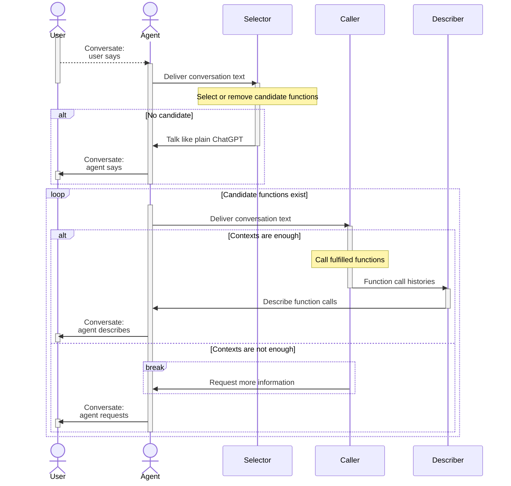
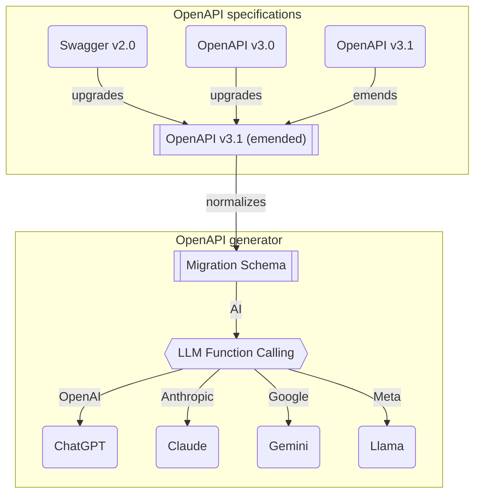

import { Callout, Tabs } from "nextra/components";

import LocalSource from "../../../components/LocalSource";
import ValidatorSupportMatrixSnippet from "../../../snippets/ValidatorSupportMatrixSnippet.mdx";

# Building a Chatbot with Agentica

`typia.llm.application<Class>()` gives you the tools an LLM can call. [Agentica](https://github.com/wrtnlabs/agentica) builds the agent loop **around** those tools — the orchestration layer that decides which function to call, when, and how to recover from mistakes.

If `typia.llm.application` is "describe my service to an LLM," Agentica is "actually run a conversation in which an LLM uses that service."

## First example

```typescript filename="src/index.ts" showLineNumbers {23-26, 37}
import { Agentica } from "@agentica/core";
import OpenAI from "openai";
import typia from "typia";

import { BbsArticleService } from "./BbsArticleService";

const agent = new Agentica({
  service: {
    api: new OpenAI({ apiKey: "*****" }),
    model: "openai/gpt-4.1-mini",
  },
  controllers: [
    typia.llm.controller<BbsArticleService>(
      "bbs",
      new BbsArticleService(),
    ),
  ],
});

await agent.conversate("Hello, I want to create an article.");
```

That's a complete chatbot: it understands intent, picks the right method on `BbsArticleService`, fills the arguments from the conversation, and asks follow-up questions when arguments are missing. No prompt engineering, no agent graph definition.


<Callout type="info">
`@nestia/agent` was renamed to `@agentica/*` to make room for additional packages built on the same idea.
</Callout>

## Full source

<Tabs items={[
    <code>src/main.ts</code>,
    <code>BbsArticleService.ts</code>,
    <code>IBbsArticle.ts</code>,
  ]}>
  <Tabs.Tab>
```typescript filename="src/index.ts" showLineNumbers {23-26, 37}
import { Agentica } from "@agentica/core";
import OpenAI from "openai";
import typia from "typia";

import { BbsArticleService } from "./BbsArticleService";

const agent = new Agentica({
  service: {
    api: new OpenAI({ apiKey: "*****" }),
    model: "openai/gpt-4.1-mini",
  },
  controllers: [
    typia.llm.controller<BbsArticleService>(
      "bbs",
      new BbsArticleService(),
    ),
  ],
});
await agent.conversate("Hello, I want to create an article.");
```
  </Tabs.Tab>
  <Tabs.Tab>
    <LocalSource
      path="examples/src/llm/BbsArticleService.ts"
      filename="examples/src/llm/BbsArticleService.ts"
      showLineNumbers />
  </Tabs.Tab>
  <Tabs.Tab>
    <LocalSource
      path="examples/src/llm/IBbsArticle.ts"
      filename="examples/src/llm/IBbsArticle.ts"
      showLineNumbers />
  </Tabs.Tab>
</Tabs>

<br/>
<iframe
  src="https://www.youtube.com/embed/pdsplQyok8k?si=geL7DH5CWcC8qlz_"
  title="BBS A.I. Chatbot built with Typia"
  width="100%"
  height="600"
  allow="accelerometer; autoplay; clipboard-write; encrypted-media; gyroscope; picture-in-picture; web-share" referrerPolicy="strict-origin-when-cross-origin"
  allowFullScreen
/>

- Live demo: [nestia.io/chat/bbs](https://nestia.io/chat/bbs)

## From an OpenAPI document

You don't have to start from TypeScript code. Agentica accepts an OpenAPI document directly — every endpoint becomes a tool the LLM can call.

```typescript filename="src/main.ts" showLineNumbers
import { Agentica, assertHttpController } from "@agentica/core";
import OpenAI from "openai";
import typia from "typia";

import { MobileFileSystem } from "./services/MobileFileSystem";

const agent = new Agentica({
  vendor: {
    api: new OpenAI({ apiKey: "********" }),
    model: "openai/gpt-4.1-mini",
  },
  controllers: [
    // Class-based functions
    typia.llm.controller<MobileFileSystem>("filesystem", MobileFileSystem()),

    // Swagger / OpenAPI document → functions
    assertHttpController({
      name: "shopping",
      document: await fetch(
        "https://shopping-be.wrtn.ai/editor/swagger.json",
      ).then((r) => r.json()),
      connection: {
        host: "https://shopping-be.wrtn.ai",
        headers: { Authorization: "Bearer ********" },
      },
    }),
  ],
});

await agent.conversate("I wanna buy MacBook Pro");
```

<br/>
<iframe src="https://www.youtube.com/embed/m47p4iJ90Ms?si=cvgfckN25GJhjLTB"
        title="Shopping A.I. Chatbot built with Nestia"
        width="100%"
        height="600"
        allow="accelerometer; autoplay; clipboard-write; encrypted-media; gyroscope; picture-in-picture; web-share" referrerPolicy="strict-origin-when-cross-origin"
        allowFullScreen></iframe>

- Live demo: [nestia.io/chat/shopping](/chat/shopping)
- Backend source: [github.com/samchon/shopping-backend](https://github.com/samchon/shopping-backend)
- Swagger UI: [open in @nestia/editor](https://nestia.io/editor/?simulate=true&e2e=true&url=https%3A%2F%2Fraw.githubusercontent.com%2Fsamchon%2Fshopping-backend%2Frefs%2Fheads%2Fmaster%2Fpackages%2Fapi%2Fswagger.json)

## How the loop works



Three sub-agents share the work:

- **Selector** — reads the latest user message, decides which of the registered functions are candidates this turn. If none apply, it falls back to plain conversational replies.
- **Caller** — given the candidate functions, tries to call them. If the conversation hasn't given it enough information for the parameters, it asks the user a follow-up.
- **Describer** — once the caller has produced results, turns them into a human-readable reply.

That separation is what keeps Agentica simple: each sub-agent does one thing and you don't have to draw a state graph to keep it on track.

## Validation feedback

LLM function calling is not perfect. Models make type mistakes — for example, they fill an `Array<string>` field with just a `string`. The fix is to give the model the **structured error** and ask it to retry.

Agentica relies on the same harness as [`typia.llm.application`](/docs/llm/application#the-function-calling-harness):

```typescript
import { FunctionCall } from "pseudo";
import { ILlmFunction, IValidation } from "typia";

export const correctFunctionCall = (p: {
  call: FunctionCall;
  functions: Array<ILlmFunction<"chatgpt">>;
  retry: (reason: string, errors?: IValidation.IError[]) => Promise<unknown>;
}): Promise<unknown> => {
  const func = p.functions.find((f) => f.name === p.call.name);
  if (func === undefined) {
    return p.retry("Unable to find the matched function name. Try it again.");
  }

  const result: IValidation<unknown> = func.validate(p.call.arguments);
  if (!result.success) {
    // 1st trial: ~50% pass (gpt-4o-mini on shopping mall demo)
    // 2nd trial with validation feedback: ~99%
    // 3rd trial with validation feedback again: never failed in my testing
    return p.retry(
      "Type errors are detected. Correct it through validation errors.",
      { errors: result.errors },
    );
  }
  return result.data;
};
```

The numbers in the comments come from running the shopping chatbot demo above. The pattern works for the same reason it works in [`application`](/docs/llm/application#validation-feedback) and at [AutoBe](https://github.com/wrtnlabs/autobe) — typia's validator gives the LLM enough detail (path, expected type, actual value) to fix its own mistakes.

Some LLM providers don't even honor all the JSON Schema constraint keywords. The validation feedback channel works around that too: the model doesn't have to understand `"format": "uuid"` — it just sees `expected: "string & Format<\"uuid\">"` in the error and tries again. The keywords most commonly ignored by providers, grouped by base type:

- **`string`** — `minLength`, `maxLength`, `pattern`, `format`, `contentMediaType`
- **`number`** — `minimum`, `maximum`, `exclusiveMinimum`, `exclusiveMaximum`, `multipleOf`
- **`array`** — `minItems`, `maxItems`, `uniqueItems`, `items`

typia checks every one of these at runtime and surfaces failures into the feedback channel — so whether or not the provider taught the model to honor the schema keyword in the first place, the model gets a chance to fix the value on the next turn.

<ValidatorSupportMatrixSnippet />

## OpenAPI pipeline



Agentica accepts Swagger 2.0 / OpenAPI 3.0 / 3.1. The conversion goes through an intermediate "emended" 3.1 representation that strips out the ambiguity and duplication of the public OpenAPI specs, then to a migration schema, and finally to whichever LLM provider's function-calling format you target.

Why the intermediate step? Without it, you'd need *n*×*m* converters (every OpenAPI version × every LLM provider). With it, you need *n*+*m*.

## Where to go next

- The class-based tool API → [`typia.llm.application`](/docs/llm/application)
- The OpenAPI-based tool API → [`HttpLlm`](/docs/llm/http)
- Validation feedback mechanics → [`LlmJson`](/docs/llm/json)
- Documentation tips for better LLM behavior → [Documentation Strategy](/docs/llm/strategy)
- Agentica itself → [github.com/wrtnlabs/agentica](https://github.com/wrtnlabs/agentica)
