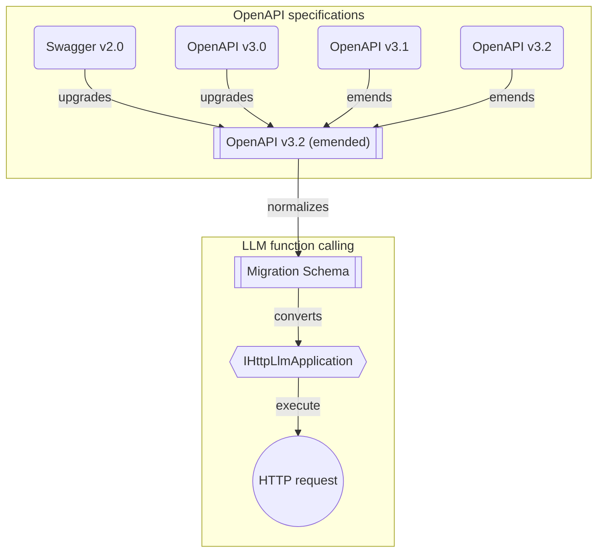

import { Callout, Tabs } from "nextra/components";

import LocalSource from "../../../components/LocalSource";

# `HttpLlm` — LLM function calling from an OpenAPI document

[`typia.llm.application<Class>`](/docs/llm/application) turns a TypeScript class into LLM tools at compile time. `HttpLlm` does the same thing — but starting from an OpenAPI (Swagger) document, at **runtime**.

Use it when:

- You have an existing REST API (yours or someone else's) and want an LLM to be able to call it
- The API is documented with Swagger 2.0 / OpenAPI 3.0 / 3.1 / 3.2
- You don't necessarily own the TypeScript code for the server

```typescript copy filename="signature"
namespace HttpLlm {
  function controller(props: {
    name: string;
    document: SwaggerV2.IDocument | OpenApiV3.IDocument
            | OpenApiV3_1.IDocument | OpenApiV3_2.IDocument;
    connection: IHttpConnection;
    config?: Partial<IHttpLlmApplication.IConfig>;
    execute?: IHttpLlmController["execute"];
  }): IHttpLlmController;
}
```

`HttpLlm` lives in `@typia/utils`. Install it alongside the framework adapter you want to wire it into (MCP, Vercel, LangChain).

## First example

```typescript copy filename="hello-httplm.ts"
import { HttpLlm } from "@typia/utils";
import { IHttpLlmController } from "@typia/interface";

const controller: IHttpLlmController = HttpLlm.controller({
  name: "shopping",
  document: await fetch(
    "https://shopping-be.wrtn.ai/editor/swagger.json",
  ).then((r) => r.json()),
  connection: {
    host: "https://shopping-be.wrtn.ai",
    headers: { Authorization: "Bearer ********" },
  },
});

// controller.application.functions: one IHttpLlmFunction per API operation
// controller.execute(funcName, args): performs the actual HTTP call
```

Each API operation becomes an `IHttpLlmFunction` carrying:

- JSON Schema for parameters
- The OpenAPI description as the tool's `description`
- The same `parse`, `coerce`, `validate` methods you get from [`typia.llm.application`](/docs/llm/application#the-function-calling-harness) — same harness, same LLM auto-correction story

<Tabs items={[<code>HttpLlm</code>, <code>IHttpLlmApplication</code>, <code>IHttpLlmFunction</code>, <code>IHttpLlmController</code>, <code>IHttpConnection</code>]}>
  <Tabs.Tab>
```typescript filename="@typia/utils"
export namespace HttpLlm {
  export function controller(props: {
    name: string;
    document:
      | SwaggerV2.IDocument
      | OpenApiV3.IDocument
      | OpenApiV3_1.IDocument
      | OpenApiV3_2.IDocument;
    connection: IHttpConnection;
    config?: Partial<IHttpLlmApplication.IConfig>;
    execute?: IHttpLlmController["execute"];
  }): IHttpLlmController;
}
```
  </Tabs.Tab>
  <Tabs.Tab>
    <LocalSource
      path="packages/interface/src/http/IHttpLlmApplication.ts"
      filename="@typia/interface"
      showLineNumbers />
  </Tabs.Tab>
  <Tabs.Tab>
    <LocalSource
      path="packages/interface/src/http/IHttpLlmFunction.ts"
      filename="@typia/interface"
      showLineNumbers />
  </Tabs.Tab>
  <Tabs.Tab>
    <LocalSource
      path="packages/interface/src/http/IHttpLlmController.ts"
      filename="@typia/interface"
      showLineNumbers />
  </Tabs.Tab>
  <Tabs.Tab>
    <LocalSource
      path="packages/interface/src/http/IHttpConnection.ts"
      filename="@typia/interface"
      showLineNumbers />
  </Tabs.Tab>
</Tabs>

### What each argument does

| Argument | Meaning |
|----------|---------|
| `name` | Controller name. Becomes the prefix for tool names (`{name}_{operationId}`) |
| `document` | The OpenAPI document — Swagger 2.0 / OpenAPI 3.0 / 3.1 / 3.2 are all accepted |
| `connection.host` | Base URL for HTTP requests |
| `connection.headers` | Optional headers (auth, etc.) sent with every request |
| `config` | Optional schema-conversion tuning |
| `execute` | Optional custom HTTP executor. Defaults to `HttpLlm.execute` |

## Conversion pipeline



`HttpLlm` first normalizes every OpenAPI dialect into one internal representation (emended OpenAPI 3.2), then converts each operation into an `IHttpLlmFunction`. The intermediate representation is what makes "any version in, any LLM provider out" possible without combinatorial conversion code.

## Framework adapters

The same controller plugs into any supported framework. Pick whichever your app already uses:

<Tabs items={["Vercel AI SDK", "LangChain"]}>
  <Tabs.Tab>
```typescript filename="src/main.ts"
import { openai } from "@ai-sdk/openai";
import { toVercelTools } from "@typia/vercel";
import { generateText, Tool } from "ai";
import { HttpLlm } from "@typia/utils";

const tools: Record<string, Tool> = toVercelTools({
  controllers: [
    HttpLlm.controller({
      name: "shopping",
      document: await fetch(
        "https://shopping-be.wrtn.ai/editor/swagger.json",
      ).then((r) => r.json()),
      connection: {
        host: "https://shopping-be.wrtn.ai",
        headers: { Authorization: "Bearer ********" },
      },
    }),
  ],
});

const result = await generateText({
  model: openai("gpt-4o"),
  tools,
  prompt: "I wanna buy MacBook Pro",
});
```
  </Tabs.Tab>
  <Tabs.Tab>
```typescript filename="src/main.ts"
import { ChainValues, Runnable } from "@langchain/core";
import { ChatPromptTemplate } from "@langchain/core/prompts";
import { DynamicStructuredTool } from "@langchain/core/tools";
import { ChatOpenAI } from "@langchain/openai";
import { toLangChainTools } from "@typia/langchain";
import { AgentExecutor, createToolCallingAgent } from "langchain/agents";
import { HttpLlm } from "@typia/utils";

const tools: DynamicStructuredTool[] = toLangChainTools({
  controllers: [
    HttpLlm.controller({
      name: "shopping",
      document: await fetch(
        "https://shopping-be.wrtn.ai/editor/swagger.json",
      ).then((r) => r.json()),
      connection: {
        host: "https://shopping-be.wrtn.ai",
        headers: { Authorization: "Bearer ********" },
      },
    }),
  ],
});

const agent: Runnable = createToolCallingAgent({
  llm: new ChatOpenAI({ model: "gpt-4o" }),
  tools,
  prompt: ChatPromptTemplate.fromMessages([
    ["system", "You are a helpful assistant."],
    ["human", "{input}"],
    ["placeholder", "{agent_scratchpad}"],
  ]),
});
const executor: AgentExecutor = new AgentExecutor({ agent, tools });
const result: ChainValues = await executor.invoke({
  input: "I wanna buy MacBook Pro",
});
```
  </Tabs.Tab>
</Tabs>

## The function calling harness

Every `IHttpLlmFunction` carries the same `parse` / `coerce` / `validate` methods as `ILlmFunction` — same parse → coerce → validate → stringify-feedback story as [`typia.llm.application`](/docs/llm/application#the-function-calling-harness). The two pages share machinery; if you've already read the application page, the rest of this section is a refresher.

### Parse and coerce

<Tabs items={[
    "Parsing (text → object)",
    "Coercing (object → object)",
    <code>ILlmFunction</code>,
  ]}>
  <Tabs.Tab>
    <LocalSource
      path="examples/src/llm/application-parse.ts"
      filename="examples/src/llm/application-parse.ts"
      showLineNumbers
      highlight="27-28" />
  </Tabs.Tab>
  <Tabs.Tab>
    <LocalSource
      path="examples/src/llm/application-coerce.ts"
      filename="examples/src/llm/application-coerce.ts"
      showLineNumbers
      highlight="24-25" />
  </Tabs.Tab>
  <Tabs.Tab>
    <LocalSource
      path="packages/interface/src/schema/ILlmFunction.ts"
      filename="@typia/interface"
      showLineNumbers
      highlight="78-126" />
  </Tabs.Tab>
</Tabs>

<Callout type="info">
**Same `parse` vs `coerce` rule**

- LLM-emitted text (raw string) → `parse(text)`
- Pre-parsed object (from the SDK) → `coerce(obj)`

Both run the same type-coercion logic; `parse` adds the lenient JSON layer in front.
</Callout>

### Validation feedback

When validation fails inside a framework adapter (MCP / Vercel / LangChain), the tool returns annotated error JSON the LLM can read:

```json
{
  "name": "John",
  "age": "twenty",      // ❌ [{"path":"$input.age","expected":"number"}]
  "email": "not-an-email", // ❌ [{"path":"$input.email","expected":"string & Format<\"email\">"}]
  "hobbies": "reading"  // ❌ [{"path":"$input.hobbies","expected":"Array<string>"}]
}
```

Same pattern as on [`application`](/docs/llm/application#validation-feedback). Same effect — LLMs self-correct on the next turn instead of producing structured nonsense.

In production at [AutoBe](https://github.com/wrtnlabs/autobe), the harness took `qwen3-coder-next` from **6.75%** raw correctness to **100%** on compiler AST types — across all four tested Qwen models. AST types are the hardest realistic target (unbounded unions × unbounded depth × recursive references), so if the harness handles those, it handles your REST API.

```typescript filename="AutoBeTest.IExpression — the kind of type the harness handles" showLineNumbers
export type IExpression =
  | IBooleanLiteral
  | INumericLiteral
  | IStringLiteral
  | IArrayLiteralExpression   // recursive
  | IObjectLiteralExpression  // recursive
  | INullLiteral
  | IUndefinedKeyword
  | IIdentifier
  | IPropertyAccessExpression // recursive
  | IElementAccessExpression  // recursive
  | ITypeOfExpression         // recursive
  | IPrefixUnaryExpression    // recursive
  | IPostfixUnaryExpression   // recursive
  | IBinaryExpression         // recursive
  | IArrowFunction            // recursive
  | ICallExpression           // recursive
  | INewExpression            // recursive
  | IConditionalPredicate     // recursive
  | ... // 30+ expression types total
```

For the full mechanics of `parse`, `coerce`, `validate`, and `stringify`, see [`LlmJson`](/docs/llm/json).

## Where to go next

- TypeScript class as the source instead of OpenAPI → [`typia.llm.application`](/docs/llm/application)
- Framework adapters → [Vercel](/docs/utilization/vercel) · [LangChain](/docs/utilization/langchain) · [MCP](/docs/utilization/mcp)
- Harness internals → [`LlmJson`](/docs/llm/json)
- Building a chatbot on top → [Agentica](/docs/llm/chat)
