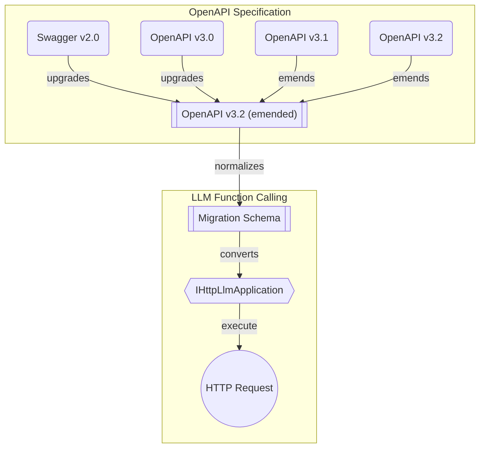

import { Callout, Tabs } from "nextra/components";

import LocalSource from "../../../components/LocalSource";

## HttpLlm module

<Tabs items={[
    <code>HttpLlm</code>,
    <code>IHttpLlmApplication</code>,
    <code>IHttpLlmFunction</code>,
    <code>IHttpLlmController</code>,
    <code>IHttpConnection</code>,
  ]}>
  <Tabs.Tab>
```typescript filename="@typia/utils"
export namespace HttpLlm {
  // Create IHttpLlmController from OpenAPI document
  export function controller(props: {
    name: string;
    document:
      | SwaggerV2.IDocument
      | OpenApiV3.IDocument
      | OpenApiV3_1.IDocument
      | OpenApiV3_2.IDocument;
    connection: IHttpConnection;
    config?: Partial<IHttpLlmApplication.IConfig>;
    execute?: IHttpLlmController["execute"];
  }): IHttpLlmController;
}
```
  </Tabs.Tab>
  <Tabs.Tab>
    <LocalSource
      path="packages/interface/src/http/IHttpLlmApplication.ts"
      filename="@typia/interface"
      showLineNumbers />
  </Tabs.Tab>
  <Tabs.Tab>
    <LocalSource
      path="packages/interface/src/http/IHttpLlmFunction.ts"
      filename="@typia/interface"
      showLineNumbers />
  </Tabs.Tab>
  <Tabs.Tab>
    <LocalSource
      path="packages/interface/src/http/IHttpLlmController.ts"
      filename="@typia/interface"
      showLineNumbers />
  </Tabs.Tab>
  <Tabs.Tab>
    <LocalSource
      path="packages/interface/src/http/IHttpConnection.ts"
      filename="@typia/interface"
      showLineNumbers />
  </Tabs.Tab>
</Tabs>

LLM function calling from OpenAPI documents.

`HttpLlm` is a utility module from `@typia/utils` that converts OpenAPI (Swagger) documents into LLM function calling schemas. While [`typia.llm.application<Class>()`](./application) generates schemas from TypeScript class types at compile time, `HttpLlm` generates them from OpenAPI documents at runtime — making any REST API instantly callable by LLMs.

It supports all OpenAPI versions: Swagger v2.0, OpenAPI v3.0, v3.1, and v3.2.

<Callout type="info">
**OpenAPI Conversion Pipeline**



`HttpLlm` first upgrades any OpenAPI version to an emended OpenAPI v3.2 format, then converts each operation into an `IHttpLlmFunction` with parameter schemas, descriptions, and HTTP metadata. The resulting `IHttpLlmController` can be passed to [MCP](./mcp), [Vercel AI SDK](./vercel), or [Agentica](./chat).
</Callout>

## `HttpLlm.controller()`

```typescript filename="@typia/utils"
import { HttpLlm } from "@typia/utils";
import { IHttpLlmController } from "@typia/interface";

const controller: IHttpLlmController = HttpLlm.controller({
  name: "shopping",
  document: await fetch(
    "https://shopping-be.wrtn.ai/editor/swagger.json",
  ).then((r) => r.json()),
  connection: {
    host: "https://shopping-be.wrtn.ai",
    headers: { Authorization: "Bearer ********" },
  },
});
```

`HttpLlm.controller()` creates an `IHttpLlmController` from an OpenAPI document. Every API operation is converted to an `IHttpLlmFunction` with schemas, descriptions, and HTTP metadata — bundled together with the connection info so it can be both described to and executed by LLMs.

  - `name`: Controller name used as prefix for tool names
  - `document`: Swagger/OpenAPI document (v2.0, v3.0, v3.1, or v3.2)
  - `connection`: HTTP connection info including `host` and optional `headers`
  - `config`: Optional LLM schema conversion configuration
  - `execute`: Optional custom executor (defaults to `HttpLlm.execute()`)

## Integrations

`HttpLlm.controller()` wraps an OpenAPI document into an `IHttpLlmController` that can be plugged into any supported framework. Every API operation becomes a tool — OpenAPI descriptions become tool descriptions, request/response schemas become JSON schemas, and validation feedback is embedded automatically.

<Tabs items={["Vercel AI SDK", "LangChain", "Model Context Protocol"]}>
  <Tabs.Tab>
```typescript filename="src/main.ts"
import { openai } from "@ai-sdk/openai";
import { toVercelTools } from "@typia/vercel";
import { generateText, Tool } from "ai";
import { HttpLlm } from "@typia/utils";

const tools: Record<string, Tool> = toVercelTools({
  controllers: [
    HttpLlm.controller({
      name: "shopping",
      document: await fetch(
        "https://shopping-be.wrtn.ai/editor/swagger.json",
      ).then((r) => r.json()),
      connection: {
        host: "https://shopping-be.wrtn.ai",
        headers: { Authorization: "Bearer ********" },
      },
    }),
  ],
});

const result = await generateText({
  model: openai("gpt-4o"),
  tools,
  prompt: "I wanna buy MacBook Pro",
});
```
  </Tabs.Tab>
  <Tabs.Tab>
```typescript filename="src/main.ts"
import { ChainValues, Runnable } from "@langchain/core";
import { ChatPromptTemplate } from "@langchain/core/prompts";
import { DynamicStructuredTool } from "@langchain/core/tools";
import { ChatOpenAI } from "@langchain/openai";
import { toLangChainTools } from "@typia/langchain";
import { AgentExecutor, createToolCallingAgent } from "langchain/agents";
import { HttpLlm } from "@typia/utils";

const tools: DynamicStructuredTool[] = toLangChainTools({
  controllers: [
    HttpLlm.controller({
      name: "shopping",
      document: await fetch(
        "https://shopping-be.wrtn.ai/editor/swagger.json",
      ).then((r) => r.json()),
      connection: {
        host: "https://shopping-be.wrtn.ai",
        headers: { Authorization: "Bearer ********" },
      },
    }),
  ],
});

const agent: Runnable = createToolCallingAgent({
  llm: new ChatOpenAI({ model: "gpt-4o" }),
  tools,
  prompt: ChatPromptTemplate.fromMessages([
    ["system", "You are a helpful assistant."],
    ["human", "{input}"],
    ["placeholder", "{agent_scratchpad}"],
  ]),
});
const executor: AgentExecutor = new AgentExecutor({ agent, tools });
const result: ChainValues = await executor.invoke({
  input: "I wanna buy MacBook Pro",
});
```
  </Tabs.Tab>
  <Tabs.Tab>
```typescript filename="src/main.ts"
import { McpServer } from "@modelcontextprotocol/sdk/server/mcp.js";
import { registerMcpControllers } from "@typia/mcp";
import { HttpLlm } from "@typia/utils";

const server: McpServer = new McpServer({
  name: "my-server",
  version: "1.0.0",
});

registerMcpControllers({
  server,
  controllers: [
    HttpLlm.controller({
      name: "shopping",
      document: await fetch(
        "https://shopping-be.wrtn.ai/editor/swagger.json",
      ).then((r) => r.json()),
      connection: {
        host: "https://shopping-be.wrtn.ai",
        headers: { Authorization: "Bearer ********" },
      },
    }),
  ],
});
```
  </Tabs.Tab>
</Tabs>

## Validation Feedback

When used through [MCP](../mcp), [Vercel AI SDK](../vercel), or [Agentica](../chat), `HttpLlm.controller()` embeds [`typia.validate<T>()`](/docs/validators/validate) in every tool for automatic argument validation. When validation fails, the error is returned as text content with inline `// ❌` comments at each invalid property:

```json
{
  "name": "John",
  "age": "twenty", // ❌ [{"path":"$input.age","expected":"number"}]
  "email": "not-an-email", // ❌ [{"path":"$input.email","expected":"string & Format<\"email\">"}]
  "hobbies": "reading" // ❌ [{"path":"$input.hobbies","expected":"Array<string>"}]
}
```

The LLM reads this feedback and self-corrects on the next turn.

In the [AutoBe](https://github.com/wrtnlabs/autobe) project (AI-powered backend code generator), `qwen3-coder-next` showed only 6.75% raw function calling success rate on compiler AST types. However, with validation feedback, it reached 100%.

Working on compiler AST means working on any type and any use case.

  - [AutoBeDatabase](https://github.com/wrtnlabs/autobe/blob/main/packages/interface/src/database/AutoBeDatabase.ts)
  - [AutoBeOpenApi](https://github.com/wrtnlabs/autobe/blob/main/packages/interface/src/openapi/AutoBeOpenApi.ts)
  - [AutoBeTest](https://github.com/wrtnlabs/autobe/blob/main/packages/interface/src/test/AutoBeTest.ts)

```typescript filename="AutoBeTest.IExpression"
// Compiler AST may be the hardest type structure possible
//
// Unlimited union types + unlimited depth + recursive references
export type IExpression =
  | IBooleanLiteral
  | INumericLiteral
  | IStringLiteral
  | IArrayLiteralExpression   // <- recursive (contains IExpression[])
  | IObjectLiteralExpression  // <- recursive (contains IExpression)
  | INullLiteral
  | IUndefinedKeyword
  | IIdentifier
  | IPropertyAccessExpression // <- recursive
  | IElementAccessExpression  // <- recursive
  | ITypeOfExpression         // <- recursive
  | IPrefixUnaryExpression    // <- recursive
  | IPostfixUnaryExpression   // <- recursive
  | IBinaryExpression         // <- recursive (left & right)
  | IArrowFunction            // <- recursive (body is IExpression)
  | ICallExpression           // <- recursive (args are IExpression[])
  | INewExpression            // <- recursive
  | IConditionalPredicate     // <- recursive (then & else branches)
  | ... // 30+ expression types total
```

## Lenient JSON Parsing

<Tabs items={[
    "Parsing Example",
    "Coercing Example",
    <code>ILlmFunction</code>,
  ]}>
  <Tabs.Tab>
    <LocalSource
      path="examples/src/llm/application-parse.ts"
      filename="examples/src/llm/application-parse.ts"
      showLineNumbers
      highlight="27-28" />
  </Tabs.Tab>
  <Tabs.Tab>
    <LocalSource
      path="examples/src/llm/application-coerce.ts"
      filename="examples/src/llm/application-coerce.ts"
      showLineNumbers
      highlight="24-25" />
  </Tabs.Tab>
  <Tabs.Tab>
    <LocalSource
      path="packages/interface/src/schema/ILlmFunction.ts"
      filename="@typia/interface"
      showLineNumbers
      highlight="78-126" />
  </Tabs.Tab>
</Tabs>

Each `IHttpLlmFunction` inherits `parse()`, `coerce()`, and `validate()` methods from `ILlmFunction`. These are specifically designed for the messy reality of LLM responses:

**Lenient JSON Features:**
- Unclosed brackets `{`, `[` and strings
- Trailing commas `[1, 2, 3, ]`
- JavaScript-style comments (`//` and `/* */`)
- Unquoted object keys (JavaScript identifier style)
- Incomplete keywords (`tru`, `fal`, `nul`)
- Markdown code block extraction (` ```json ... ``` `)
- Junk text prefix skipping (explanatory text LLMs often add)

**Type Coercion:**

LLMs frequently return wrong types — numbers as strings, booleans as strings, or even double-stringified JSON objects. `IHttpLlmFunction.parse()` automatically coerces these based on the function's parameter schema.

```typescript
// LLM returns:     { "count": "42", "active": "true", "data": "{\"x\": 1}" }
// After coercion: { "count": 42,   "active": true,   "data": { x: 1 } }
```

<Callout type="warning">
**0% → 100% Success Rate on Union Types**

`Qwen3.5` model shows 0% success rate when handling union types with double-stringified JSON objects. With `IHttpLlmFunction.parse()` type coercion, the success rate jumps to 100%.
</Callout>

<Callout type="info">
**For Pre-parsed Objects, Use `IHttpLlmFunction.coerce()`**

Some LLM SDKs (Anthropic, Vercel AI, LangChain, MCP) parse JSON internally and return JavaScript objects directly. In these cases, use `IHttpLlmFunction.coerce()` instead of `IHttpLlmFunction.parse()` to fix types without re-parsing.

For more details, see [JSON Utilities](../json).
</Callout>

